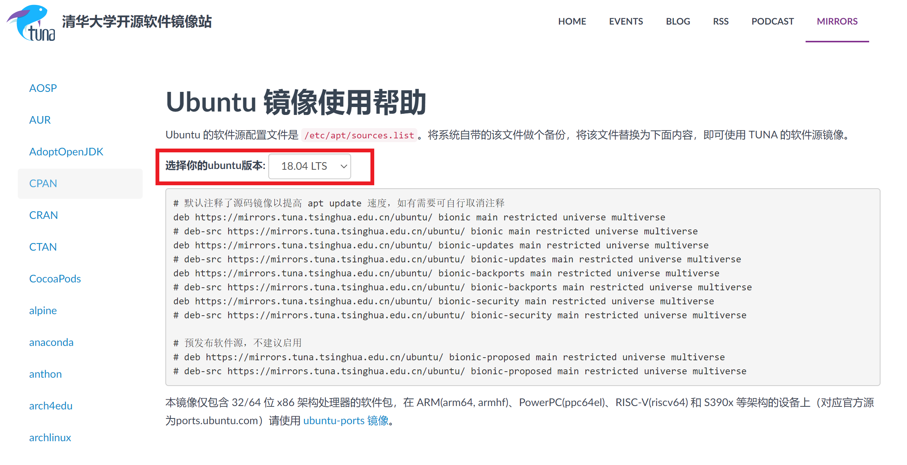
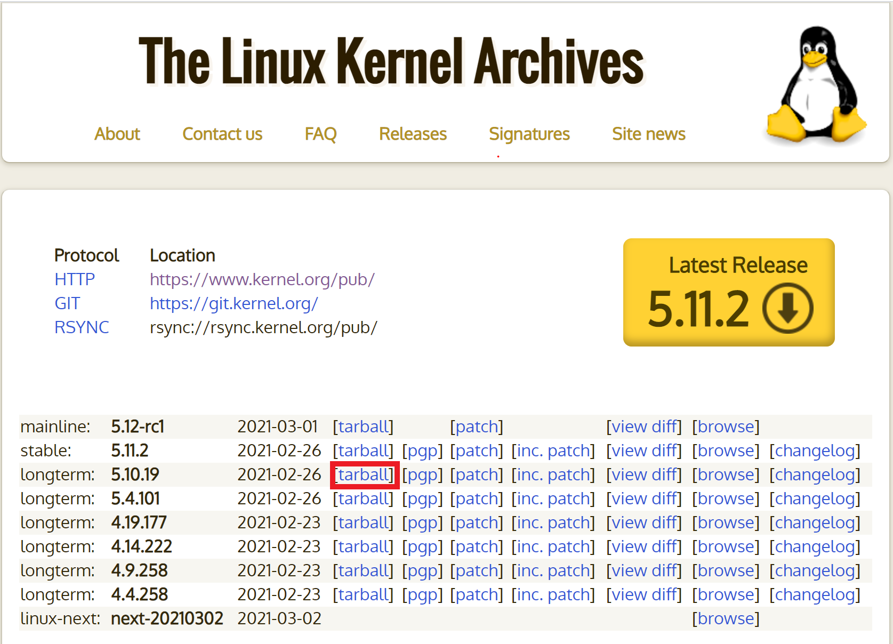
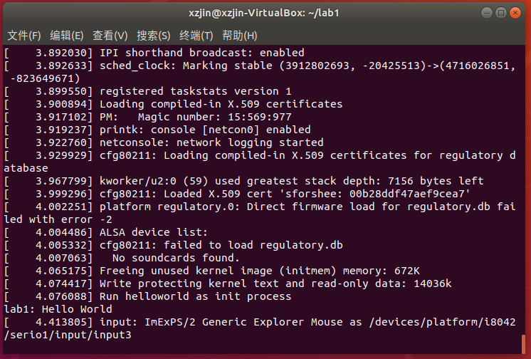
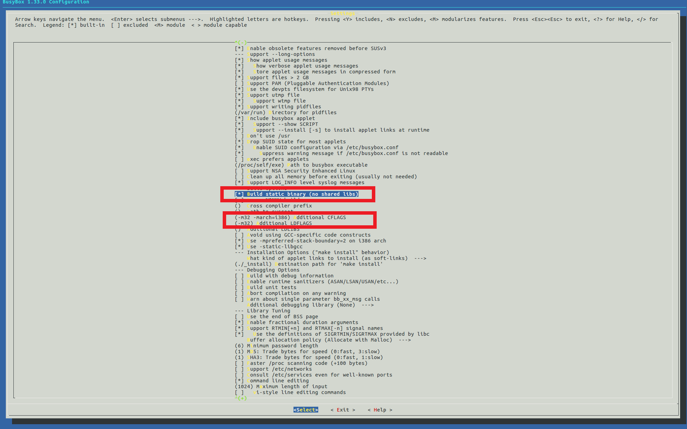
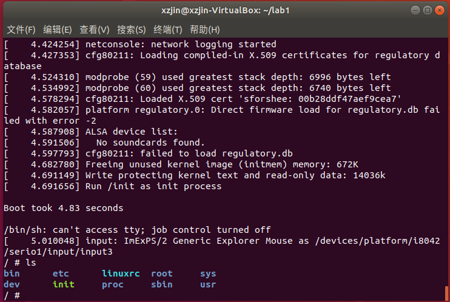

# lab1 编译内核/利用已有内核构建OS  

# 写在前面

实验课的实验内容需要对linux系统有一定的了解，同时也会涉及到linux环境下一些常用工具的使用方法，包括git，vim/gedit，shell编程，linux命令等，这些也是计算机专业学习必不可少的技能点。

由于实验设置中并没有对这些内容进行教学，所以需要同学们利用搜索引擎等渠道对上述内容进行学习，对于计算机专业来说，**学会利用搜索引擎获取自己需要的资料是非常重要的一门功课**。

在实验教程中如果对Linux命令的功能不太清晰，可以通过 https://wangchujiang.com/linux-command/ 网站进行查询。

Have fun!   :)

​																																	实验助教组

# 实验要求

> + **DDL：2023-03-09 12:00**
> + 提交的内容：将**实验报告**转换成pdf格式，并命名为“lab1-学号-姓名.pdf”，然后提交到课程的实验邮箱 `os_sysu_lab@163.com` 处。

1. **独立完成**实验5个部份**环境配置**、**编译Linux内核**、**Qemu启动内核并开启远程调试**、**制作Initramfs**和**编译并启动Busybox**。
2. 编写实验报告、结合实验过程来谈谈你完成实验的思路和结果，最后需要提供实验的5个部份的程序运行截屏来证明你完成了实验。
4. 实验不限语言， C/C++/Rust都可以。
5. 实验不限平台， Windows、Linux和MacOS等都可以。
6. 实验不限CPU， ARM/Intel/Risc-V都可以。

# 实验概述

> 在本次实验中，同学们会熟悉现有Linux内核的编译过程和启动过程， 并在自行编译内核的基础上构建简单应用并启动。同时，同学们会利用精简的Busybox工具集构建简单的OS， 熟悉现代操作系统的构建过程。 此外，同学们会熟悉编译环境、相关工具集，并能够实现内核远程调试。

1. 搭建OS内核开发环境包括：代码编辑环境、编译环境、运行环境、调试环境等。
2. 下载并编译i386（32位）内核，并利用qemu启动内核。
3. 熟悉制作initramfs的方法。
4. 编写简单应用程序随内核启动运行。
5. 编译i386版本的Busybox，随内核启动，构建简单的OS。
6. 开启远程调试功能，进行调试跟踪代码运行。
7. 撰写实验报告。

# 环境配置

若在非Linux环境下，首先下载安装Virtualbox，用于启动虚拟机。如果本身是Linux环境则不需要这个步骤。建议安装Ubuntu 18.04桌面版，并将下载源换成清华下载源。

**创建用户时，请使用能够体现自己真实姓名的简写来作为用户名。如：叶文洁可以取名为wjye**

对于一个新安装的虚拟机，按如下步骤配置环境。

## 换源

由于ubuntu的下载源默认是国外的，为了提高下载速度，我们需要将下载源更换为国内源。我们首先备份原先的下载源。

```shell
sudo mv /etc/apt/sources.list /etc/apt/sources.list.backup
```

然后找到清华的[ubuntu下载源](https://mirrors.tuna.tsinghua.edu.cn/help/ubuntu)。注意，选择你ubuntu的版本对应的下载源。



然后使用`gedit`打开下载源保存的文件`/etc/apt/sources.list`

（注意：gedit是一款文本编辑器，常见的编辑指令可以在网络上进行搜索；当然更常用的文本编辑器是vim，相关的编辑指令同样可以在网络上进行查询。如果你想使用vim，只需将下面所有步骤中的gedit更改为vim即可。）

```shell
sudo gedit /etc/apt/sources.list
```

将下载源复制进`/etc/apt/sources.list`后保存退出。

更新`apt`，检查是否更换为清华的下载源。

```shell
sudo apt update
```

## 配置C/C++环境

```shell
sudo apt install binutils
sudo apt install gcc
```

查看`gcc`是否安装。

```shell
gcc -v
```

若输出gcc的版本号则表明安装成功。

## 安装其他工具

```shell
sudo apt install nasm
sudo apt install qemu
sudo apt install cmake
sudo apt install libncurses5-dev
sudo apt install bison
sudo apt install flex
sudo apt install libssl-dev
sudo apt install libc6-dev-i386
```

安装vscode以及在vscode中安装汇编、 C/C++插件。vscode将作为一个有力的代码编辑器。

# 编译Linux内核

## 下载内核

我们先在当前用户目录下创建文件夹`lab1`并进入。

```shell
mkdir ~/lab1
cd ~/lab1
```

到 <https://www.kernel.org/> 下载内核5.10到文件夹`~/lab1`。

（这里我们也提供了一种无需进入网页，快捷的方式下载内核，在终端下输入如下指令）

```
wget https://mirrors.tuna.tsinghua.edu.cn/kernel/v5.x/linux-5.10.19.tar.xz
```



解压并进入。

```shell
xz -d linux-5.10.19.tar.xz
tar -xvf linux-5.10.19.tar
cd linux-5.10.19
```

## 编译内核

将内核编译成i386 32位版本。

```shell
make i386_defconfig
make menuconfig
```

在打开的图像界面中依次选择`Kernel hacking`、`Compile-time checks and compiler options`，最后在`[ ] Compile the kernel with debug info`输入`Y`勾选，保存退出。

编译内核，这一步较慢。

```shell
make -j8
```

检查Linux压缩镜像`linux-5.10.19/arch/x86/boot/bzImage`和符号表`linux-5.10.19/vmlinux`是否已经生成。

# 启动内核并调试  

> qemu和gdb是常用的程序调试工具，如果你不知道qemu是什么，请参考[链接](https://baike.baidu.com/item/QEMU/1311178?fr=aladdin)；同样地，如果你不知道gdb是什么，请参考[链接](https://baike.baidu.com/item/gdb/10869514?fr=aladdin)。

下面的过程在文件夹`~/lab1`下进行。

```shell
cd ~/lab1
```

## 启动qemu

使用`qemu`启动内核并开启远程调试。

```shell
qemu-system-i386 -kernel linux-5.10.19/arch/x86/boot/bzImage -s -S -append "console=ttyS0" -nographic
```

此时，同学们会发现qemu并未输出任何信息。这是因为我们开启了gdb调试，而qemu在等待gdb输入的指令后才能继续执行。接下来我们启动gdb，通过gdb来告诉qemu应该怎么做。

## gdb调试

在另外一个Terminal下启动gdb，注意，不要关闭qemu所在的Terminal。

```shell
cd ~/lab1
gdb
```

在gdb下，加载符号表

```shell
file linux-5.10.19/vmlinux
```

在gdb下，连接已经启动的qemu进行调试。

```shell
target remote:1234
```

在gdb下，为start_kernel函数设置断点。

```shell
break start_kernel
```

在gdb下，输入`c`运行。

```
c
```

在继续执行后，最终qemu的输出如下，在qemu虚拟机里运行的Linux系统能成功启动，并且最终以Kernel panic宣告结束。看到call trace打出来的是在initrd_load的时候出错，原因很简单，因为启动系统的时候只指定了bzImage，没有指定initrd文件，系统无法mount上initrd (init ram disk) 及其initramfs文件系统。


# 制作Initramfs  

下面的过程在文件夹`~/lab1`下进行。

```shell
cd ~/lab1
```

## Hello World

在前面调试内核中，我们已经准备了一个Linux启动环境，但是缺少initramfs。我们可以做一个最简单的Hello World initramfs，来直观地理解initramfs，

```
vim helloworld.c
```

Hello World程序如下。

```c
#include <stdio.h>

void main()
{
    printf("lab1: Hello World\n");
    fflush(stdout);
    /* 让程序打印完后继续维持在用户态 */
    while(1);
}
```

上述文件保存在`~/lab1/helloworld.c`中，然后将上面代码编译成32位可执行文件。

```shell
gcc -o helloworld -m32 -static helloworld.c
```

## 加载initramfs

用cpio打包initramfs。

```shell
echo helloworld | cpio -o --format=newc > hwinitramfs
```

启动内核，并加载initramfs。

```shell
qemu-system-i386 -kernel linux-5.10.19/arch/x86/boot/bzImage -initrd hwinitramfs -s -S -append "console=ttyS0 rdinit=helloworld" -nographic
```

重复上面的gdb的调试过程，可以看到qemu中输出了`lab1: Hello World\n`



# 编译并启动Busybox  

下面的过程在文件夹`~/lab1`下进行。

```shell
cd ~/lab1
```

## 下载并解压

从课程网站处 http://files.dds-sysu.tech/wl/?id=YnIeNeKJ4LVb4bXQTxz4oCCuRs7WIBAr 下载下载Busybox到`~/lab1`，然后解压。

```shell
tar -xf Busybox_1_33_0.tar.gz
```

## 编译busybox

```shell
cd busybox-1_33_0
make defconfig
make menuconfig
```

进入`settings`，然后在`Build static binary(no shared libs)`处输入`Y`勾选，然后在`() Additional CFLAGS`键入`-m32 -march=i386`，

在`() Additional LDFLAGS` 键入`(-m32)`。



保存退出，然后编译。

```shell
make -j8
make install
```

## 制作Initramfs 

将安装在_install目录下的文件和目录取出放在`~/lab1/mybusybox`处。

```shell
cd ~/lab1
mkdir mybusybox
mkdir -pv mybusybox/{bin,sbin,etc,proc,sys,usr/{bin,sbin}}
cp -av busybox-1_33_0/_install/* mybusybox/
cd mybusybox
```

initramfs需要一个init程序，可以写一个简单的shell脚本作为init。

用vim打开文件`init`

```
vim init
```

复制入如下内容，保存退出。

```shell
#!/bin/sh
mount -t proc none /proc
mount -t sysfs none /sys
echo -e "\nBoot took $(cut -d' ' -f1 /proc/uptime) seconds\n"
exec /bin/sh
```

加上执行权限。

```shell
chmod u+x init
```

将x86-busybox下面的内容打包归档成cpio文件，以供Linux内核做initramfs启动执行。

```shell
find . -print0 | cpio --null -ov --format=newc | gzip -9 > ~/lab1/initramfs-busybox-x86.cpio.gz
```

## 加载busybox

```shell
cd ~/lab1
qemu-system-i386 -kernel linux-5.10.19/arch/x86/boot/bzImage -initrd initramfs-busybox-x86.cpio.gz -nographic -append "console=ttyS0"
```

然后使用`ls`命令即可看到当前文件夹。



# 附录

## 校园网环境加速

部分软件在校园网下下载可能缓慢，建议使用镜像源。此处推荐两个：

- [Matrix 镜像源](https://mirrors.matrix.moe)（此镜像源位于校内）
- [清华 Tuna 镜像源](https://mirrors.tuna.tsinghua.edu.cn)

例如，

- <https://mirrors.matrix.moe/kernel/v5.x/> 的 `linux-5.6.12.tar.gz` 等压缩文件提供了 Linux Kernel 源代码的下载。
- 参照[帮助文档](https://mirrors.matrix.moe/docs/ubuntu)可以设置 Ubuntu 软件源更新使用 Matrix 镜像源。另外，Matrix 镜像源也提供 Arch Linux、Debian、CentOS、Fedora 等发行版的软件源镜像。

## busybox源码

如果github下载速度慢，可以从课程网站处下载。

```
http://files.dds-sysu.tech/wl/?id=YnIeNeKJ4LVb4bXQTxz4oCCuRs7WIBAr
```

