<center><h1>本科生实验报告</h1></center>

实验课程:操作系统原理

实验名称:lab1 编译内核/利用已有内核构建OS

专业名称:计算机科学与技术(人工智能与大数据方向)

学生姓名:刘卓逸

学生学号:21307303

实验地点:东校园实验中心大楼D503

实验成绩:

报告时间:2023年3月3日

<!-- <div style="page-break-after:always"></div> 换页 -->

# 1.实验要求

1. **独立完成**实验5个部份**环境配置**、**编译Linux内核**、**Qemu启动内核并开启远程调试**、**制作Initramfs**和**编译并启动Busybox**。
2. 编写实验报告、结合实验过程来谈谈你完成实验的思路和结果，最后需要提供实验的5个部份的程序运行截屏来证明你完成了实验。
3. 实验不限语言， C/C++/Rust都可以。
4. 实验不限平台， Windows、Linux和MacOS等都可以。
5. 实验不限CPU， ARM/Intel/Risc-V都可以。

# 2.实验过程

### 搭建OS内核开发环境

使用VMware® Workstation 17 Pro虚拟机，安装Ubuntu 18.04.6 LTS

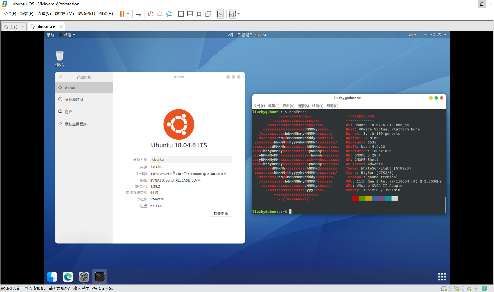

在“软件和更新”，将软件源更改为华为云源

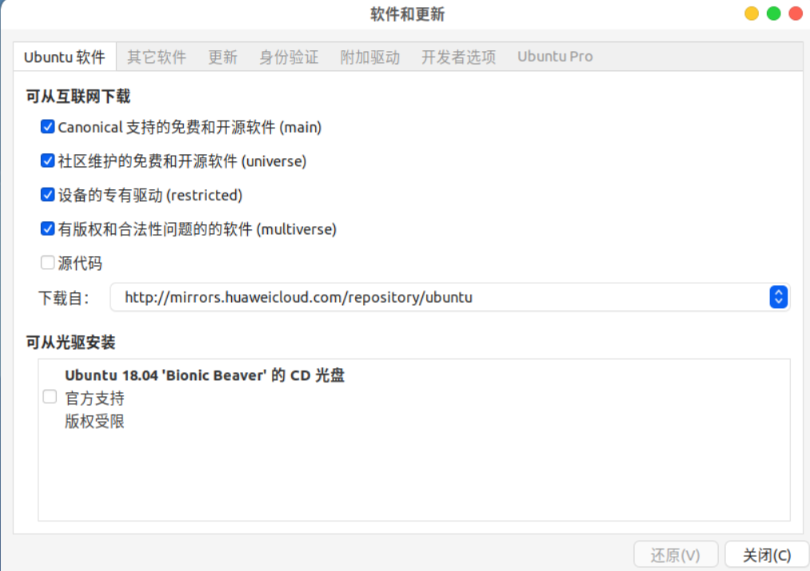

更新apt，确定更换为了华为云源,并更新软件

```shell
sudo apt update
sudo apt full-upgrade
```

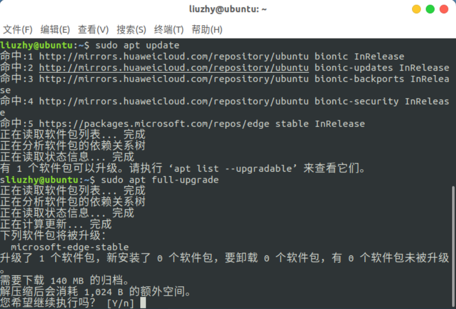

安装必要环境

```shell
sudo apt install binutils
sudo apt install gcc
sudo apt install nasm
sudo apt install qemu
sudo apt install cmake
sudo apt install libncurses5-dev
sudo apt install bison
sudo apt install flex
sudo apt install libssl-dev
sudo apt install libc6-dev-i386
```

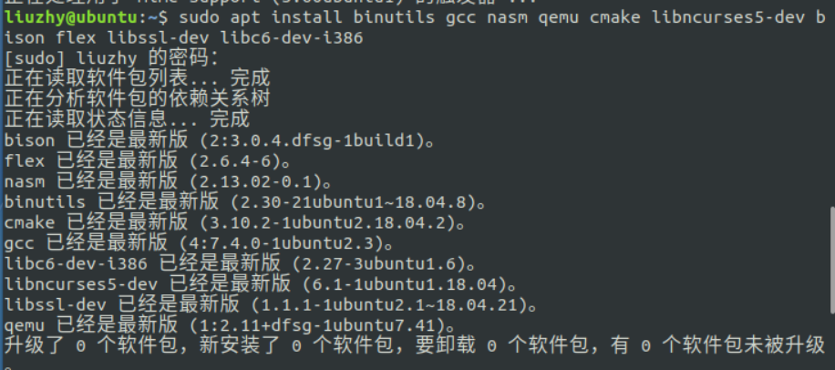

检查gcc版本

```shell
gcc -v
```

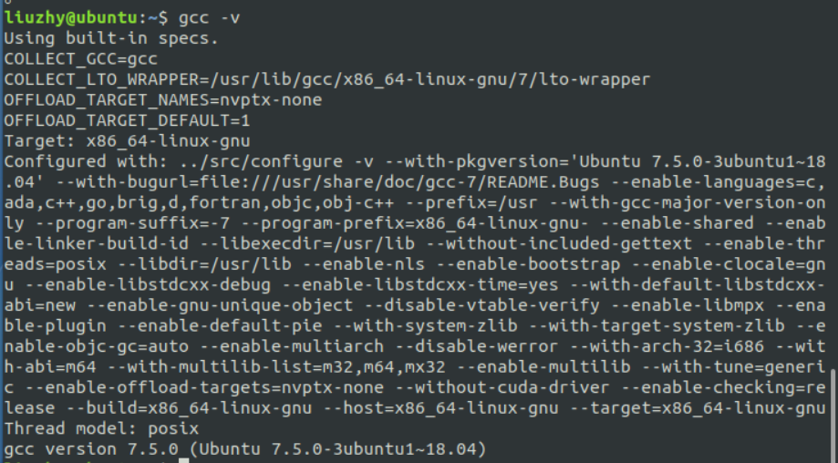

环境准备完成

### 下载与编译内核

按照要求设置后再编译内核

```shell
wget https://mirrors.tuna.tsinghua.edu.cn/kernel/v5.x/linux-5.10.19.tar.xz
xz -d linux-5.10.19.tar.xz
tar -xvf linux-5.10.19.tar
cd linux-5.10.19
make i386_defconfig
make menuconfig
make -j8
```

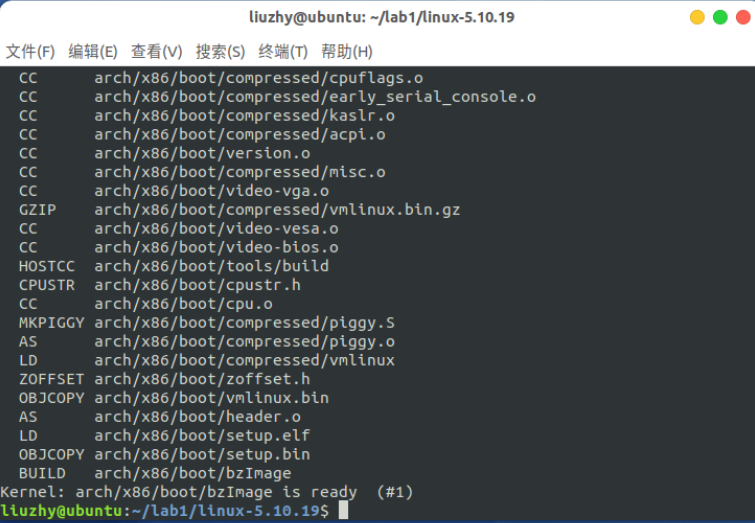

检查Linux压缩镜像与符号表是否生成

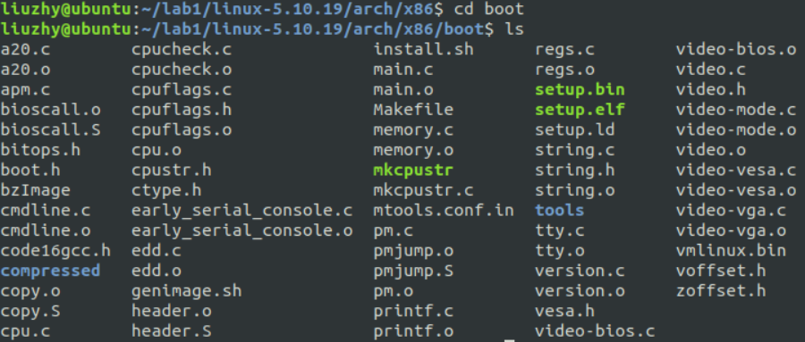

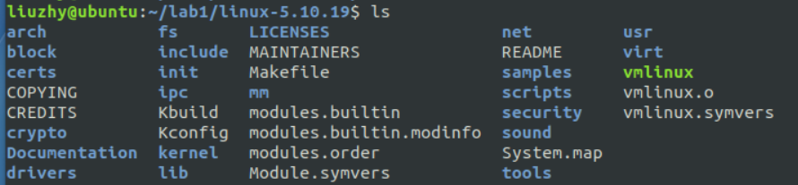

编译内核实验完成

### 启动与调试内核

启动qemu，如实验手册所说，无任何输出信息

```shell
qemu-system-i386 -kernel linux-5.10.19/arch/x86/boot/bzImage -s -S -append "console=ttyS0" -nographic
```

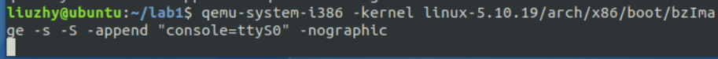

按照手册进行gdb调试，如手册所说无法mount

```shell
gdb
file linux-5.10.19/vmlinux
target remote:1234
break start_kernel
c
```

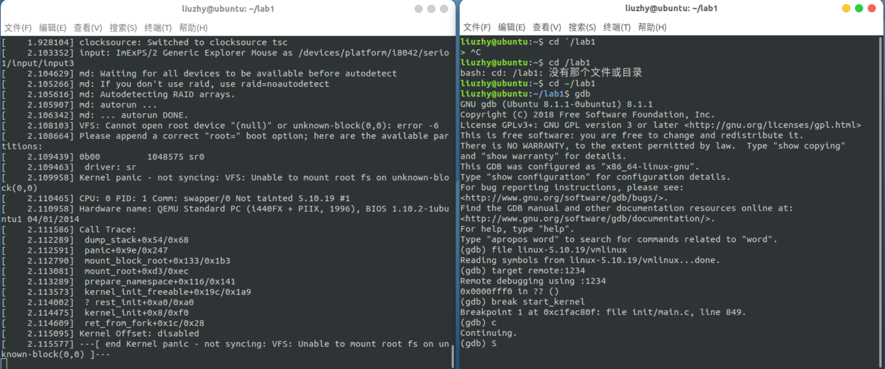

编写helloworld.c,并编译

```shell
gcc -o helloworld -m32 -static helloworld.c
```

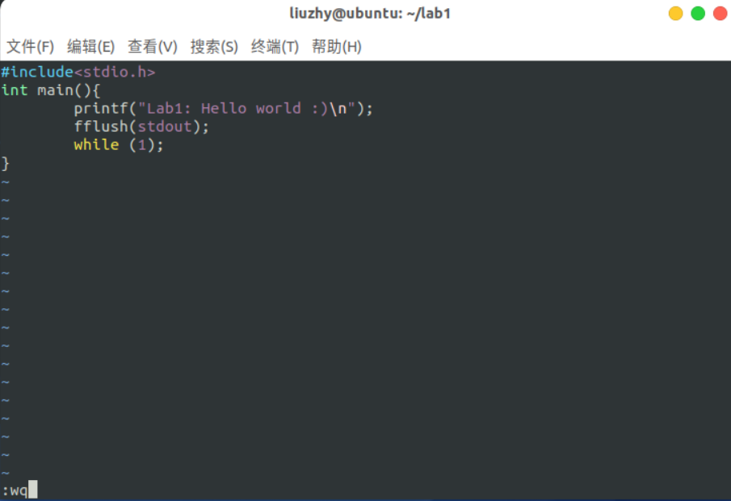

打包并加载initramfs后再重试gdb调试，出现hello world结果

```shell
echo helloworld | cpio -o --format=newc > hwinitramfs
qemu-system-i386 -kernel linux-5.10.19/arch/x86/boot/bzImage -initrd hwinitramfs -s -S -append "console=ttyS0 rdinit=helloworld" -nographic
```

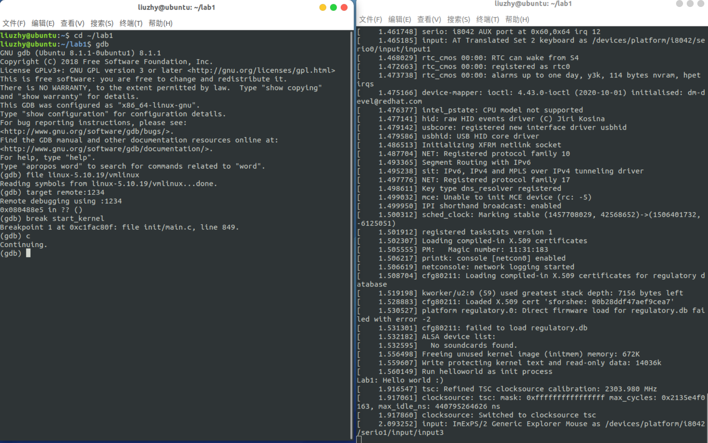

### 编译启动Busybox

按照实验手册调设置

```shell
cd busybox-1_33_0
make defconfig
make menuconfig
```

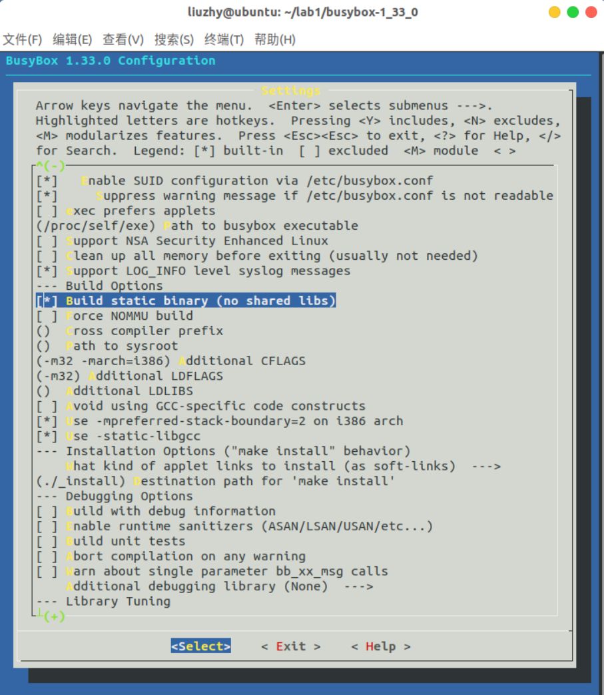

编译busybox

```shell
make -j8
make install
```

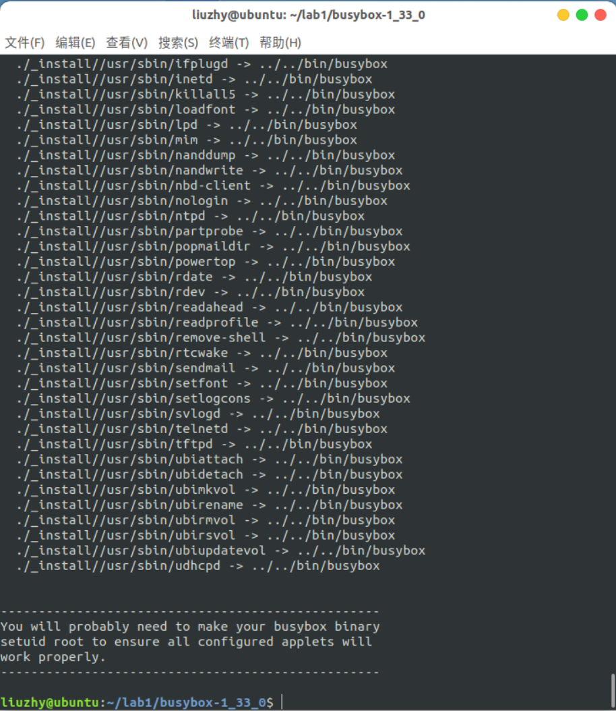

制作initramfs,并加载busybox，

```shell
cd ~/lab1
mkdir mybusybox
mkdir -pv mybusybox/{bin,sbin,etc,proc,sys,usr/{bin,sbin}}
cp -av busybox-1_33_0/_install/* mybusybox/
cd mybusybox
vim init
chmod u+x init
find . -print0 | cpio --null -ov --format=newc | gzip -9 > ~/lab1/initramfs-busybox-x86.cpio.gz
cd ~/lab1
qemu-system-i386 -kernel linux-5.10.19/arch/x86/boot/bzImage -initrd initramfs-busybox-x86.cpio.gz -nographic -append "console=ttyS0"
ls
```

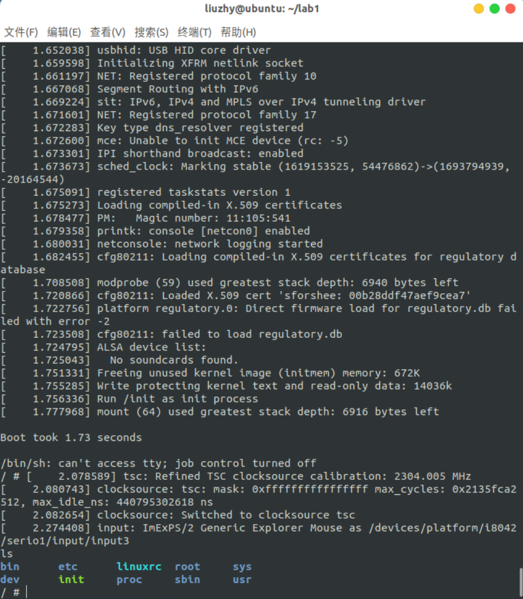

busybox正常加载了

# 3.关键代码

本次实验只是照着实验手册熟系实验流程，无自我编写关键代码部分

# 4.实验结果


顺利按照实验手册编译linux内核与busybox,顺利见到子系统

# 5.总结

通过本次实验,初步了解了linux系统的使用方法，对终端命令有了初步的认识。学习了内核与bash的编译运行流程，初步学习了如何开启远程调试功能并进行调试跟踪代码运行
