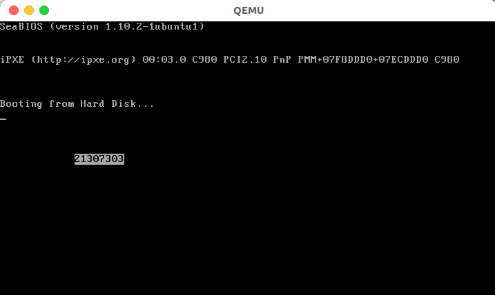

<center><font size=6>本科生实验报告</font></center>

实验课程:操作系统原理

实验名称:lab2 编译内核/利用已有内核构建OS

专业名称:计算机科学与技术(人工智能与大数据方向)

学生姓名:刘卓逸

学生学号:21307303

实验地点:东校园实验中心大楼D503

实验成绩:

报告时间:2023年3月3日

<div style="page-break-after:always"></div>

## 1.实验要求

1. 独立完成实验5个部份环境配置、编译Linux内核、Qemu启动内核并开启远程调试、制作Initramfs和编译并启动Busybox。
2. 编写实验报告、结合实验过程来谈谈你完成实验的思路和结果，最后需要提供实验的5个部份的程序运行截屏来证明你完成了实验。
3. 实验不限语言， C/C++/Rust都可以。
4. 实验不限平台， Windows、Linux和MacOS等都可以。
5. 实验不限CPU， ARM/Intel/Risc-V都可以。

## 2.实验过程

#### 任务1 MBR

###### 1.1 复现example 1

先用gedit将示例代码写入~/lab2/mbr.asm

然后按照实验手册敲指令


复现完成

###### 1.2 修改example 1使得输出学号

设定背景色为白色，前景色为黑色后
依次在2*(80*x+y)
修改后代码如下
```
org 0x7c00
[bits 16]
xor ax, ax ; eax = 0
; 初始化段寄存器, 段地址全部设为0
mov ds, ax
mov ss, ax
mov es, ax
mov fs, ax
mov gs, ax

; 初始化栈指针
mov sp, 0x7c00
mov ax, 0xb800
mov gs, ax

mov ah, 0x70 ; 白底黑字
mov al, '2'
mov [gs:2 * (80*12+12)], ax
mov al, '1'
mov [gs:2 * (80*12+12+1)], ax
mov al, '3'
mov [gs:2 * (80*12+12+2)], ax
mov al, '0'
mov [gs:2 * (80*12+12+3)], ax
mov al, '7'
mov [gs:2 * (80*12+12+4)], ax
mov al, '3'
mov [gs:2 * (80*12+12+5)], ax
mov al, '0'
mov [gs:2 * (80*12+12+6)], ax
mov al, '3'
mov [gs:2 * (80*12+12+7)], ax

jmp $ ; 死循环

times 510 - ($ - $$) db 0
db 0x55, 0xaa
```


#### 任务2 实模式中断
## 3.关键代码

本次实验只是照着实验手册熟系实验流程，无自我编写关键代码部分

## 4.实验结果


顺利按照实验手册编译linux内核与busybox

## 5.总结

通过本次实验,初步了解了linux系统的使用方法，对终端命令有了初步的认识。学习了内核与bash的编译运行流程，初步学习了如何开启远程调试功能并进行调试跟踪代码运行

<style>
    img[alt="defpic"]{
        width:450px;
    }
</style>
