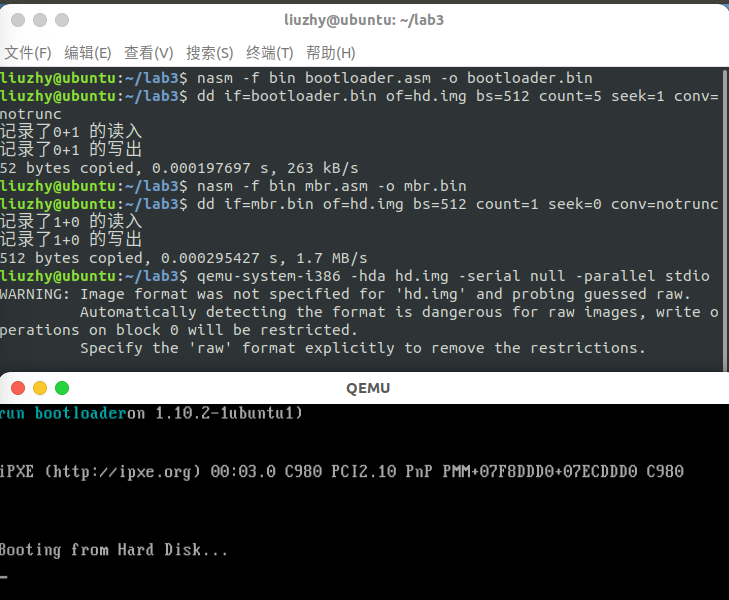

本科生实验报告

实验课程:操作系统原理

实验名称:lab3 从实模式到保护模式

专业名称:计算机科学与技术(人工智能与大数据方向)

学生姓名:刘卓逸

学生学号:21307303

实验地点:东校园实验中心大楼D503

实验成绩:

报告时间:2023年3月17日

## 1.实验要求

## 2.实验过程

#### assignment 1

###### 1.1 复现example1

## 3.关键代码

## 4.实验结果

## 5.总结

