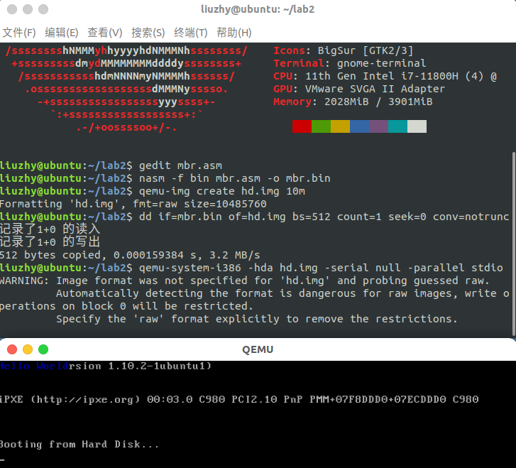
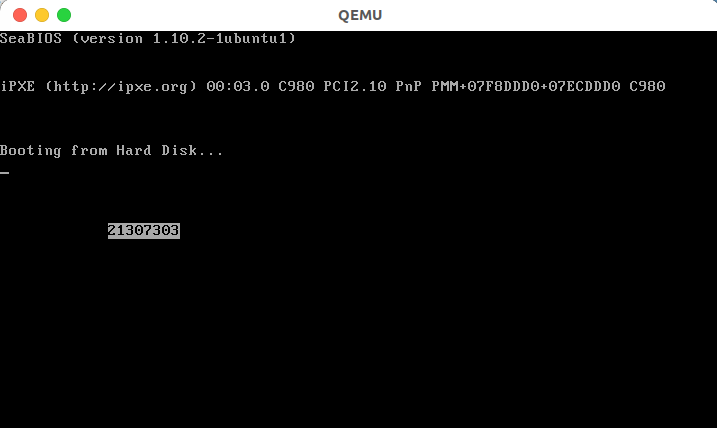
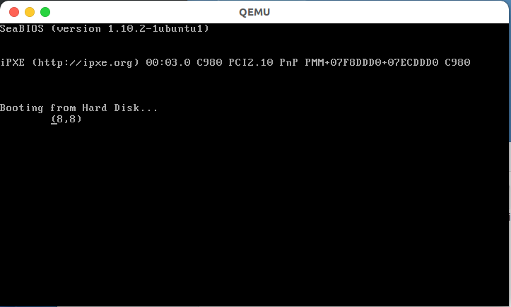
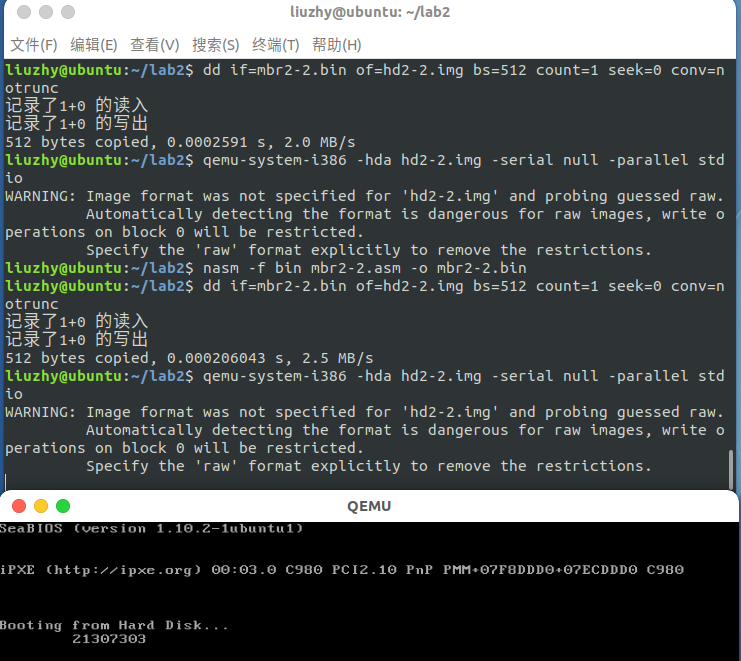
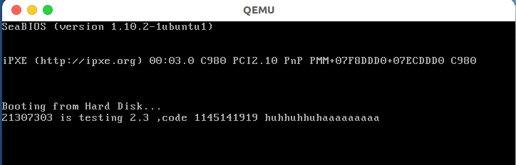
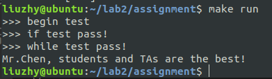
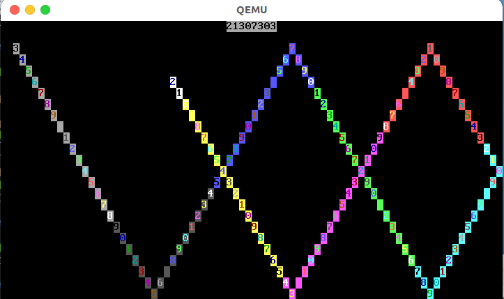
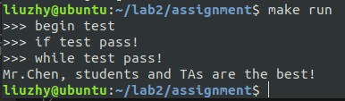

<center><font size=6>本科生实验报告</font></center>

实验课程:操作系统原理

实验名称:lab2 编译内核/利用已有内核构建OS

专业名称:计算机科学与技术(人工智能与大数据方向)

学生姓名:刘卓逸

学生学号:21307303

实验地点:东校园实验中心大楼D503

实验成绩:

报告时间:2023年3月17日

<div style="page-break-after:always"></div>

## 1.实验要求

> + 请同学们先读实验入门资料，掌握基础的汇编知识，再开始实验。
> + DDL：**2023.03.23 23:59**
> + 提交的内容：将**3+1（选做）个任务的代码**和**实验报告**放到**压缩包**中，命名为“**lab2-姓名-学号**”，提交到实验课程邮箱：os_sysu_lab@163.com。

1. 实验不限语言， C/C++/Rust都可以。
2. 实验不限平台， Windows、Linux和MacOS等都可以。
3. 实验不限CPU， ARM/Intel/Risc-V都可以。

## 2.实验过程

#### 任务1 MBR

###### 1.1 复现example 1

先用gedit将示例代码写入~/lab2/mbr.asm

然后按照实验手册敲指令

```shell
nasm -f bin mbr.asm -o mbr.bin
qemu-img create hd.img 10m
dd if=mbr.bin of=hd.img bs=512 count=1 seek=0 conv=notrunc
qemu-system-i386 -hda hd.img -serial null -parallel stdio 
```



###### 1.2 修改example 1使得输出学号

设定背景色为白色，前景色为黑色后,将学号依次在2*(80*x+y)输出



#### 任务2 实模式中断

###### 2.1 移动光标并获取光标位置

先用AH=02H的10h中断，将光标移动到(8,8)

再用AH=03H的10h中断获取光标位置

然后用用AH=0EH的中断输出光标位置信息

最后用AH=02H的10h中断，将光标回到(8,8)



###### 2.2在(8,8)用中断输出自己的学号

同**2.1**只需修改输出内容即可



###### 2.3键盘响应

在死循环中，先执行AH=0h的int 16h中断,即等待键盘输入，输入的ascii码将会在al中

键盘输入后立刻执行ah=0Eh的int 10h中断，将al中ascii码对应的字符输出在光标位置，并使光标右移一位



#### 任务3 汇编



#### 任务4 汇编小代码

用ax控制输出的字符，用(bl,bh)装坐标,用(cl,ch)装方向,

当碰边时cl=0-cl或ch=0-ch



## 3.关键代码

###### 1.2修改example 1使得输出学号

```asm
org 0x7c00
[bits 16]
xor ax, ax ; eax = 0
; 初始化段寄存器, 段地址全部设为0
mov ds, ax
mov ss, ax
mov es, ax
mov fs, ax
mov gs, ax
; 初始化栈指针
mov sp, 0x7c00
mov ax, 0xb800
mov gs, ax
; 输出学号
mov ah, 0x70 ; 白底黑字
mov al, '2'
mov [gs:2 * (80*12+12)], ax
mov al, '1'
mov [gs:2 * (80*12+12+1)], ax
mov al, '3'
mov [gs:2 * (80*12+12+2)], ax
mov al, '0'
mov [gs:2 * (80*12+12+3)], ax
mov al, '7'
mov [gs:2 * (80*12+12+4)], ax
mov al, '3'
mov [gs:2 * (80*12+12+5)], ax
mov al, '0'
mov [gs:2 * (80*12+12+6)], ax
mov al, '3'
mov [gs:2 * (80*12+12+7)], ax
; 结束
jmp $ ; 死循环

times 510 - ($ - $$) db 0
db 0x55, 0xaa
```

###### 2.1 移动光标并获取光标位置

```asm
org 0x7c00
[bits 16]
xor ax, ax ; eax = 0
; 初始化段寄存器, 段地址全部设为0
mov ds, ax
mov ss, ax
mov es, ax
mov fs, ax
mov gs, ax
; 初始化栈指针
mov sp, 0x7c00
mov ax, 0xb800
mov gs, ax
;设置光标位置
mov ah, 0x02
mov bh, 0
mov dh, 8
mov dl, 8
int 10h
;读取光标位置
mov ah, 0x03
mov bx, 0
int 10h
;输出光标位置
mov bl, 0x70 
mov cx, 1

mov al, '('
mov ah, 0x0E
int 10h

mov al, dh
add al, 48 ;这里输出的坐标是运算出来的
mov ah, 0x0E
int 10h

mov al, ','
mov ah, 0x0E
int 10h

mov al, dl
add al, 48
mov ah, 0x0E
int 10h

mov al, ')'
mov ah, 0x0E
int 10h

;重设光标位置
mov ah, 0x02
mov bh, 0
mov dh, 8
mov dl, 8
int 10h
;结束
jmp $ ; 死循环
times 510 - ($ - $$) db 0
db 0x55, 0xaa
```

###### 2.2在(8,8)用中断输出自己的学号

```asm
org 0x7c00
[bits 16]
xor ax, ax ; eax = 0
; 初始化段寄存器, 段地址全部设为0
mov ds, ax
mov ss, ax
mov es, ax
mov fs, ax
mov gs, ax

; 初始化栈指针
mov sp, 0x7c00
mov ax, 0xb800
mov gs, ax

;设置光标位置
mov ah, 0x02
mov bh, 0
mov dh, 8
mov dl, 8
int 10h

;读取光标位置
mov ah, 0x03
mov bx, 0
int 10h

;输出光标位置
mov bl, 70H 
mov cx, 1

mov al, '2'
mov ah, 0x0E
int 10h
mov al, '1'
mov ah, 0x0E
int 10h
mov al, '3'
mov ah, 0x0E
int 10h
mov al, '0'
mov ah, 0x0E
int 10h
mov al, '7'
mov ah, 0x0E
int 10h
mov al, '3'
mov ah, 0x0E
int 10h
mov al, '0'
mov ah, 0x0E
int 10h
mov al, '3'
mov ah, 0x0E
int 10h

jmp $ ; 死循环
times 510 - ($ - $$) db 0
db 0x55, 0xaa
```

###### 2.3 探索int 16h，实现键盘响应

```asm
org 0x7c00
[bits 16]
xor ax, ax ; eax = 0
; 初始化段寄存器, 段地址全部设为0
mov ds, ax
mov ss, ax
mov es, ax
mov fs, ax
mov gs, ax

; 初始化栈指针
mov sp, 0x7c00
mov ax, 0xb800
mov gs, ax

loop:
	mov ah, 00h ;等待键盘输入
	int 16h
	mov ah, 0Eh ;将键盘输入的内容在光标处输出
	int 10h
jmp loop
times 510 - ($ - $$) db 0
db 0x55, 0xaa
```

###### 3 汇编

your_if中，用eax装a1

your_while中，用ebx装a2,ecx装*while_flag

your_function中，用eax表示i，用ebx装*your_string

```asm
%include "head.include"

your_if:
	pushad
	mov eax, [a1]
	cmp eax, 12  
	jl branch1
	cmp eax, 24
	jl branch2
	jmp branch3
	branch1:
		mov edx, 0
		mov ebx, 2
		idiv ebx
		add eax, 1
		mov [if_flag], eax
	jmp endif
	branch2:
		mov ebx, 24
		sub ebx, eax
		imul eax, ebx
		mov [if_flag], eax
	jmp endif
	branch3:
		shl eax, 4
		mov [if_flag], eax 
	endif:
	popad

your_while:
	pushad
	loop:
	mov ecx, [while_flag]
	mov ebx, [a2]
	cmp ebx, 12
	jl endloop
		push ebx 
		push ecx
		call my_random
		pop ecx
		pop ebx
		sub ebx, 12
		mov [ecx+ebx], al
		add ebx, 11
		mov [a2], ebx
	jmp loop
	endloop:
	popad

%include "end.include"

your_function:
	pushad
	mov ebx, [your_string]
	mov eax, 0
	loop2:
	mov ecx, [ebx+eax]
	cmp cl, 0
	je endloop2
		pushad
			push ecx 
			call print_a_char
			pop ecx
		popad
		add eax, 1 
	jmp loop2
	endloop2:
	popad
```
###### 4.汇编小程序

用ax控制输出的字符，用(bl,bh)装坐标,用(cl,ch)装方向,

当碰边时cl=0-cl或ch=0-ch

```asm
org 0x7c00
[bits 16]
xor ax, ax ; eax = 0
; 初始化段寄存器, 段地址全部设为0
mov ds, ax
mov ss, ax
mov es, ax
mov fs, ax
mov gs, ax
; 初始化栈指针
mov sp, 0x7c00 ;line10
mov ax, 0xb800
mov gs, ax
;清屏
mov ah, 0x07 ; 黑底白字
mov al, ' '
mov ebx, 0
loop1:
	cmp ebx, 3200
	jge endloop1
	mov [gs:2*ebx], ax ;line20
	add ebx, 1
	jmp loop1
endloop1:;输出学号
mov ah, 0x70 ;白底黑字
mov al, '2'
mov [gs:72], ax
mov al, '1'
mov [gs:74], ax
mov al, '3'
mov [gs:76], ax
mov al, '0' ;line30
mov [gs:78], ax
mov al, '7'
mov [gs:80], ax
mov al, '3'
mov [gs:82], ax
mov al, '0'
mov [gs:84], ax
mov al, '3'
mov [gs:86], ax
;初始化
mov bl, 2
mov bh, 2
mov cl, 1
mov ch, 1
loop: 
	;算坐标并输出
	push bx
	mov dh, 0
	mov dl, bh
	imul dx, 80
	mov bh, 0
	add dx, bx
	pop bx
	mov [gs:2*edx], ax 
	;移动，并判断是否更改方向
	add bl, cl
	cmp bl, 0
	jle branch1
	cmp bl, 79
	jge branch1
	jmp end1
	branch1
		mov edx, 0
		sub dl, cl
		mov cl, dl
	end1:

	add bh, ch
	cmp bh, 2
	jle branch2
	cmp bh, 24
	jge branch2
	jmp end2
	branch2
		mov edx, 0
		sub dl, ch
		mov ch, dl
	end2:
	;更改输出字符
	add ah, 1
	add al, 1
	cmp al, 58
	jl end3
		mov al, 48
	end3:
	;纯纯的拖延
	mov edx,0
	loop3:
		cmp edx, 11451
		jg endloop3
		pushad
			mov ah, 03h
			mov bx, 0
			int 10h
		popad
		add edx, 1
		jmp loop3
	endloop3:
jmp loop
times 510 - ($ - $$) db 0
db 0x55, 0xaa
```
## 4.实验结果

汇编顺利通过测试



小程序也跑了起来


## 5.总结

通过本次实验,继续学习linux系统的使用方法，对汇编有了初步的了解并实践编写了汇编代码，对debug有了初步的了解

<style>
    img[alt="defpic"]{
        width:450px;
    }
</style>
