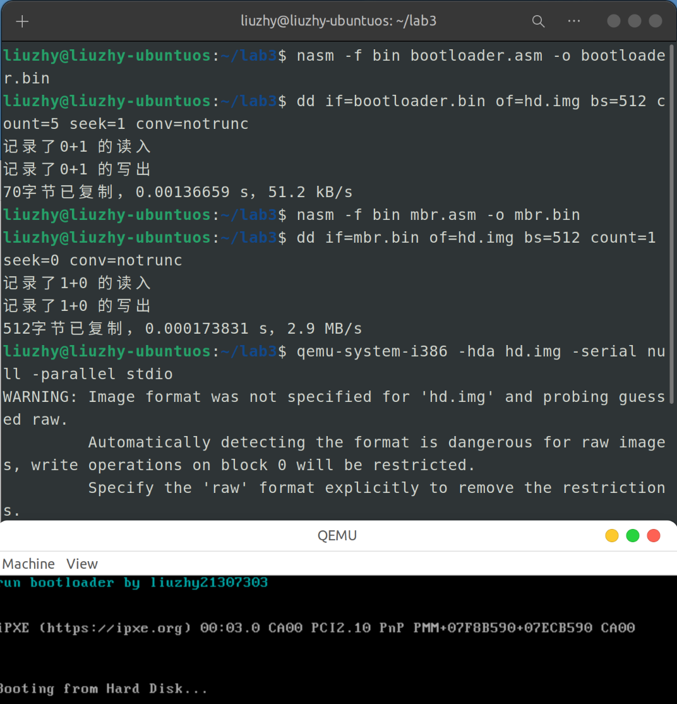
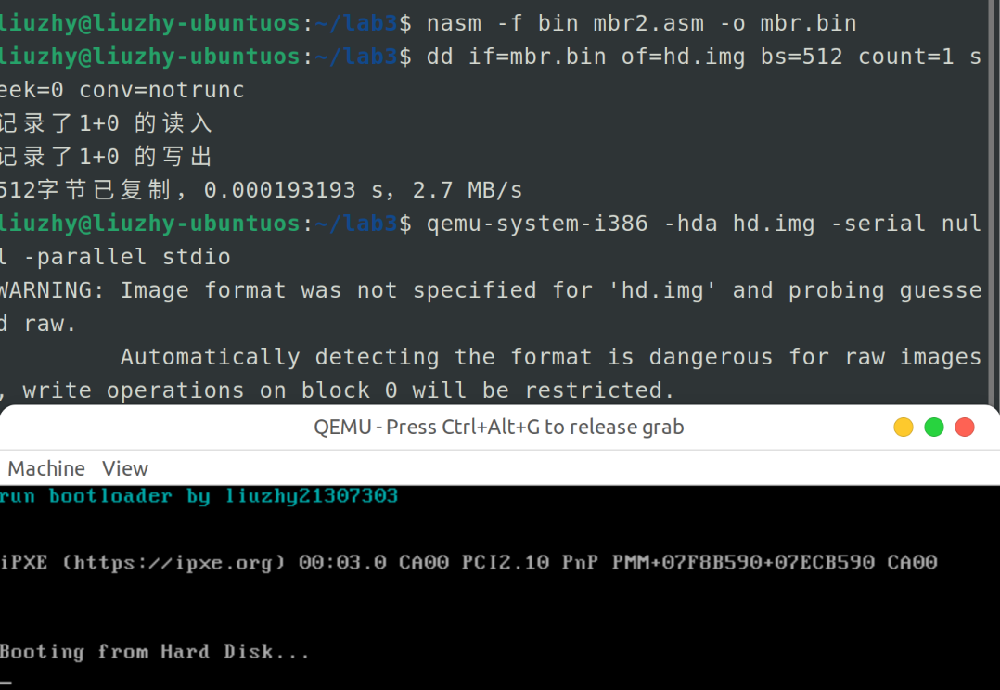
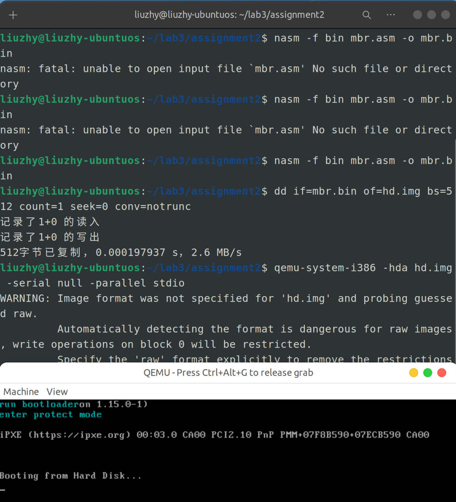
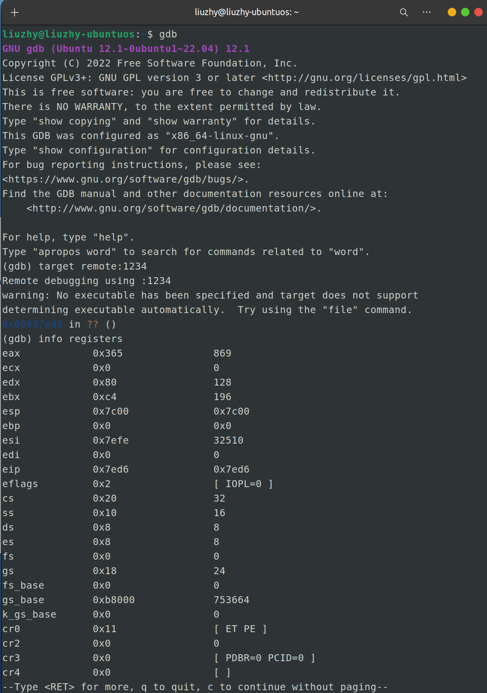
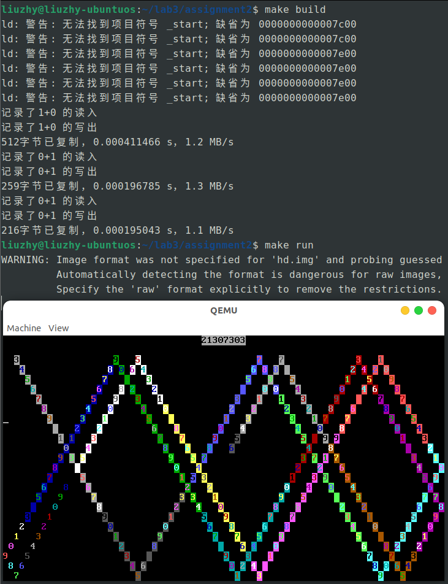

<center><font size=6>本科生实验报告</font></center>

实验课程:操作系统原理

实验名称:lab3 从实模式到保护模式

专业名称:计算机科学与技术(人工智能与大数据方向)

学生姓名:刘卓逸

学生学号:21307303

实验地点:东校园实验中心大楼D503

实验成绩:

报告时间:2023年4月7日

<div style="page-break-after:always"></div>

## 1.实验要求

> + DDL：2023年4月6号 23:59
> + 提交的内容：**将2+1(选做)个assignment的代码**和**实验报告**放到**压缩包**中，命名为“**lab3-姓名-学号**”，并交到课程邮箱上 os_sysu_lab@163.com
> + **材料的Example的代码放置在 `src`目录下**。

1. 实验不限语言， C/C++/Rust都可以。
2. 实验不限平台， Windows、Linux和MacOS等都可以。
3. 实验不限CPU， ARM/Intel/Risc-V都可以。

## 2.实验过程

### assignment 1.1 复现example1

#### 实验原理

完全按照实验手册的操作步骤，将输出改为了姓名+学号，不过多赘述

```asm
bootloader_tag db 'run bootloader by liuzhy21307303'
```

#### 实验结果



### assignment 1.2 使用CHS读取磁盘

#### 实验原理

使用int13h终端的0x2功能进行CHS模式读取

```
入口参数：ah=02H
al=扇区数
ch=柱面C
cl=扇区S
dh=磁头H
dl=驱动器
```

已知LBA=cx:ax，按照以下公式求出柱面C/磁头H/扇区S，并分别储存在ch,cl,dh寄存器中

$C \space = \space LBA/(PH×PS)+Cs$
$H \space = \space LBA/PS–(C-Cs)×PH+Hs$
$S \space = \space LBA–(C–Cs)×PH×PS-(H–Hs)×Ps+Ss$

其中在默认情况下Cs=0,Hs=0,Ss=1,驱动器号为0x80，且特别指出实验条件下PS=63,PH=18,

#### 代码实现

```asm
org 0x7c00
[bits 16]
xor ax, ax ; eax = 0
; 初始化段寄存器, 段地址全部设为0
mov ds, ax
mov ss, ax
mov es, ax
mov fs, ax
mov gs, ax
; 初始化栈指针
mov sp, 0x7c00
mov ax, 1                ; 逻辑扇区号第0~15位
mov cx, 0                ; 逻辑扇区号第16~31位
mov bx, 0x7e00           ; bootloader的加载地址

call asm_read_hard_disk  ; 读取硬盘
jmp 0x0000:0x7e00        ; 跳转到bootloader

jmp $ ; 死循环

asm_read_hard_disk:  
;ch 柱面C / cl 扇区S /  dh 磁头H / dl 驱动器
;CS=0 HS=0 SS=1 PS=63 PH=18
	and eax, 0x0000ffff
	and ecx, 0x00001fff
	;mov ch, 0x00 ; 计算柱面号  1/(63*18)+0=0
	push eax
	push ecx
	    mov edx, 0
	    mov ecx, 18*63
	    idiv ecx
	pop ecx
	mov ch,al
	pop eax

	;mov dh, 0x00 ; 计算磁头 1/63-(0-0)*18+0=0
	push eax
	push ecx
	    mov edx, 0
	    mov ecx, 63
	    idiv ecx
	pop ecx
	push ecx
	    shr ecx, 8
	    sub ecx, 0
	    imul ecx, ecx, 18
	    sub eax, ecx
	pop ecx
	add eax, 0
	mov dh, al
	pop eax

	;mov cl, 0x02 ; 计算扇区 1-(0-0)*63*18+(0-0)*63+1=2
	push eax
	push ecx
		shr ecx, 8
		imul ecx, ecx, 63*18
		sub eax, ecx
	pop ecx
	push edx
		shr edx, 8
		imul edx, edx, 63
		sub eax, edx
	pop edx
	add eax,1
	mov cl, al
	pop eax
  
	mov dl, 0x80 ; 硬盘
	mov ah, 0x02 ; 中断功能:读扇区
	mov al, 0x05 ; 读5个扇区
	int 13H
ret

times 510 - ($ - $$) db 0
db 0x55, 0xaa
```

#### 实验结果



### assignment 2

#### 实验原理

参照lab1，运用GDB的远程调试功能进行调试

#### 实验过程

阅读实验手册，按照实验手册编写文件，汇编，运行



然后再最后的运行指令后加上-s的参数

```shell
qemu-system-i386 -hda hd.img -serial null -parallel stdio -s
```

打开终端，依次输入

```gdb
gdb
target remote:1234
info registers
```

顺利看到寄存器的状态



### assignment 3

#### 实验原理

原本想法是这样的：

```
把Lab2-Assignment 4代码的核心片段拷贝至bootloader.asm的末尾，打上excode标记，
在bootloader完成后的死循环即jmp $处修改为jmp excode
```

但是这谁都会啊，而且这是直接修改了bootloader，所以我觉得这是与实验目的相悖的

所以真正原理是这样：

```
将Lab2-Assignment 4的代码(excode)作为第三个数据块写入硬盘，
在还是实模式即mbr.asm中就把该代码块载入内存，
bootloader指定的地址为0x7e00,excode指定地址为0x8200
在bootloader结束即即jmp $前jump至0x8200
```

#### 代码实现

###### boot.inc

增加excode的片段

```asm
; 常量定义区
; _____________Excode_____________
; 自定义扇区数
EXCODE_SECTOR_COUNT equ 5
; 自定义起始扇区
EXCODE_START_SECTOR equ 6
; 自定义被加载到地址
EXCODE_START_ADDRESS equ 0x8200
; _____________Loader_____________
; 加载器扇区数
LOADER_SECTOR_COUNT equ 5
; 加载器起始扇区
LOADER_START_SECTOR equ 1
; 加载器被加载地址
LOADER_START_ADDRESS equ 0x7e00
; _____________GDT_____________
; GDT起始位置
GDT_START_ADDRESS equ 0x8800
; _____________Selector_____________
;平坦模式数据段选择子
DATA_SELECTOR equ 0x8
;平坦模式栈段选择子
STACK_SELECTOR equ 0x10
;平坦模式视频段选择子
VIDEO_SELECTOR equ 0x18
VIDEO_NUM equ 0x18
;平坦模式代码段选择子
CODE_SELECTOR equ 0x20
```

###### mbr.asm

增加将excode导入内存的部分

```asm
%include "boot.inc"

[bits 16]

; 初始化栈指针
mov sp, 0x7c00  

mov ax, LOADER_START_SECTOR
mov cx, LOADER_SECTOR_COUNT
mov bx, LOADER_START_ADDRESS  
load_bootloader: 
    push ax
    push bx
    call asm_read_hard_disk  ; 读取硬盘
    add sp, 4
    inc ax
    add bx, 512
    loop load_bootloader

mov ax, EXCODE_START_SECTOR
mov cx, EXCODE_SECTOR_COUNT
mov bx, EXCODE_START_ADDRESS 
load_excode: 				;读excode
    push ax
    push bx
    call asm_read_hard_disk  
    add sp, 4
    inc ax
    add bx, 512
    loop load_excode
  
jmp 0x0000:0x7e00        ; 跳转到bootloader
jmp $ ; 死循环

; asm_read_hard_disk(memory,block)
; 加载逻辑扇区号为block的扇区到内存地址memory

asm_read_hard_disk:                       
    push bp
    mov bp, sp
    push ax
    push bx
    push cx
    push dx
    mov ax, [bp + 2 * 3] ; 逻辑扇区低16位
    mov dx, 0x1f3
    out dx, al    ; LBA地址7~0
    inc dx        ; 0x1f4
    mov al, ah
    out dx, al    ; LBA地址15~8
    xor ax, ax
    inc dx        ; 0x1f5
    out dx, al    ; LBA地址23~16 = 0
    inc dx        ; 0x1f6
    mov al, ah
    and al, 0x0f
    or al, 0xe0   ; LBA地址27~24 = 0
    out dx, al
    mov dx, 0x1f2
    mov al, 1
    out dx, al   ; 读取1个扇区
    mov dx, 0x1f7    ; 0x1f7
    mov al, 0x20     ;读命令
    out dx,al
    ; 等待处理其他操作
  .waits:
    in al, dx        ; dx = 0x1f7
    and al,0x88
    cmp al,0x08
    jnz .waits                     
    ; 读取512字节到地址ds:bx
    mov bx, [bp + 2 * 2]
    mov cx, 256   ; 每次读取一个字，2个字节，因此读取256次即可      
    mov dx, 0x1f0
  .readw:
    in ax, dx
    mov [bx], ax
    add bx, 2
    loop .readw
    pop dx
    pop cx
    pop bx
    pop ax
    pop bx
    ret
```

###### bootloader.asm

**删去bootloader开头的org 0x7e00**，不知为啥保留这句就无法使用给出的makefile的build指令

增加跳转至0x8200的jmp指令

```asm
%include "boot.inc"
[bits 16]
mov ax, 0xb800
mov gs, ax
mov ah, 0x03 ;青色
mov ecx, bootloader_tag_end - bootloader_tag
xor ebx, ebx
mov esi, bootloader_tag
output_bootloader_tag:
    mov al, [esi]
    mov word[gs:bx], ax
    inc esi
    add ebx,2
    loop output_bootloader_tag
;空描述符
mov dword [GDT_START_ADDRESS+0x00],0x00
mov dword [GDT_START_ADDRESS+0x04],0x00  
;创建描述符，这是一个数据段，对应0~4GB的线性地址空间
mov dword [GDT_START_ADDRESS+0x08],0x0000ffff    ; 基地址为0，段界限为0xFFFFF
mov dword [GDT_START_ADDRESS+0x0c],0x00cf9200    ; 粒度为4KB，存储器段描述符 
;建立保护模式下的堆栈段描述符  
mov dword [GDT_START_ADDRESS+0x10],0x00000000    ; 基地址为0x00000000，界限0x0 
mov dword [GDT_START_ADDRESS+0x14],0x00409600    ; 粒度为1个字节
;建立保护模式下的显存描述符   
mov dword [GDT_START_ADDRESS+0x18],0x80007fff    ; 基地址为0x000B8000，界限0x07FFF 
mov dword [GDT_START_ADDRESS+0x1c],0x0040920b    ; 粒度为字节
;创建保护模式下平坦模式代码段描述符
mov dword [GDT_START_ADDRESS+0x20],0x0000ffff    ; 基地址为0，段界限为0xFFFFF
mov dword [GDT_START_ADDRESS+0x24],0x00cf9800    ; 粒度为4kb，代码段描述符 
;初始化描述符表寄存器GDTR
mov word [pgdt], 39      ;描述符表的界限   
lgdt [pgdt]
in al,0x92                         ;南桥芯片内的端口 
or al,0000_0010B
out 0x92,al                        ;打开A20
cli                                ;中断机制尚未工作
mov eax,cr0
or eax,1
mov cr0,eax                        ;设置PE位
;以下进入保护模式
jmp dword CODE_SELECTOR:protect_mode_begin

;16位的描述符选择子：32位偏移
;清流水线并串行化处理器
[bits 32]       
protect_mode_begin:                          

mov eax, DATA_SELECTOR                     ;加载数据段(0..4GB)选择子
mov ds, eax
mov es, eax
mov eax, STACK_SELECTOR
mov ss, eax
mov eax, VIDEO_SELECTOR
mov gs, eax

mov ecx, protect_mode_tag_end - protect_mode_tag
mov ebx, 80 * 2
mov esi, protect_mode_tag
mov ah, 0x3
output_protect_mode_tag:
    mov al, [esi]
    mov word[gs:ebx], ax
    add ebx, 2
    inc esi
    loop output_protect_mode_tag

jmp dword CODE_SELECTOR:0x8200 ;跳转至excode
jmp $

pgdt dw 0
     dd GDT_START_ADDRESS

bootloader_tag db 'run bootloader'
bootloader_tag_end:

protect_mode_tag db 'enter protect mode'
protect_mode_tag_end:
```

###### excode.asm

与Lab2-Assignment 4的源代码相比，删除了初始化指针的部分，在开头有[bits 32]

```asm
%include "boot.inc"
[bits 32]
excode_begin:
;清屏
mov ah, 0x07 ; 黑底白字
mov al, ' '
mov ebx, 0
loop1:
	cmp ebx, 3200
	jge endloop1
	mov word[gs:2*ebx], ax 
	add ebx, 1
	jmp loop1
endloop1:
;输出学号
mov ah, 0x70 ;白底黑字
mov al, '2'
mov [gs:72], ax
mov al, '1'
mov [gs:74], ax
mov al, '3'
mov [gs:76], ax
mov al, '0' ;line30
mov [gs:78], ax
mov al, '7'
mov [gs:80], ax
mov al, '3'
mov [gs:82], ax
mov al, '0'
mov [gs:84], ax
mov al, '3'
mov [gs:86], ax
;输出
mov bl, 2
mov bh, 2
mov cl, 1
mov ch, 1
loop:
	push bx
	mov dh, 0
	mov dl, bh
	imul dx, dx, 80
	mov bh, 0
	add dx, bx
	pop bx
	mov [gs:2*edx], ax 

	add bl, cl
	cmp bl, 0
	jle branch1
	cmp bl, 79
	jge branch1
	jmp end1
	branch1:
		mov edx, 0
		sub dl, cl
		mov cl, dl
	end1:

	add bh, ch
	cmp bh, 2
	jle branch2
	cmp bh, 24
	jge branch2
	jmp end2
	branch2:
		mov edx, 0
		sub dl, ch
		mov ch, dl
	end2:

	add ah, 1
	add al, 1
	cmp al, 58
	jl end3
		mov al, 48
	end3:

	mov edx,0
	loop3:
		cmp edx, 32767
		jg endloop3
		pushad
			mov ah, 03h
			mov bx, 0
		popad
		add edx, 1
		jmp loop3
	endloop3:
jmp loop
```

###### gdbinit与makefile

依葫芦画瓢地加上excode的部分，因为mbr和bootloader分别占1个和5个块，所以excode从第6个块开始写seek=6

```
target remote:1234
set disassembly-flavor intel
add-symbol-file mbr.symbol 0x7c00
add-symbol-file bootloader.symbol 0x7c00
add-symbol-file excode.symbol 0x7c00
```

```make
run:
	@qemu-system-i386 -hda hd.img -serial null -parallel stdio 
debug:
	@qemu-system-i386 -s -S -hda hd.img -serial null -parallel stdio &
	@sleep 1
	@gnome-terminal -e "gdb -q -x gdbinit "
build:
	@nasm -g -f elf32 mbr.asm -o mbr.o
	@ld -o mbr.symbol -melf_i386 -N mbr.o -Ttext 0x7c00
	@ld -o mbr.bin -melf_i386 -N mbr.o -Ttext 0x7c00 --oformat binary

	@nasm -g -f elf32 bootloader.asm -o bootloader.o
	@ld -o bootloader.symbol -melf_i386 -N bootloader.o -Ttext 0x7e00
	@ld -o bootloader.bin -melf_i386 -N bootloader.o -Ttext 0x7e00 --oformat binary

	@nasm -g -f elf32 excode.asm -o excode.o
	@ld -o excode.symbol -melf_i386 -N excode.o -Ttext 0x7e00
	@ld -o excode.bin -melf_i386 -N excode.o -Ttext 0x7e00 --oformat binary


	@dd if=mbr.bin of=hd.img bs=512 count=1 seek=0 conv=notrunc
	@dd if=bootloader.bin of=hd.img bs=512 count=5 seek=1 conv=notrunc
	@dd if=excode.bin of=hd.img bs=512 count=5 seek=6 conv=notrunc
clean:
	@rm -fr *.bin *.o *.symbol
```

#### 实验结果

```shell
make build
make run
```

顺利在保护模式下执行了Lab2-Assignment 4的代码



## 3.总结

通过这次的实验，我深⼊理解了硬盘读写的原理，探究了从实模式过渡到保护模式的过程。我还加深了对BIOS中断和段保护机制的理解。借助实验过程和实验指导，我加深了GDB调试的使⽤经验。

## 4.参考文献

LBA向CHS模式的转换。[https://blog.csdn.net/G_Spider/article/details/6906184]

int 13h中断。[https://blog.csdn.net/brainkick/article/details/7583727]

<style>
    img[alt="defpic"]{
        width:450px;
    }
</style>
