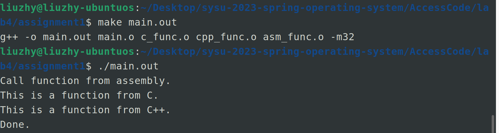
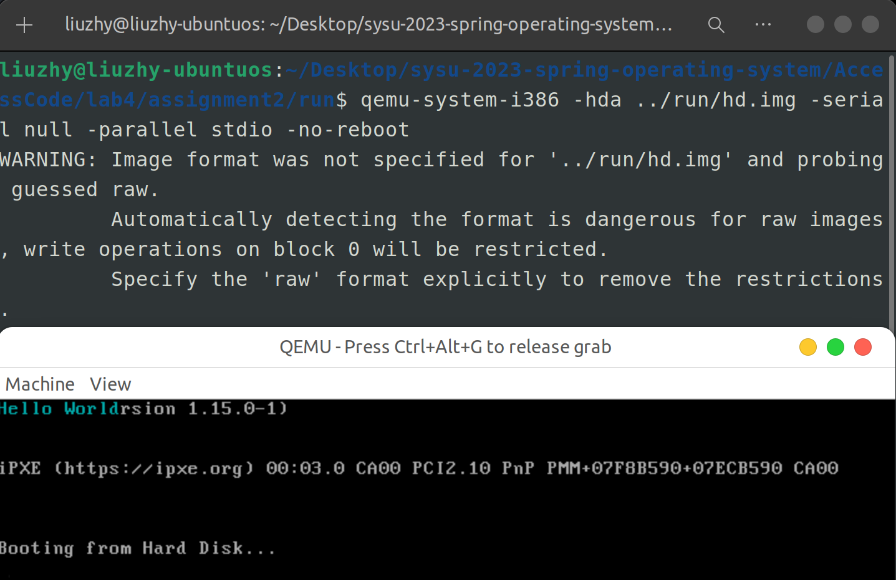
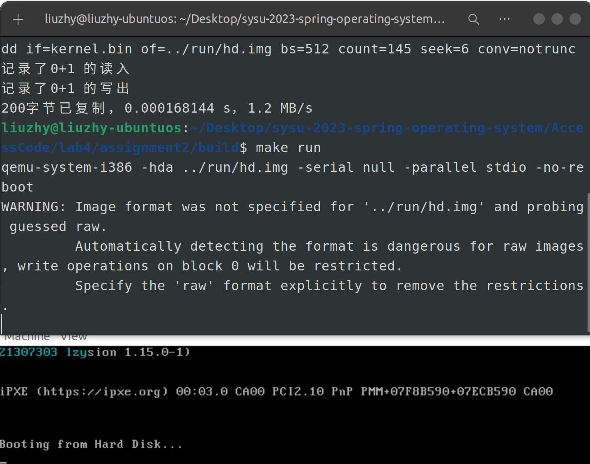
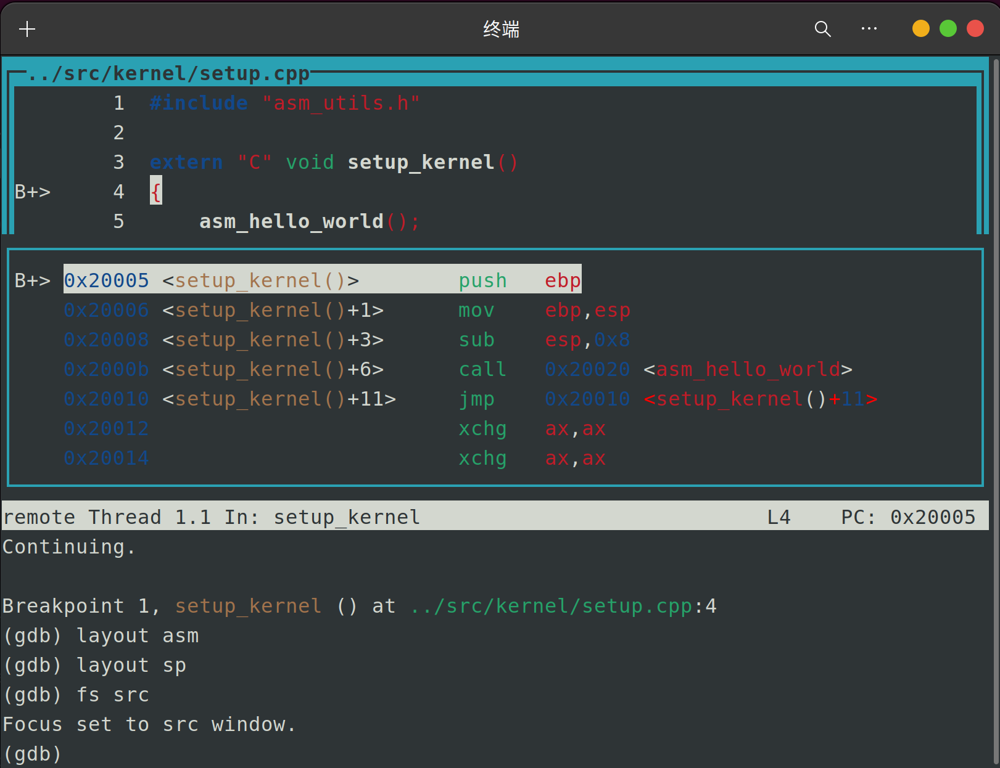
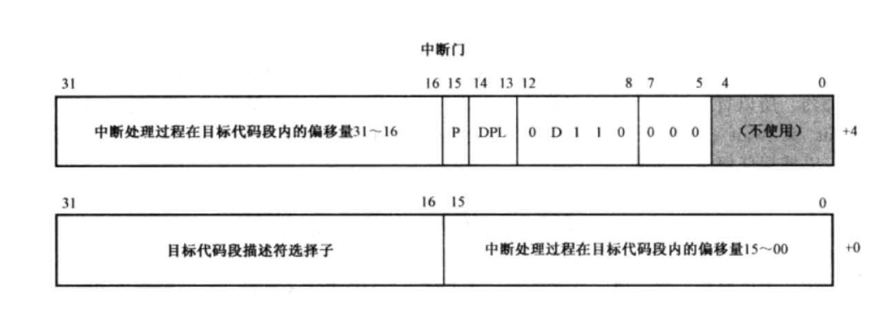
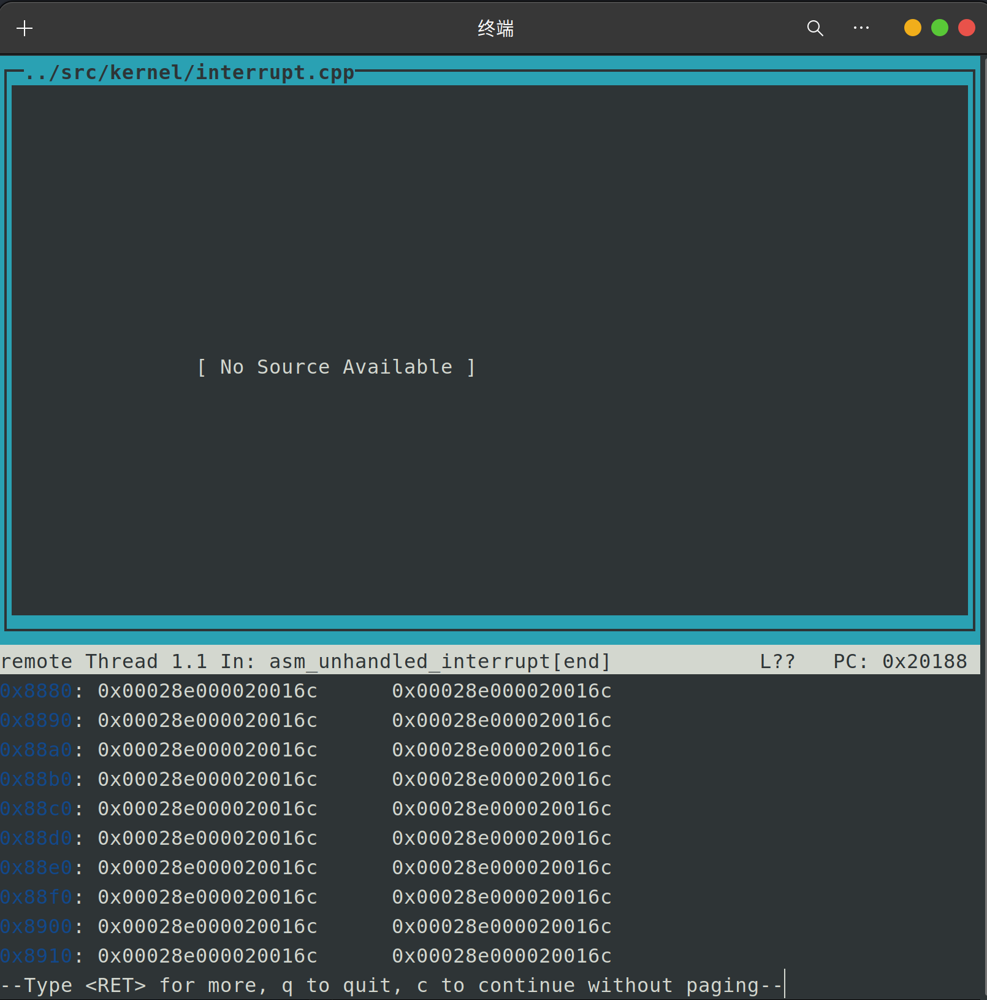
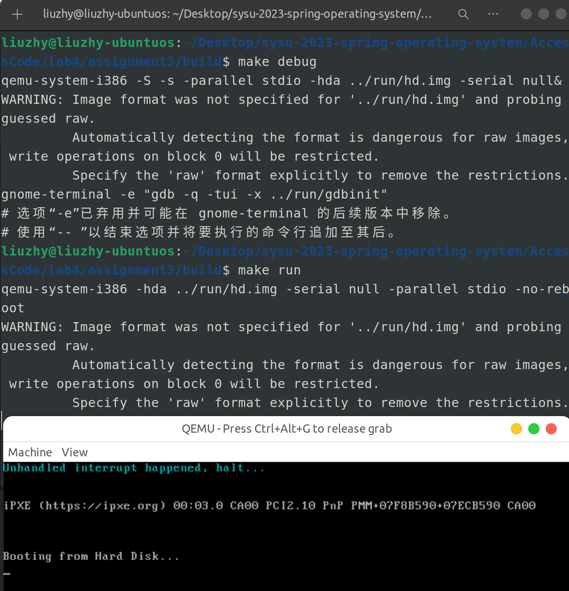
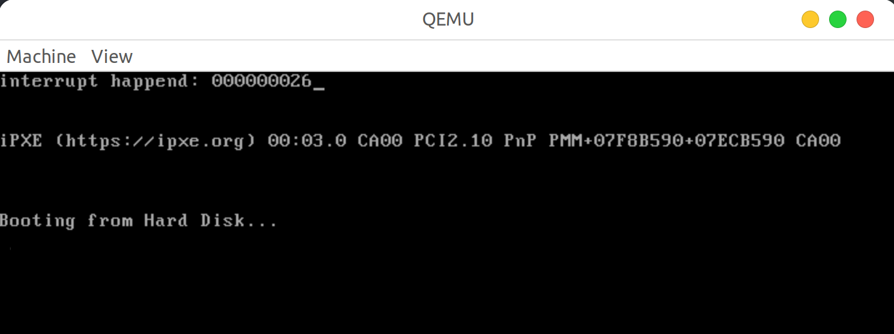
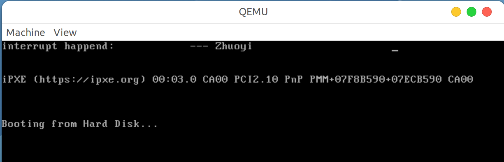
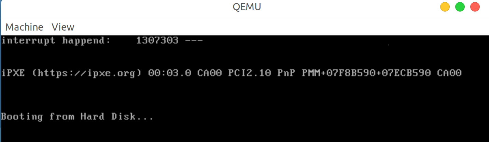

<center><font size=6>本科生实验报告</font></center>

实验课程:操作系统原理

实验名称:lab4 第三章 中断

专业名称:计算机科学与技术(人工智能与大数据方向)

学生姓名:刘卓逸

学生学号:21307303

实验地点:东校园实验中心大楼D503

实验成绩:

报告时间:2023年4月14日

<div style="page-break-after:always"></div>

## 1.实验要求

> + DDL：2023年4月20号 23:59
> + 提交的内容：将**4个assignment的代码**和**实验报告**放到**压缩包**中，命名为“**lab4-姓名-学号**”，并交到课程并交到课程邮箱 os_sysu_lab@163.com
> + **Example材料的代码放置在 `src`目录下**。

1. 实验不限语言， C/C++/Rust都可以。
2. 实验不限平台， Windows、Linux和MacOS等都可以。
3. 实验不限CPU， ARM/Intel/Risc-V都可以。

## 2.实验过程

### Assignment 1 混合编程的基本思路

#### 实验内容

复现Example 1，结合具体的代码说明C代码调用汇编函数的语法和汇编代码调用C函数的语法。例如，结合代码说明 `global`、`extern`关键字的作用，为什么C++的函数前需要加上 `extern "C"`等， 结果截图并说说你是怎么做的。同时，学习make的使用，并用make来构建Example 1，结果截图并说说你是怎么做的。

#### 实验原理

编译器在编译代码时包含如下几个步骤。

+ **预处理**。处理宏定义，如 `#include`, `#define`, `#ifndef`等，生成预处理文件，一般以 `.i`为后缀，展开所有宏。

  ```shell
  gcc -o main.i -E main.c
  ```
+ **编译**。将预处理文件转换成汇编代码文件，一般以 `.S`为后缀，`-masm=intel`是为了生成intel风格的汇编代码，否则默认AT&T风格的代码。

  ```shell
  gcc -o main.s -S main.c -masm=intel
  ```
+ **汇编**。将汇编代码文件文件转换成可重定位文件，一般以 `.o`为后缀。

  ```shell
  gcc -o main.o -c main.c
  ```
+ **链接**。将多个可重定位文件链接生成可执行文件，一般以 `.o`为后缀。

  ```shell
  gcc -o main.o -c main.c
  gcc -o print.o -c print.c
  gcc -o main.out main.o print.o
  ```

  等价于

  ```shell
  gcc -o main.out main.c print.c
  ```

#### 实验代码与解释

将以代码注释的形式给出

c_func.c

```c
#include <stdio.h>
// #定义一个c函数
void function_from_C() { 
    printf("This is a function from C.\n");
}
```

cpp_func.cpp

```c++
#include <iostream>
// extern "C"告诉C++编译器该函数使用C链接,这意味着它遵循 C 的命名约定和调用约定,也就能被汇编语言直接调用
extern "C" void function_from_CPP() {
    std::cout << "This is a function from C++." << std::endl;
}
```

asm_func.asm:

```assembly
[bits 32]
global function_from_asm ;global告诉汇编器该符号应该在链接时对其他目标文件可见。这意味着其他目标文件可以引用该符号，而不需要使用extern关键字声明它
extern function_from_C ;extern告诉汇编器该符号已在其他地方定义，汇编器将生成一个对该符号的外部引用，链接器将在链接过程中解析该引用
extern function_from_CPP

function_from_asm:
    call function_from_C
    call function_from_CPP
    ret
```

main.cpp

```cpp
#include <iostream>
// extern "C"告诉C++编译器该函数使用C链接,这意味着它遵循 C 的命名约定和调用约定,允许c++调用c代码
extern "C" void function_from_asm();

int main() {
    std::cout << "Call function from assembly." << std::endl;
    function_from_asm();
    std::cout << "Done." << std::endl;
}
```

#### 实验结果

使用make来构建example1：



### Assignment 2 使用C/C++来编写内核

#### 实验内容

复现Example 2，在进入 `setup_kernel`函数后，将输出 Hello World 改为输出你的学号，结果截图并说说你是怎么做的。

#### 实验原理

在项目中做好文件夹分类，假设项目的放置的文件夹是 `project`。那么在 `project`文件夹下会有 `build`，`include`，`run`，`src`等，各个子文件夹的含义如下。

+ `project/build`。存放Makefile，make之后生成的中间文件如 `.o`，`.bin`等会放置在这里，目的是防止这些文件混在代码文件中。
+ `project/include`。存放 `.h`等函数定义和常量定义的头文件等。
+ `project/run`。存放gdb配置文件，硬盘映像 `.img`文件等。
+ `project/src`。存放 `.c`，`.cpp`等函数实现的文件。

.h文件与.cpp文件可以分开放，只需在编译时用-I参数指定头文件的位置

```shell
g++ -o hello -I../include ../src/hello.cpp
```

**启动内核过程**：

```
mbr：舒适化指针，读取bootloader进内存，跳到bootloader
bootloader：进入保护模式，将内核读进内存，跳转时内核开始的地址（entry）
entry：跳到用c/c++编写的内核
```

**编译过程**

nasm的重要参数
+ `-I`参数指定了头文件路径
+ `-f`指定了生成的文件格式是二进制的文件(bin是二进制文件，elf32是可重定位文件)

g++的重要参数
+ `-O0`告诉编译器不开启编译优化。
+ `-Wall`告诉编译器显示所有编译器警告信息
+ `-march=i386`告诉编译器生成i386处理器下的 `.o`文件格式。
+ `-m32`告诉编译器生成32位的二进制文件。
+ `-nostdlib -fno-builtin -ffreestanding -fno-pic`是告诉编译器不要包含C的任何标准库。
+ `-g`表示向生成的文件中加入debug信息供gdb使用。
+ `-I`指定了代码需要的头文件的目录。
+ `-c`表示生成可重定位文件。

ld链接时的重要参数

+ `-m`参数指定模拟器为i386。
+ `-N`参数告诉链接器不要进行页对齐。
+ `-Ttext`指定标号的起始地址。
+ `-e`参数指定程序进入点。
+ `--oformat`指定输出文件格式。`-oformat binary`表示从头到尾都是编写代码的机器指令， 不再有`debug`信息和 `elf`文件信息

**make的使用**

能把多条指令集成到一条指令中

并且能定义变量，通过$(x)来适应复杂的编译命令

但makefile中变量赋值要注意：
```
= 表示基本的赋值，make会将整个makefile展开后，再决定变量的值，也就是说取变量x在makefile中最后被指定的值
:= 覆盖之前的值，立刻决定变量，不再等makefile展开
?= 是如果没有被赋值过就赋予等号后面的值
+= 是添加等号后面的值
```
#### 实验代码

改输出学号仅需改asm_utils.asm，略

#### 实验结果

手输编译命令：



使用make run



使用make debug



### Assignment 3 使用C/C++来编写内核

#### 实验内容

复现Example 3，你可以更改Example中默认的中断处理函数为你编写的函数，然后触发之，结果截图并说说你是怎么做的。

#### 实验原理

初始化内核的第一件事就是要初始化中断描述符表IDT，具体来说

+ 确定IDT的地址
+ 定义中断默认处理函数。
+ 初始化256个中断描述符。

IDTR寄存器有48位，高32位为基地址，低16位为表的界限，有256个中断描述符，每个大小为8字节，故表的界限为8*256-1=2047。

IDTR的32位基地址是`0x8880`，表的界限是`2047`

设置IDTR的指令为`lidt [tag]`,以tag为起始地址的48个字节放入IDTR中

具体代码如下：

```assembly
; void asm_lidt(uint32 start, uint16 limit)
; 
asm_lidt:
    push ebp
    mov ebp, esp
    push eax
    
   ;此处，[ebp+4]存原本的ebp,[ebp+8]存高32位，[ebp+12]存低16位
    mov eax, [ebp + 4 * 3]
    mov [ASM_IDTR], ax
    mov eax, [ebp + 4 * 2]
    mov [ASM_IDTR + 2], eax
    lidt [ASM_IDTR]

    pop eax
    pop ebp
    ret
    
ASM_IDTR dw 0
      dd 0
```

中断描述符规则如下



+ 段选择子：中断程序所在段的选择子。
+ 偏移量：中断程序的代码在中断程序所在段的偏移位置。
+ P位：段存在位。 0表示不存在，1表示存在。
+ DPL：特权级描述。 0-3 共4级特权，特权级从0到3依次降低。
+ D位： D=1表示32位代码，D=0表示16位代码。
+ 保留位：保留不使用。

其中有几个在实验中是定值

+ P=1表示存在。
+ D=1表示32位代码。
+ DPL=0表示特权级0.
+ 代码段选择子等于bootloader中的代码段选择子，也就是寻址4GB空间的代码段选择子。

具体IDT中设定中断的代码如下

```c++
// 设置中断描述符
// index   第index个描述符，index=0, 1, ..., 255
// address 中断处理程序的起始地址
// DPL     中断描述符的特权级
void InterruptManager::setInterruptDescriptor(uint32 index, uint32 address, byte DPL)
{
    IDT[index * 2] = (CODE_SELECTOR << 16) | (address & 0xffff);
    IDT[index * 2 + 1] = (address & 0xffff0000) | (0x1 << 15) | (DPL << 13) | (0xe << 8);
}

void InterruptManager::initialize()
{
    // 初始化IDT
    IDT = (uint32 *)IDT_START_ADDRESS;
    asm_lidt(IDT_START_ADDRESS, 256 * 8 - 1);

    for (uint i = 0; i < 256; ++i)
    {
        setInterruptDescriptor(i, (uint32)asm_unhandled_interrupt, 0);
    }

}
```

#### 实验代码

改成自己的函数仅需修改asm_utils.asm中的`asm_unhandled_interrupt`部分，略

#### 实验结果

make debug



make run



### Assignment 4 时钟中断

#### 实验内容

复现Example 4，仿照Example中使用C语言来实现时钟中断的例子，利用C/C++、 InterruptManager、STDIO和你自己封装的类来实现你的时钟中断处理过程，结果截图并说说你是怎么做的。注意，不可以使用纯汇编的方式来实现。(例如，通过时钟中断，你可以在屏幕的第一行实现一个跑马灯。跑马灯显示自己学号和英文名，即类似于LED屏幕显示的效果。)

#### 实验原理

**对于8259A芯片产生的中断，我们需要手动在中断返回前向8259A发送EOI消息。如果没有发送EOI消息，那么此后的中断便不会被响应**。

中断处理程序的编写思路如下。

+ **保护现场**。现场指的是寄存器的内容，因此在处理中断之前，我们需要手动将寄存器的内容放置到栈上面。待中断返回前，我们会将这部分保护在栈中的寄存器内容放回到相应的寄存器中。
+ **中断处理**。执行中断处理程序。
+ **恢复现场**。中断处理完毕后恢复之前放在栈中的寄存器内容，然后执行 `iret`返回。在执行 `iret`前，如果有错误码，则需要将错误码弹出栈；如果是8259A芯片产生的中断，则需要在中断返回前发送EOI消息。注意，8259A芯片产生的中断不会错误码。事实上，只有中断向量号1-19的部分中断才会产生错误码。


需要对屏幕进行输出时，往显存地址赋值太麻烦，可以用C语言封装一个能够处理屏幕输出的类 `STDIO`，声明放置在文件 `include/stdio.h`中

#### 实验代码

自定义跑马灯时钟中断

```c++

extern "C" void my_interrupt_handler(){
    times++;
    // 清空屏幕
    for (int i = 0; i < 80; ++i)
    {
        stdio.print(0, i, ' ', 0x07);
    }
    char str[] ="interrupt happend:   ";
    char code_name[]="21307303 --- Zhuoyi 'DonaLdZY' Liu --- :)";
    // 移动光标到(0,0)输出字符
    stdio.moveCursor(0);
    for(int i = 0; str[i]; ++i ) {
        stdio.print(str[i]);
    }
    //输出字符串，只有里跑马灯中心距离5以内的字符可以输出
    int ll=40;
    for (int i=0; code_name[i]; i++){
        int temp=(times%ll-i+ll)%ll;
        if (temp<=5||temp>=ll-5)
            stdio.print(code_name[i]);
        else 
            stdio.print(' ');
    }
}

```

#### 实验结果

时钟中断'c_time_interrupt_handler()'



自定义中断`my_interrupt_handler()`





## 3.总结

通过这次的实验，我对中断有了更深的理解，简单了解了如何用c语言封装中断内容。

<style>
    img[alt="def"]{
        width:450px;
    }
</style>
