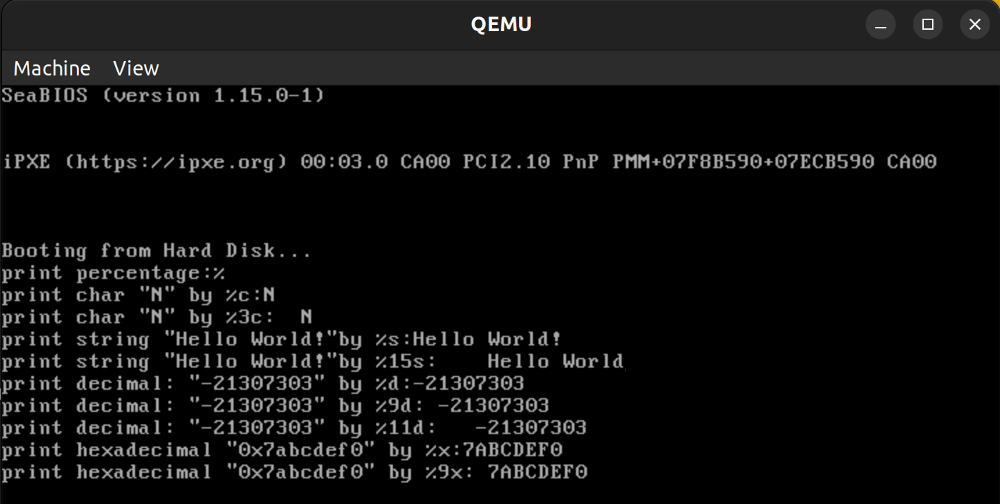
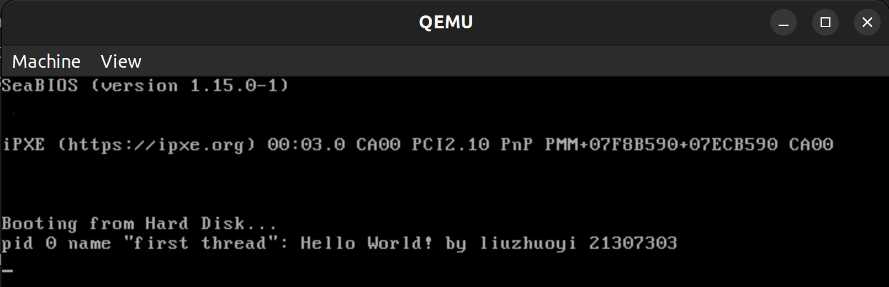
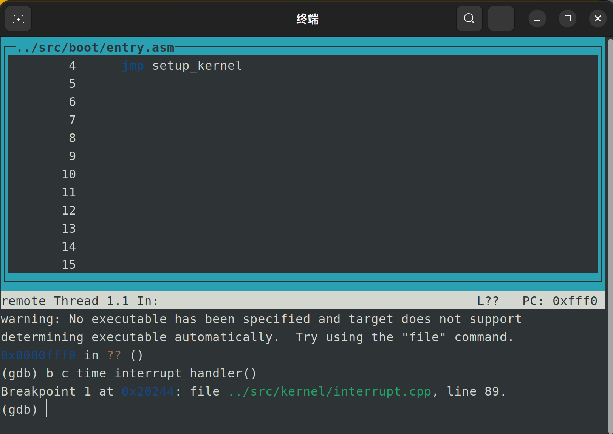
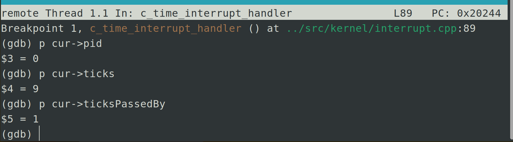
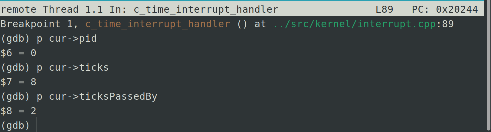
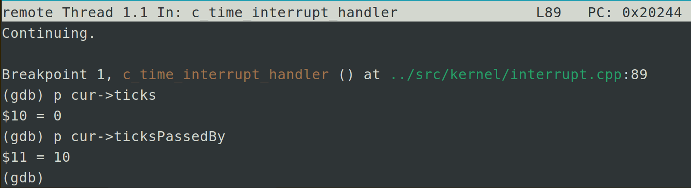
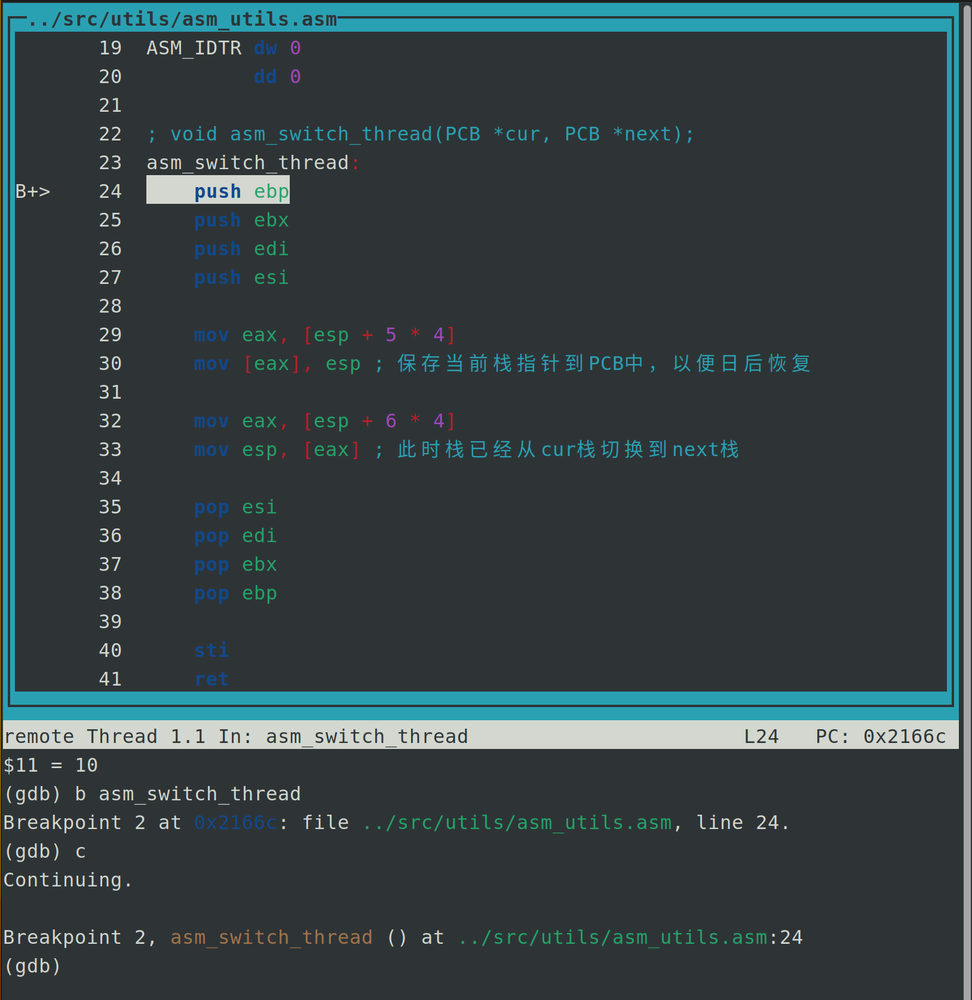
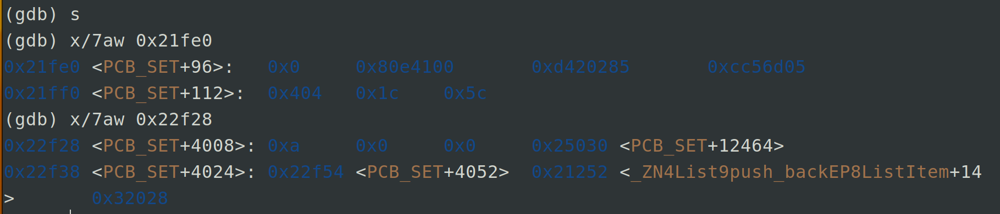
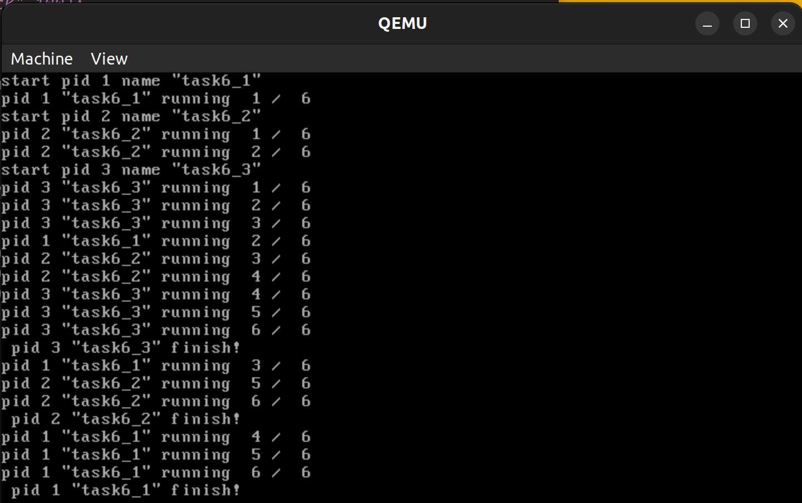
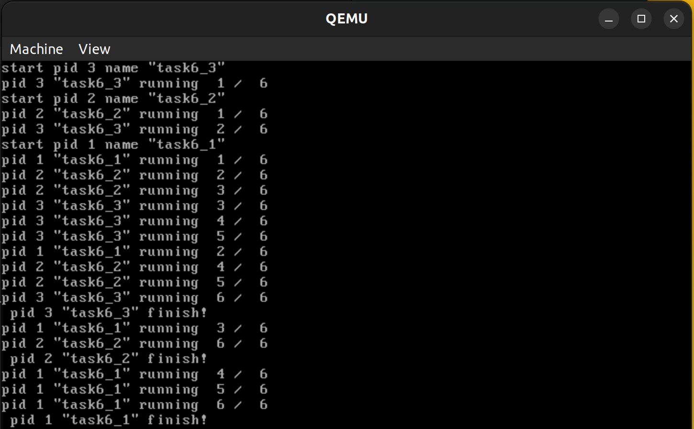

<center><font size=6>本科生实验报告</font></center>

实验课程:操作系统原理

实验名称:lab5

专业名称:计算机科学与技术(人工智能与大数据方向)

学生姓名:刘卓逸

学生学号:21307303

实验地点:东校园实验中心大楼D503

实验成绩:

报告时间:2023年5月4日

<div style="page-break-after:always"></div>

## 1.实验要求

> + DDL：2023.5.4 23:59
> + 提交的内容：将**3+1（选做）个assignment的代码**和**实验报告**放到**压缩包**中，命名为“**lab5-姓名-学号**”，并交到课程邮箱 os_sysu_lab@163.com
>   将实验报告的pdf提交至 http://inbox.weiyun.com/clh4JgCg
> + **材料的Example的代码放置在 `src`目录下**。

1. 实验不限语言， C/C++/Rust都可以。
2. 实验不限平台， Windows、Linux和MacOS等都可以。
3. 实验不限CPU， ARM/Intel/Risc-V都可以。

## 2.实验过程

### Assignment 1 printf的实现

#### 实验内容

学习可变参数机制，然后实现printf，你可以在材料中的printf上进行改进，或者从头开始实现自己的printf函数。结果截图并说说你是怎么做的。

#### 实验原理

实现printf前，要先实现一个能直接输出字符串的函数，要处理好 `\n`、滚屏等。

实现printf，重要的是遇到 `%`时，立刻去检查 `%`后面的参数，分情况处理

+ `%%`。输出一个 `%`。
+ `%c`。输出 `ap`指向的字符。
+ `%s`。输出 `ap`指向的字符串的地址对应的字符串。
+ `%d`。输出 `ap`指向的数字对应的十进制表示。
+ `%x`。输出 `ap`指向的数字对应的16进制表示。
+ 其他。不做任何处理。

对于 `%d`,`%x`,`%o`,可以先把数值转化成字符串再输出。进制转换时要特别处理0的情况

`在实验手册的基础上`，增加了对 `基础的用空格填充右对齐场宽`的支持。

在 `%`后若是数字，这将该串数字储存到temp中，输出前先判断输出长度len，若不足temp，则先输出temp-len个空格

#### 实验代码

修改代码部分

```cpp
int printf(const char *const fmt, ...)
{
    const int BUF_LEN = 32;

    char buffer[BUF_LEN + 1];
    char number[33];

    int idx, counter;
    va_list ap;

    va_start(ap, fmt);
    idx = 0;
    counter = 0;

    for (int i = 0; fmt[i]; ++i)
    {
        //在case外就要定义好局部变量
    	int t=0,t2=0,t3=0;
    	char *strs=nullptr;
        if (fmt[i] != '%')
        {
            counter += printf_add_to_buffer(buffer, fmt[i], idx, BUF_LEN);
        }
        else
        {
            i++;
            while (fmt[i]>='0' && fmt[i]<='9'){
            	t=(t<<3)+(t<<1)+fmt[i]-'0';
            	i++;
            }
        
            if (fmt[i] == '\0')
            {
                break;
            }

            switch (fmt[i])
            {
            case '%':
                counter += printf_add_to_buffer(buffer, fmt[i], idx, BUF_LEN);
                break;

            case 'c':
                //补空格
            	for (;t>1;t--) counter += printf_add_to_buffer(buffer,' ', idx, BUF_LEN); 
                counter += printf_add_to_buffer(buffer, va_arg(ap, char), idx, BUF_LEN);
                break;

            case 's':   
                strs=va_arg(ap,char *);
                //求输出长度
                for(;strs[t2];t2++){} 
                //补空格
                for (;t>t2;t--) counter += printf_add_to_buffer(buffer,' ', idx, BUF_LEN);
            	buffer[idx] = '\0';
                idx = 0;
                counter += stdio.print(buffer);
                counter += stdio.print(strs);
                break;

            case 'd':
            case 'x':
                int temp = va_arg(ap, int);

                if (temp < 0 && fmt[i] == 'd')
                {
                    temp = -temp;
                    t2=t3=1;
                }
                itos(number, temp, (fmt[i] == 'd' ? 10 : 16));
                //求输出长度
                for(;number[t2];t2++){} 
                //补空格
                for (;t>t2;t--) counter += printf_add_to_buffer(buffer,' ', idx, BUF_LEN);
		        if (t3)
                {
                    counter += printf_add_to_buffer(buffer, '-', idx, BUF_LEN);
                }
                for (int j = 0; number[j]; ++j)
                {
                    counter += printf_add_to_buffer(buffer, number[j], idx, BUF_LEN);
                }
                break;
            }
        
        }
    }

    buffer[idx] = '\0';
    counter += stdio.print(buffer);

    return counter;
}
```

```cpp
extern "C" void setup_kernel()
{
    // 中断处理部件
    interruptManager.initialize();
    // 屏幕IO处理部件
    stdio.initialize();
    interruptManager.enableTimeInterrupt();
    interruptManager.setTimeInterrupt((void *)asm_time_interrupt_handler);
    //asm_enable_interrupt();
    printf("print percentage:%%\n"
    	   "print char \"N\" by %%c:%c\n"
           "print char \"N\" by %%3c:%3c\n"
           "print string \"Hello World!\"by %%s:%s\n"
           "print string \"Hello World!\"by %%15s:%15s\n"
           "print decimal: \"-21307303\" by %%d:%d\n"
           "print decimal: \"-21307303\" by %%9d:%9d\n"
           "print decimal: \"-21307303\" by %%11d:%11d\n"
           "print hexadecimal \"0x7abcdef0\" by %%x:%x\n"
           "print hexadecimal \"0x7abcdef0\" by %%9x:%9x\n",
           'N','N', "Hello World!", "Hello World",-21307303, -21307303,-21307303,0x7abcdef0,0x7abcdef0);
    //uint a = 1 / 0;
    asm_halt();
}
```

#### 实验结果



基础的场宽也有正常工作

### Assignment 2 线程的实现

#### 实验内容

自行设计PCB，可以添加更多的属性，如优先级等，然后根据你的PCB来实现线程，演示执行结果。

#### 实验原理

1.设计PCB(Process Control Block，进程控制块)，储存记录进程信息，内容包括：

+ `stack`指向栈底的指针，从这个指针指向的位置往低地址方向就是该PCB的页，线程被换下时保存esp的内容，换上时恢复esp
+ `name`进程名称
+ `priority`优先级
+ `pid`线程标识符
+ `ticks`剩余执行次数，每一次中断则-1，到0就会被换下
+ `ticksPassedBy` 线程执行 `tick`的总数
+ `tagInGeneralList`和 `tagInAllList`是线程在线程队列中的标识，用于在线程队列中找到线程的PCB。
+ 以及其他自定义的有用信息

2.实现PCB的分配

在实验中我们直接在内存中预留空间来管理与存放PCB

要实现PCB的分配与归还两个函数

3.线程创建，步骤包括：

+ 关闭中断
+ 申请PCB并初始化
+ 将信息塞进线程栈
+ 恢复中断

4.线程调度

在时钟中断，若当前线程的执行次数已经用完，那么执行线程调度

#### 实验代码

```cpp
struct PCB
{
    int *stack;                      // 栈指针，用于调度时保存esp
    char name[MAX_PROGRAM_NAME + 1]; // 线程名
    enum ProgramStatus status;       // 线程的状态
    int priority;                    // 线程原本优先级
    int cur_priority;		     // 线程当前优先级(new)
    int pid;                         // 线程pid
    int ticks;                       // 线程时间片总时间
    int ticksPassedBy;               // 线程已执行时间
    ListItem tagInGeneralList;       // 线程队列标识
    ListItem tagInAllList;           // 线程队列标识
};
```

```cpp
int ProgramManager::executeThread(ThreadFunction function, void *parameter, const char *name, int priority)
{
    // 关中断，防止创建线程的过程被打断
    bool status = interruptManager.getInterruptStatus();
    interruptManager.disableInterrupt();

    // 分配一页作为PCB
    PCB *thread = allocatePCB();

    if (!thread)
        return -1;

    // 初始化分配的页
    memset(thread, 0, PCB_SIZE);

    for (int i = 0; i < MAX_PROGRAM_NAME && name[i]; ++i)
    {
        thread->name[i] = name[i];
    }

    thread->status = ProgramStatus::READY;
    thread->priority = priority;
    thread->cur_priority=priortiy; //(new)
    thread->ticks = priortiy*10;
    thread->ticksPassedBy = 0;
    thread->pid = ((int)thread - (int)PCB_SET) / PCB_SIZE;

    // 线程栈
    thread->stack = (int *)((int)thread + PCB_SIZE);
    thread->stack -= 7;
    thread->stack[0] = 0;
    thread->stack[1] = 0;
    thread->stack[2] = 0;
    thread->stack[3] = 0;
    thread->stack[4] = (int)function;
    thread->stack[5] = (int)program_exit;
    thread->stack[6] = (int)parameter;

    allPrograms.push_back(&(thread->tagInAllList));
    readyPrograms.push_back(&(thread->tagInGeneralList));

    // 恢复中断
    interruptManager.setInterruptStatus(status);

    return thread->pid;
}
```

#### 实验结果



线程有正确创建

### Assignment 3 线程调度切换的秘密

#### 实验内容

编写若干个线程函数，使用gdb跟踪 `c_time_interrupt_handler`、`asm_switch_thre ead`等函数，观察线程切换前后栈、寄存器、PC等变化，结合gdb、材料中“线程的调度”的内容来跟踪并说明下面两个过程。

`ad`等函数，观察线程切换前后栈、寄存器、PC等变化，结合gdb、材料中“线程的调度”的内容来跟踪并说明下面两个过程。

+ 一个新创建的线程是如何被调度然后开始执行的。
+ 一个正在执行的线程是如何被中断然后被换下处理器的，以及换上处理机后又是如何从被中断点开始执行的。

#### 实验过程

先给c_time_interrupt_handler设置断点



查看每次时钟中断发生后当前运行的线程的经过时间片和剩余时间片的变化：





...



可以看到，新创建的线程会被分配一个时间片，并被加入到一个 CPU 运行队列中。每次时钟中断发生后，当前运行的线程经过时间片加 1，剩余时间片减 1。

当剩余时间片为 0 时，分配给该线程的时间已耗尽，下面进行调度。就该执行asm_switch_thread。



asm_switch_thread 实现了线程栈的切换，线程栈的切换实际上就是将线程的栈指针放到esp中。



系统会保存准备被换下线程的上下文，包括栈、寄存器、PC 等。

下次被换上时，会恢复该线程的环境，并且CPU的pc跳转到该线程pc所指的位置继续执行

### Assignment 4 调度算法的实现

#### 实验内容

同学们需要将线程调度算法修改为上面提到的算法或者是同学们自己设计的算法。然后，同学们需要自行编写测试样例来呈现你的算法实现的正确性和基本逻辑。最后，将结果截图并说说你是怎么做的。**（先来先服务为必做，其他为选做）**

#### 实验原理

先到的进程优先执行，优先级为x则一次执行x*10个ticks，这样优先级大的执行时间就长于优先级小的。

若ticks用完了线程还没结束，那么重新排队

这样新来的很快就能执行完的线程可能需要等待前面的长时间线程执行完才能执行，浪费了大量等待时间

#### 实验代码

```cpp
void ProgramManager::schedule()
{
    bool status = interruptManager.getInterruptStatus();
    interruptManager.disableInterrupt();

    if (readyPrograms.size() == 0)
    {
        interruptManager.setInterruptStatus(status);
        return;
    }

    if (running->status == ProgramStatus::RUNNING)
    {
        running->status = ProgramStatus::READY;
        running->ticks = running->priority*10;
        readyPrograms.push_back(&(running->tagInGeneralList));
    }
    else if (running->status == ProgramStatus::DEAD)
    {
        releasePCB(running);
    }
  
    ListItem *item = readyPrograms.front();
    PCB *next = ListItem2PCB(item, tagInGeneralList);
    PCB *cur = running;
    next->status = ProgramStatus::RUNNING;
    running = next;
    readyPrograms.pop_front(); 

    asm_switch_thread(cur, next);

    interruptManager.setInterruptStatus(status);
}
```

#### 实验结果



一个循环所有线程依次执行优先级遍

### Assignment 4+ 自定义调度算法

#### 实验原理

`自定义调度方法`:

每次线程被换下前，优先级自动-1。优先级到达0时，自动变回最初的优先级

优先级大的进程经过若干次时间片后优先级会衰减，这样就能顾及到优先级低的进程。

同时，由于优先级大的进程在一次循环中更多时间处在高优先级，于是会得到比低优先级更多的时间片

如原本优先级为5的线程就会获得5倍于优先级为1的线程。原本优先级为n的线程就会获得n/m倍于原本优先级m的线程的时间片

一个新来的非常重要或者是很短的任务，可以有一个较大的初始优先级先执行，不用到队列末尾

#### 实验代码

```cpp
void ProgramManager::schedule()
{
    bool status = interruptManager.getInterruptStatus();
    interruptManager.disableInterrupt();

    if (readyPrograms.size() == 0)
    {
        interruptManager.setInterruptStatus(status);
        return;
    }

    if (running->status == ProgramStatus::RUNNING)
    {
        running->status = ProgramStatus::READY;
        //ticks设为固定，初始化时也是固定10，代码就改一点不再展出
        running->ticks = 10; 
        //优先级衰减
        running->cur_priority = (running->cur_priority<=1)? running->priority : running->cur_priority-1;
        readyPrograms.push_back(&(running->tagInGeneralList));
    }
    else if (running->status == ProgramStatus::DEAD)
    {
        releasePCB(running);
    }
    int highest=0,highest_id=0;
    PCB *next=nullptr;
    ListItem *tp=readyPrograms.front();
    //寻找最大优先级
    for (int i=0; i<readyPrograms.size(); i++){
    	PCB *temp = ListItem2PCB(tp, tagInGeneralList);
    	if (temp->cur_priority > highest){
    	    highest=temp->cur_priority;
    	    highest_id=i;
    	    next=temp;
    	}
    	tp=tp->next;
    }
    //ListItem *item = readyPrograms.front();
    //PCB *next = ListItem2PCB(item, tagInGeneralList);
    PCB *cur = running;
    next->status = ProgramStatus::RUNNING;
    running = next;
    readyPrograms.erase(highest_id); 

    asm_switch_thread(cur, next);

    interruptManager.setInterruptStatus(status);
}
```

#### 实验结果



过程(*原优先级(当前优先级)*)

3(3)->2(2)->3(2)->1(1)->2(1)->2(2)->

3(1)->3(3)->3(2)->1(1)->2(1)->2(2)->

3(1)#->1(1)->2(1)#->1(1)#

正确按照预期执行了调度

## 3.总结

通过本次实验，我加深了对线程的理解，对线程调度算法有了深入思考.

不得不感慨学好c/c++的重要性

<style>
    img[alt="def"]{
        width:450px;
    }
</style>
