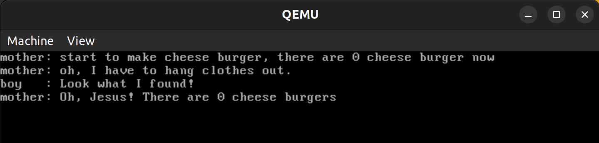
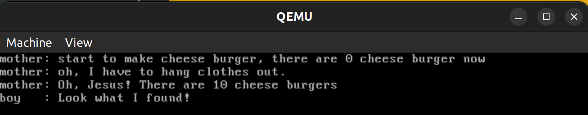
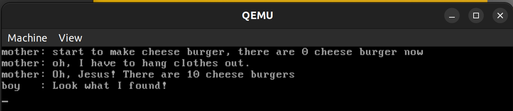
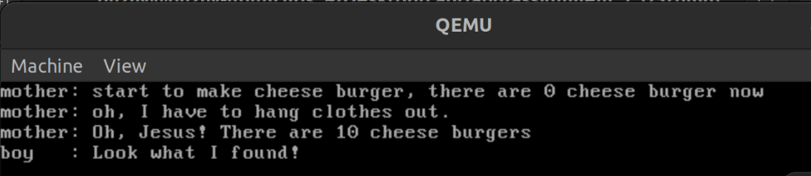
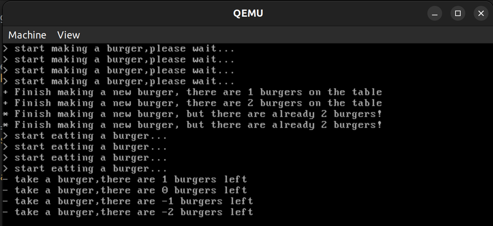
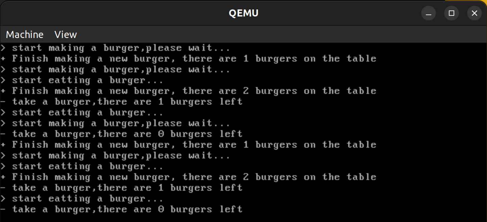
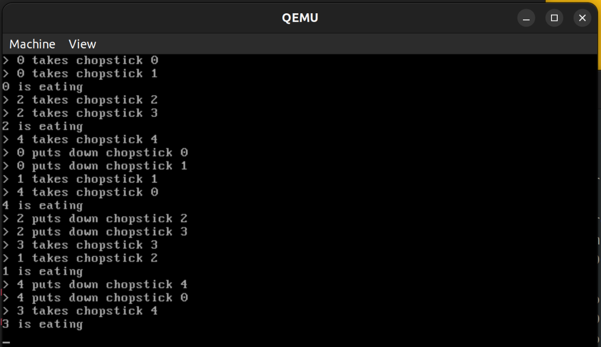
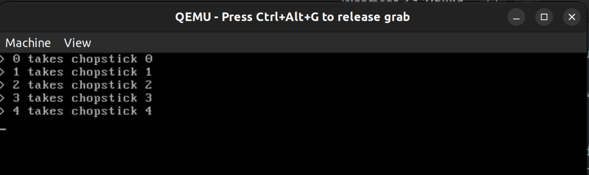
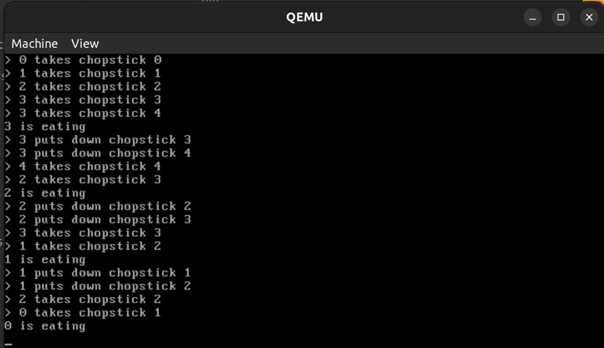
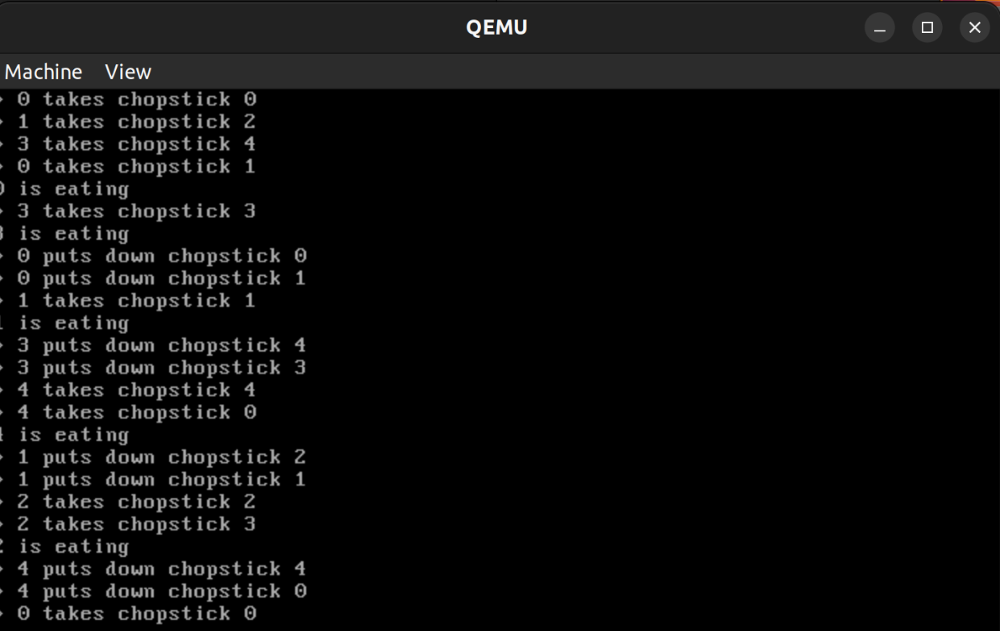

<center><font size=6>本科生实验报告</font></center>

实验课程:操作系统原理

实验名称:lab6 

专业名称:计算机科学与技术(人工智能与大数据方向)

学生姓名:刘卓逸

学生学号:21307303

实验地点:东校园实验中心大楼D503

实验成绩:

报告时间:2023年5月12日

<div style="page-break-after:always"></div>

## 1.实验要求

> - DDL：2023.05.18 23:59
>
> + 提交的内容：将**3个assignment的代码**和**实验报告**放到**压缩包**中，命名为“**lab6-姓名-学号**”，并交到课程邮箱 os_sysu_lab@163.com
>
>   将实验报告的pdf提交至 http://inbox.weiyun.com/izossU8G
>
> - **材料的代码放置在 `src`目录下**。

1. 实验不限语言， C/C++/Rust都可以。
2. 实验不限平台， Windows、Linux和MacOS等都可以。
3. 实验不限CPU， ARM/Intel/Risc-V都可以。

## 2.实验过程

### Assignment 1.1 代码复现

#### 实验内容

在本章中，我们已经实现了自旋锁和信号量机制。现在，同学们需要复现教程中的自旋锁和信号量的实现方法，分别使用二者解决一个同步互斥问题，如消失的芝士汉堡问题。最后，将结果截图并说说你是怎么做的。

#### 实验原理

**自旋锁**

定义“访问共有资源的代码”为临界区，线程想访问共有资源必须经过临界区。

为临界区定义一个共享变量`bolt`，线程进入临界区前，先判断`bolt`是否为0，为0则代表该没有其他线程在临界区，先设为1再进入临界区，否则代表有其他线程，循环检查`bolt`直到为0再进入

**信号量**

与自旋锁差不多，不过临界区可以不只一个线程访问，用counter记录还有多少个线程可以访问该临界区(但counter相当于一个共享变量，所以得借助自旋锁实现counter).若counter>0，则counter-1，释放counter的自旋锁，然后访问临界区；如果counter<=0，那么**直接把当前线程阻塞**，执行线程调度。由于阻塞塞进的是`waiting`而不是`programManager`中，所以不会被调度执行

#### 实验代码

**自旋锁**

```cpp
class SpinLock
{
private:
    // 共享变量
    uint32 bolt;
public:
    SpinLock();
    void initialize();
    // 请求进入临界区
    void lock();
    // 离开临界区
    void unlock();
};
```

```cpp
SpinLock::SpinLock()
{
    initialize();
}
void SpinLock::initialize()
{
    bolt = 0;
}
void SpinLock::lock()
{
    uint32 key = 1;

    do
    {
        asm_atomic_exchange(&key, &bolt);
    } while (key);
}
```

```asm
; void asm_atomic_exchange(uint32 *register, uint32 *memeory);
asm_atomic_exchange:
    push ebp
    mov ebp, esp
    pushad

    mov ebx, [ebp + 4 * 2] ; register
    mov eax, [ebx]      ; 取出register指向的变量的值
    mov ebx, [ebp + 4 * 3] ; memory
    xchg [ebx], eax      ; 原子交换指令
    mov ebx, [ebp + 4 * 2] ; memory
    mov [ebx], eax      ; 将memory指向的值赋值给register指向的变量

    popad
    pop ebp
    ret
```

**信号量**

```c++
class Semaphore
{
private:
    uint32 counter;
    List waiting;
    SpinLock semLock;

public:
    Semaphore();
    void initialize(uint32 counter);
    void P(); //申请"锁"
    void V(); //撤销"锁"
};
```

```c++
void Semaphore::P()
{
    PCB *cur = nullptr;

    while (true)
    {
        semLock.lock();
        if (counter > 0)
        {
            --counter;
            semLock.unlock();
            return;
        }

        cur = programManager.running;
        waiting.push_back(&(cur->tagInGeneralList));
        cur->status = ProgramStatus::BLOCKED;

        semLock.unlock();
        programManager.schedule();
    }
}

void Semaphore::V()
{
    semLock.lock();
    ++counter;
    //将一个需要该信号量的线程拉回programManager
    if (waiting.size()) 
    {
        PCB *program = ListItem2PCB(waiting.front(), tagInGeneralList);
        waiting.pop_front();
        semLock.unlock();
        programManager.MESA_WakeUp(program);
    }
    else
    {
        semLock.unlock();
    }
}
```

#### 实验结果

没有锁



用自旋锁



用信号量



### Assignment 1.2 锁机制的实现

#### 实验内容

我们使用了原子指令 `xchg`来实现自旋锁。但是，这种方法并不是唯一的。例如，x86指令中提供了另外一个原子指令 `bts`和 `lock`前缀等，这些指令也可以用来实现锁机制。现在，同学们需要结合自己所学的知识，实现一个与本教程的实现方式不完全相同的锁机制。最后，测试你实现的锁机制，将结果截图并说说你是怎么做的。

提示：在 `asm_utils.asm`中实现你自己的原子操作 `your_asm_atomic_exchange`，并在 `sync.cpp`中做相应修改。

#### 实验原理

在x86汇编语言中，有一些专门用于实现锁机制的指令，例如：

+ LOCK前缀：可以在任何修改内存内容的指令前加上LOCK前缀，表示在执行该指令期间，CPU不响应其他处理器对总线的请求，从而保证对内存的独占访问。
+ XCHG指令：可以用来交换两个操作数的值，如果其中一个操作数是内存单元，那么该指令会自动加上LOCK前缀，从而实现原子操作。
+ CMPXCHG指令：可以用来比较两个操作数的值，如果相等，则将第三个操作数的值存入第一个操作数；如果不相等，则将第一个操作数的值存入EAX寄存器。这个指令也会自动加上LOCK前缀，从而实现原子操作。
+ BTS指令是将寄存器中的某一位(从0开始计数)的值复制到CF标志，然后将原本的该位赋为1。可以与LOCK前缀结合使用
  
但是本质上就是个交换内存中数交换的函数，将两个数都加载到寄存器，然后交叉载回内存就实现了交换。全部指令打上`lock`前缀进行保护

#### 实验代码

```
asm_atomic_exchange:
    push ebp
    mov ebp, esp
    pushad

    lock mov ecx, [ebp + 4 * 2] 
    lock mov eax, [ecx] ;eax=*n1 
    lock mov ecx, [ebp + 4 * 3]  
    lock mov ebx, [ecx] ;ebx=*n2
    lock mov [ecx], eax ;*n2=eax
    lock mov ecx, [ebp + 4 * 2]
    lock mov [ecx], ebx	;*n1=ebx
    
    popad
    pop ebp
    ret
```

#### 实验结果



### Assignment 2.1 Race Condition

#### 实验内容

同学们可以任取一个生产者-消费者问题，然后在lab6的代码环境下创建多个线程来模拟这个问题。在2.1中，我们不使用任何同步互斥的工具。因此，这些线程可能会产生冲突，进而无法产生我们预期的结果。同学们需要将这个产生错误的场景呈现出来，将结果截图并说说你是怎么做的。

#### 实验原理

场景设定：会有4个厨师，4个吃货。桌子上只够放2个汉堡。厨师等到桌子上有位置放新汉堡时时就会去花费时间去制作一个汉堡，制作完成后立刻上菜，但上菜时发现桌子已满就会把汉堡扔掉，吃货一看到桌上有多的汉堡就会花费时间去吃汉堡

厨师没有协调，没有汉堡时全都去做汉堡，就会在前两个汉堡被吃完前上新的汉堡导致汉堡被扔掉(相当于有界缓冲区问题)；吃货见到汉堡就上桌，吃完的那一刻汉堡-1，扎堆吃会导致汉堡数量减到负数(读者-写着问题，上一个吃货作为写者，下一个吃货应该看到上一个吃货写的-1而选择等待下一个汉堡)

#### 实验代码

```cpp
void a_cooker(void *arg)
{
    int delay=0;
    while (cheese_burger>=2);
    printf("> start making a burger,please wait...\n");
    delay = 0xaffffff;
    while (delay)
        --delay;
    if (cheese_burger>=2)
    	printf("* Finish making a new burger, but there are already 2 burgers!\n");
    else{
        cheese_burger++;
        printf("+ Finish making a new burger, there are %d burgers on the table\n",cheese_burger);
    }
}

void a_foodie(void *arg)
{
    while (cheese_burger<=0);
    printf("> start eatting a burger...\n");
    int delay = 0xfffffff;
    while (delay) 
    	--delay;
    	
    cheese_burger--;
    printf("- take a burger,there are %d burgers left\n",cheese_burger);
}

void first_thread(void *arg)
{
    // 第1个线程不可以返回
    stdio.moveCursor(0);
    for (int i = 0; i < 25 * 80; ++i)
    {
        stdio.print(' ');
    }
    stdio.moveCursor(0);

    cheese_burger = 0;
    makeburger.initialize(1);
    eatburger.initialize(1);
    programManager.executeThread(a_cooker, nullptr, "cooker1", 1);
    programManager.executeThread(a_cooker, nullptr, "cooker2", 1);
    programManager.executeThread(a_foodie, nullptr, "foodie1", 1);
    programManager.executeThread(a_foodie, nullptr, "foodie2", 1);
    programManager.executeThread(a_cooker, nullptr, "cooker3", 1);
    programManager.executeThread(a_cooker, nullptr, "cooker4", 1);
    programManager.executeThread(a_foodie, nullptr, "foodie3", 1);
    programManager.executeThread(a_foodie, nullptr, "foodie4", 1);
    asm_halt();
}
```

#### 实验结果



### Assignment 2.2 信号量解决方法

#### 实验内容

使用信号量解决上述你模拟的生产者-消费者问题。将结果截图并说说你是怎么做的。

#### 实验原理

规定每次只能一个厨师去做汉堡，一个吃货去吃汉堡。一个吃货在吃汉堡时，是可以有一个厨师做汉堡的，所以吃汉堡和做汉堡分开两个锁(虽然都是修改值但是方向相反)

#### 实验代码

```cpp
void a_cooker(void *arg)
{
    int delay=0;
    makeburger.P(); //上锁
    while (cheese_burger>=2);
    printf("> start making a burger,please wait...\n");
    delay = 0xaffffff;
    while (delay)
        --delay;
    if (cheese_burger>=2)
    	printf("* Finish making a new burger, but there are already 2 burgers!\n");
    else{
    cheese_burger++;
    printf("+ Finish making a new burger, there are %d burgers on the table\n",cheese_burger);
    }
    makeburger.V(); //释放锁
}

void a_foodie(void *arg)
{
    eatburger.P(); //上锁
    while (cheese_burger<=0); 
    printf("> start eatting a burger...\n");
    int delay = 0xfffffff;
    while (delay) 
    	--delay;
    	
    cheese_burger--;
    printf("- take a burger,there are %d burgers left\n",cheese_burger);
    eatburger.V(); //释放锁
}
```

#### 实验结果



### Assignment 3.1 哲学家就餐问题-初步解决方法

#### 实验内容

同学们需要在本教程的代码环境下，创建多个线程来模拟哲学家就餐的场景。然后，同学们需要结合信号量来实现理论课教材中给出的关于哲学家就餐问题的方法。最后，将结果截图并说说你是怎么做的。

该方案可能导致死锁，请举例出现死锁的场景和原因，并提出一种解决死锁的方案。

#### 实验原理

一个线程代表一位哲学家，一个锁代表一根筷子

#### 实现代码


```cpp
const int N=5;

Semaphore chopstick[5];

template<int T>
void philosopher(void *arg)
{
	int id=T;
	//int id=4;
	int left=id;
	int right=(id+1)%N;
	while (1){
		chopstick[left].P();
		printf("> %d takes chopstick %d\n",id,left);
		chopstick[right].P();
		printf("> %d takes chopstick %d\n",id,right);
		
		printf("%d is eating\n",id);
		int delay=0x3fffffff;
		while (delay>0) 
			--delay;
			
		chopstick[left].V();
		printf("> %d puts down chopstick %d\n",id,left);
		chopstick[right].V();
		printf("> %d puts down chopstick %d\n",id,right);
		
		delay=0x3fffffff;
		while (delay>0) 
			--delay;
		
	}
}

void first_thread(void *arg)
{
    // 第1个线程不可以返回
    stdio.moveCursor(0);
    for (int i = 0; i < 25 * 80; ++i)
    {
        stdio.print(' ');
    }
    stdio.moveCursor(0);
    for (int i = 0; i < 5; ++i)
    {
    	chopstick[i].initialize(1);
    }
    programManager.executeThread(philosopher<0>, nullptr, "p0", 1);
    programManager.executeThread(philosopher<1>, nullptr, "p1", 1);
    programManager.executeThread(philosopher<2>, nullptr, "p2", 1);
    programManager.executeThread(philosopher<3>, nullptr, "p3", 1);
    programManager.executeThread(philosopher<4>, nullptr, "p4", 1);
    asm_halt();
}
```


#### 实验结果

**正常实现哲学家就餐问题**




### Assignment 3.2 哲学家就餐问题-死锁解决方法

#### 实验内容

虽然3.1的解决方案保证两个邻居不能同时进食，但是它可能导致死锁。现在，同学们需要想办法将死锁的场景演示出来。提出一种解决死锁的方法并实现。最后，将结果截图并说说你是怎么做的。

#### 实验原理

**构造死锁**

每位哲学家都尝试拿左边的筷子，然后休息一段时间再去拿右边的筷子，这样所有哲学家都在等右边的筷子

**解决办法1**

在构造死锁的代码基础上，至多允许4位哲学家拿起筷子

**解决方法2**

编号为偶数的哲学家先拿左边的筷子再拿右边

编号为奇数的哲学家先拿右边的筷子再拿左边

这样哲学家们永远先去拿偶数的筷子，

两个哲学家竞争偶数筷子时，必是还没有拿筷子的

两个哲学家竞争奇数筷子时，必是只差这一根筷子的

#### 实验代码

**构造死锁**

```cpp
template<int T>
void philosopher(void *arg)
{
	int id=T;
	//int id=4;
	int left=id;
	int right=(id+1)%N;
	while (1){
		chopstick[left].P();
		printf("> %d takes chopstick %d\n",id,left);
		
		int delay=0x3fffffff;
		while (delay>0) 
			--delay;
			
		chopstick[right].P();
		printf("> %d takes chopstick %d\n",id,right);
		
		printf("%d is eating\n",id);
		delay=0x3fffffff;
		while (delay>0) 
			--delay;
			
		chopstick[left].V();
		printf("> %d puts down chopstick %d\n",id,left);
		chopstick[right].V();
		printf("> %d puts down chopstick %d\n",id,right);
		
		delay=0x3fffffff;
		while (delay>0) 
			--delay;
		
	}
}
```

**解决方法1**

```c++
const int N=5;

Semaphore chopstick[5];
Semaphore takeon;


template<int T>
void philosopher(void *arg)
{
	int id=T;
	//int id=4;
	int left=id;
	int right=(id+1)%N;
	while (1){
		takeon.P(); //增加锁
		chopstick[left].P();
		printf("> %d takes chopstick %d\n",id,left);
		
		int delay=0x3fffffff;
		while (delay>0) 
			--delay;
			
		chopstick[right].P();
		printf("> %d takes chopstick %d\n",id,right);
		
		printf("%d is eating\n",id);
		delay=0x3fffffff;
		while (delay>0) 
			--delay;
			
		chopstick[left].V();
		printf("> %d puts down chopstick %d\n",id,left);
		chopstick[right].V();
		printf("> %d puts down chopstick %d\n",id,right);
		takeon.V();
		
		delay=0x3fffffff;
		while (delay>0) 
			--delay;
		
	}
}

void first_thread(void *arg)
{
    // 第1个线程不可以返回
    stdio.moveCursor(0);
    for (int i = 0; i < 25 * 80; ++i)
    {
        stdio.print(' ');
    }
    stdio.moveCursor(0);
    takeon.initialize(4); //至多4位进餐
    for (int i = 0; i < 5; ++i)
    {
    	chopstick[i].initialize(1);
    }
    programManager.executeThread(philosopher<0>, nullptr, "p0", 1);
    programManager.executeThread(philosopher<1>, nullptr, "p1", 1);
    programManager.executeThread(philosopher<2>, nullptr, "p2", 1);
    programManager.executeThread(philosopher<3>, nullptr, "p3", 1);
    programManager.executeThread(philosopher<4>, nullptr, "p4", 1);
    asm_halt();
}
```

**解决方法2**

```cpp
template<int T>
void philosopher(void *arg)
{
	int id=T;
	//int id=4;
	int left=id;
	int right=(id+1)%N;
	//当id为奇数,先去申请原本的右边
	if (id&1){ 
		asm_atomic_exchange((uint32 *)&left,(uint32 *) &right);
	}
	while (1){
		chopstick[left].P();
		printf("> %d takes chopstick %d\n",id,left);
		
		int delay=0x3fffffff;
		while (delay>0) 
			--delay;
			
		chopstick[right].P();
		printf("> %d takes chopstick %d\n",id,right);
		
		printf("%d is eating\n",id);
		delay=0x3fffffff;
		while (delay>0) 
			--delay;
			
		chopstick[left].V();
		printf("> %d puts down chopstick %d\n",id,left);
		chopstick[right].V();
		printf("> %d puts down chopstick %d\n",id,right);
		
		delay=0x3fffffff;
		while (delay>0) 
			--delay;
		
	}
}
```

#### 实验结果

**构造死锁**



**解决办法1 至多4位拿起筷子**

可以看到编号4的哲学家没有急着拿起4号筷子



**解决办法2 先去抢偶数的**



都顺利的解决了死锁

## 3.总结

通过这次实验，我临界区、锁有了深入地了解与思考，了解到了死锁问题，并学习了解决死锁问题的方法

<style>
    img[alt="def"]{
        width:450px;
    }
</style>
