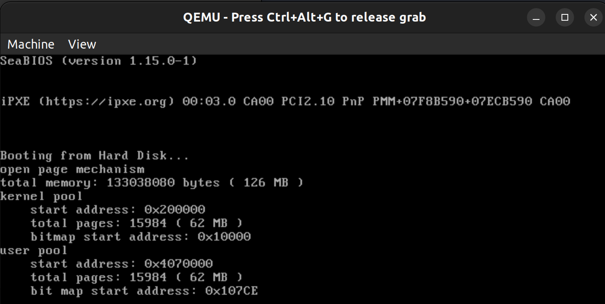
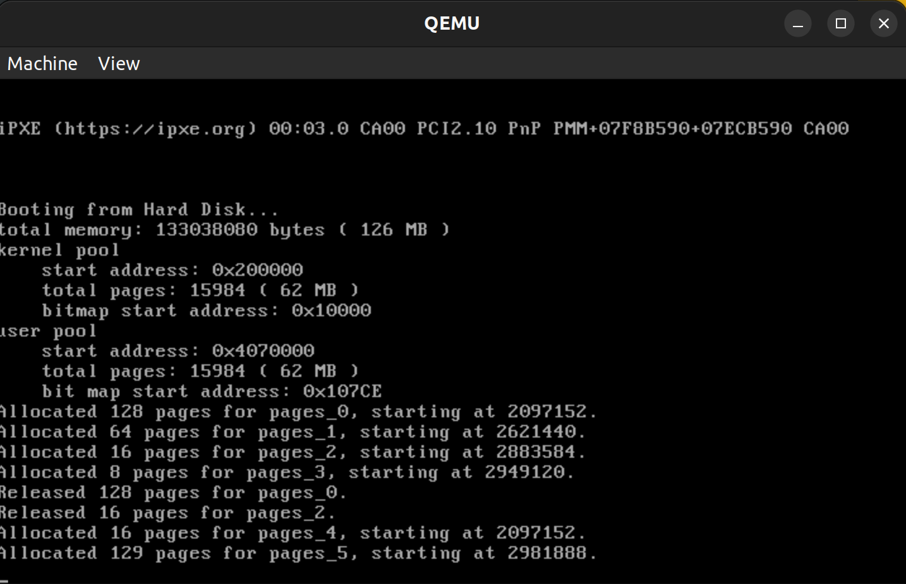
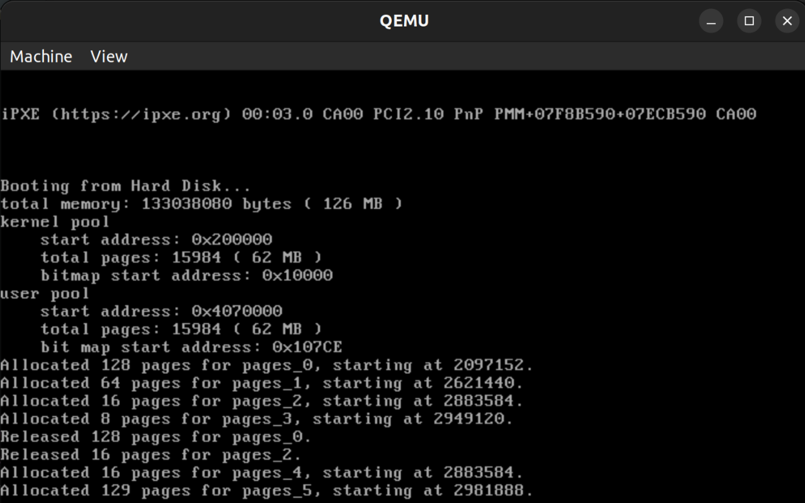
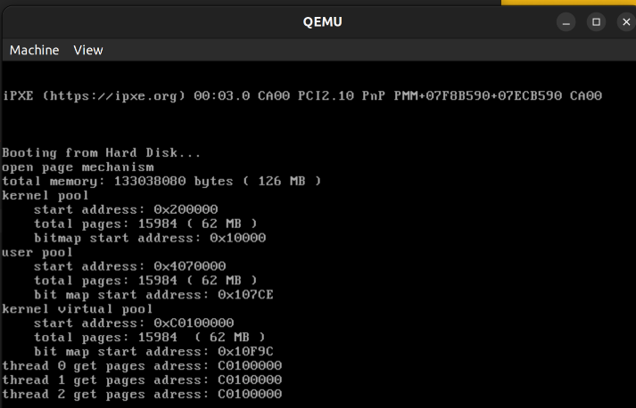
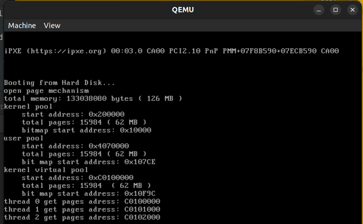

<center><font size=6>本科生实验报告</font></center>

实验课程:操作系统原理

实验名称:lab7 第六章 内存管理

专业名称:计算机科学与技术(人工智能与大数据方向)

学生姓名:刘卓逸

学生学号:21307303

实验地点:东校园实验中心大楼D503

实验成绩:

报告时间:2023年5月26日

<div style="page-break-after:always"></div>

## 1.实验要求

> - DDL：2023.06.01 23:59
> - 提交的内容：将**3+1（选做）个assignment的代码**和**实验报告**放到**压缩包**中，命名为“**lab7-姓名-学号**”，并交到课程邮箱 os_sysu_lab@163.com
>
>   将实验报告的pdf提交至 http://inbox.weiyun.com/LQktoWFt
> - **材料的代码放置在 `src`目录下**。

1. 实验不限语言， C/C++/Rust都可以。
2. 实验不限平台， Windows、Linux和MacOS等都可以。
3. 实验不限CPU， ARM/Intel/Risc-V都可以。

## 2.实验过程

### Assignment 1

#### 实验内容

复现参考代码，实现二级分页机制，并能够在虚拟机地址空间中进行内存管理，包括内存的申请和释放等，截图并给出过程解释。

#### 实验原理

**获取内存大小**

在实模式下就使用功能号为0xe801的15h中断获取内存大小，然后将该大小储存在一个固定地址中(0x7C00)，这样就能在保护模式下读取内存地址了

```asm
; 获取内存大小
    mov ax, 0xe801
    int 15h
    mov [0x7c00], ax
    mov [0x7c00+2], bx
```

```c++
    int memory = *((uint32 *)MEMORY_SIZE_ADDRESS);
    // ax寄存器保存的内容
    int low = memory & 0xffff;
    // bx寄存器保存的内容
    int high = (memory >> 16) & 0xffff;
    memory = low * 1024 + high * 64 * 1024;
    printf("total memory: %d bytes (%d MB)\n", memory, memory / 1024 / 1024);
```

**位图**

位图(BitMap)是只使用1位来记录某段资源是否被分配的数据结构,
定义如下：

```c++
class BitMap
{
public:
    // 被管理的资源个数，bitmap的总位数
    int length;
    // bitmap的起始地址
    char *bitmap;
public:
    // 初始化
    BitMap();
    // 设置BitMap，bitmap=起始地址，length=总位数(被管理的资源个数)
    void initialize(char *bitmap, const int length);
    // 获取第index个资源的状态，true=allocated，false=free
    bool get(const int index) const;
    // 设置第index个资源的状态，true=allocated，false=free
    void set(const int index, const bool status);
    // 分配count个连续的资源，若没有则返回-1，否则返回分配的第1个资源单元序号
    int allocate(const int count);
    // 释放第index个资源开始的count个资源
    void release(const int index, const int count);
    // 返回Bitmap存储区域
    char *getBitmap();
    // 返回Bitmap的大小
    int size() const;
private:
    // 禁止Bitmap之间的赋值
    BitMap(const BitMap &) {}
    void operator=(const BitMap&) {}
};
```

要修改资源单位状态时，先定位到存储第$i$个资源单元的字节序号$pos$，然后再确定第$i$个资源单元的状态位在第$pos$字节中的偏移位置$offset$，最后使用位运算来修改该位即可，如下所示。

$$
i=8\cdot pos+offset,\ 0 \le offset<8
$$

**地址池**

地址池用来标识地址空间中的哪些页是已经被分配的，哪些是未被分配的。当需要页内存分配时，我们可以从地址池中取出一个空闲页。然后地址池便会标识该空闲页已被分配，最后计算并返回该空闲页对应的地址。空闲页只要没有被释放，就不会被再次分配。

```cpp
class AddressPool
{
public:
    BitMap resources;
    int startAddress;
public:
    AddressPool();
    // 初始化地址池
    void initialize(char *bitmap, const int length,const int startAddress);
    // 从地址池中分配count个连续页，成功则返回第一个页的地址，失败则返回-1
    int allocate(const int count);
    // 释放若干页的空间
    void release(const int address, const int amount);
};
```

用BitMap来标识哪些页是空闲的。，使用 `startAddress`来记录地址池管理的页的共同起始地址。假设每一页的大小为$PAGE\_SIZE$，那么地址池中的第$i$页的起始地址$address$为

$$
address=startAddress+i\times PAGE\_SIZE
$$

**物理内存管理**

物理内存分成两个部分，第一部分是内核空间，第二部分是用户空间。实际上每个程序都有一个独立的用户空间。

为了有效隔离内核和用户程序的物理地址空间。我们将整个物理地址空间划分为两部分，内核空间和用户空间。内核需要的物理页只会从内核空间中分配，用户程序需要的物理页也只会从用户空间中分配。

```cpp
enum AddressPoolType
{
    USER,
    KERNEL
};

class MemoryManager
{
public:
    // 可管理的内存容量
    int totalMemory;
    // 内核物理地址池
    AddressPool kernelPhysical;
    // 用户物理地址池
    AddressPool userPhysical;

public:
    MemoryManager();
    // 初始化地址池
    void initialize();
    // 从type类型的物理地址池中分配count个连续的页
    // 成功，返回起始地址；失败，返回0
    int allocatePhysicalPages(enum AddressPoolType type, const int count);
    // 释放从paddr开始的count个物理页
    void releasePhysicalPages(enum AddressPoolType type, const int paddr, const int count);
    // 获取内存总容量
    int getTotalMemory();

};
```

在进行物理内存管理之前，我们需要进行初始化。

```cpp
MemoryManager::MemoryManager() {
    initialize();
}

void MemoryManager::initialize()
{
    this->totalMemory = 0;
    this->totalMemory = getTotalMemory();

    // 预留的内存，放的是内核
    int usedMemory = 256 * PAGE_SIZE + 0x100000;
    if(this->totalMemory < usedMemory) {
        printf("memory is too small, halt.\n");
        asm_halt();
    }
    // 剩余的空闲的内存
    int freeMemory = this->totalMemory - usedMemory;

    int freePages = freeMemory / PAGE_SIZE;
    //空闲内存，一半给内核空间一半给用户空间
    int kernelPages = freePages / 2; 
    int userPages = freePages - kernelPages;
    //预留给内核的内存后立刻跟着内核内存空间
    int kernelPhysicalStartAddress = usedMemory;
    //内核空间后跟着用户空间
    int userPhysicalStartAddress = usedMemory + kernelPages * PAGE_SIZE;

    //bitmap地址是单独分配的
    int kernelPhysicalBitMapStart = BITMAP_START_ADDRESS;
    //内核bitmap后跟着用户bitmap
    int userPhysicalBitMapStart = kernelPhysicalBitMapStart + ceil(kernelPages, 8);

    //算好地址后开始初始化
    kernelPhysical.initialize((char *)kernelPhysicalBitMapStart, kernelPages, kernelPhysicalStartAddress);
    userPhysical.initialize((char *)userPhysicalBitMapStart, userPages, userPhysicalStartAddress);
}
```

重要的是初始化好user poll与的startaddress、pages、bitmapstart

分配和释放就直接分地址类型分开处理就行了,是kernel address就用kernalPhysical的allocate与release，反之亦然。


**一级页表**

虚拟地址到物理地址的变换过程如下所示。

虚拟地址的高20位是 `0x4`，因此我们到页表中去找第 `0x4`个页表项，页表项的内容为3，表示虚拟地址所在的物理页是第3个物理页。虚拟地址的低12位表示的是页内偏移，因此虚拟地址 `0x43e4`对应的地址是第3个物理页中偏移地址为 `0x3e4`的地址。由于一个物理页的大小为4KB，虚拟地址对应的物理地址是 `0x33e4`，实际上就是用物理页号去替换虚拟地址中的页号。

明白了一级分页机制的基本思想后，我们便不难将分页机制的概念扩展，从而得到二级页表分页机制。

**二级页表**

我们不希望在一开始就创建所有的页表项，而是根据需要动态地创建页表项。借用分页机制的思想，我们也为页表创建页表。这个“页表的页表”被称为页目录表，页目录表中的每一项被称为页目录项，页目录项的内容是页表的物理地址。通过页目录表来访问页表，然后通过页表访问物理页的方式被称为二级分页机制。

先看最高几位，换出页表的地址，然后再去页表偏移，换出页块的起始地址，最后偏移得出真地址

**第一步，规划好页目录表和页表在内存中的位置并写入内容**

页目录表和页表是需要在内存中特意地划分出位置来存放的。所以，我们需要在内存中指定页目录表和页表存放的位置。同时，页目录表和页表的物理地址必须是4KB的整数倍，也就是低12位为0。

规定了页目录表的位置后，我们根据线性地址空间的大小来确定需要分配的页表的数量和位置，不必一开始就分配完1024个页表给页目录表。规划好了页目录表的位置后，我们向页目录表中写入页表对应的页目录项。页目录项的结构如下。


+ **31-12位**是页表的物理地址位的高20位，这也是为什么规定了页目录表的地址必须是4KB的整数倍。页目录表和页表实际上也是内存中的一个页，而内存被划分成了大小为4KB的页。自然地，这些物理页的起始就是4KB的整数倍。
+ **P位**是存在位，1表示存在，0表示不存在。
+ **RW位**，read/write。1表示可读写，0表示可读不可写。
+ **US位**，user/supervisor。若为1时，表示处于User级，任意级别（ 0、 1、 2、3）特权的程序都可以访问该页。若为0，表示处于 Supervisor 级，特权级别为3的程序不允许访问该页，该页只允许特权级别为0、1、2的程序可以访问。
+ **PWT位**，这里置0。PWT， Page-level Write-Through，意为页级通写位，也称页级写透位。若为 1 表示此项采用通写方式，表示该页不仅是普通内存，还是高速缓存。
+ **PCD位**，这里置0。PCD， Page-level Cache Disable，意为页级高速缓存禁止位。若为 1 表示该页启用高速缓存，为 0 表示禁止将该页缓存。
+ **A位**，访问位。1表示被访问过，0表示未被访问，由CPU自动置位。
+ **D位**，Dirty，意为脏页位。当CPU对一个页面执行写操作时，就会设置对应页表项的D位为1。此项
  仅针对页表项有效，并不会修改页目录项中的D位。
+ **G位**，这里置0，和TLB相关。
+ **PAT**， 这里置0。Page Attribute Table，意为页属性表位，能够在页面一级的粒度上设置内存属性。

写完页目录项后便可以在页表中写页表项，页表项结构如下。


除31-12位是页的物理地址位的高20位外，其余位的意义与页目录项完全相同，这里便不再赘述。

**第二步，将页目录表的地址写入cr3**

cr3寄存器保存的是页目录表的地址，使得CPU的MMU能够找到页目录表的地址，然后自动地将线性地址转换成物理地址。我们在建立页目录表和页表后，需要将页目录表地址放到CPU所约定的地方，而这个地方是cr3。cr3又被称为页目录基址寄存器 PDBR，其内容如下。


**cr3可以直接使用mov指令赋值**

第三步，将cr0的PG位置1。

启动分页机制的开关是将控制寄存器 cr0 的 PG 位置 1，PG 位是cr0寄存器的第31位，PG位为1后便进入了内存分页运行机制。


在内存管理器 `MemoryManager`加入开启分页机制的成员函数声明，并实现
```cpp
class MemoryManager
{
	...
    // 开启分页机制
    void openPageMechanism();
};
```

```cpp
void MemoryManager::openPageMechanism()
{
    // 页目录表指针
    int *directory = (int *)PAGE_DIRECTORY;
    //线性地址0~4MB对应的页表
    int *page = (int *)(PAGE_DIRECTORY + PAGE_SIZE);
    // 初始化页目录表
    memset(directory, 0, PAGE_SIZE);
    // 初始化线性地址0~4MB对应的页表
    memset(page, 0, PAGE_SIZE);

    int address = 0;

    // 将线性地址0~1MB恒等映射到物理地址0~1MB
    for (int i = 0; i < 256; ++i)
    {
        // U/S = 1, R/W = 1, P = 1
        page[i] = address | 0x7;
        address += PAGE_SIZE;
    }

    // 初始化页目录项

    // 0~1MB
    directory[0] = ((int)page) | 0x07;
    // 3GB的内核空间
    directory[768] = directory[0];
    // 最后一个页目录项指向页目录表
    directory[1023] = ((int)directory) | 0x7;

    // 初始化cr3，cr0，开启分页机制
    asm_init_page_reg(directory);

    printf("open page mechanism\n");
    
}
```

```asm
asm_init_page_reg:
    push ebp
    mov ebp, esp

    push eax

    mov eax, [ebp + 4 * 2]
    mov cr3, eax ; 放入页目录表地址
    mov eax, cr0
    or eax, 0x80000000
    mov cr0, eax           ; 置PG=1，开启分页机制

    pop eax
    pop ebp

    ret
```

执行实验代码后，便开启了二级分页机制

#### 实验结果



### Assignment 2

#### 实验内容

参照理论课上的学习的物理内存分配算法如first-fit, best-fit等实现动态分区算法等，或者自行提出自己的算法。

提示：基于scr/3下的代码进行修改，你需要改动的文件：

src/kernel/setup.cpp

src/utils/bitmap.cpp

#### 实验原理

first-fit，找到第一个能容得下的连续未分配页就分配；

best-fit，找到能满足大小需求且大小最小的空闲空间

#### 实验代码

测试代码setup:

```cpp
void first_thread(void *arg)
{
    // 第1个线程不可以返回
    // stdio.moveCursor(0);
    
    // 定义你自己分配想要分配的页数来模拟你实现的算法正确与否，这里我们提供了一个样例，你也可以自行修改：
    char *pages_0 = (char *)memoryManager.allocatePhysicalPages(AddressPoolType::KERNEL, 128);
    printf("Allocated 128 pages for pages_0, starting at %d.\n", pages_0);

    char *pages_1 = (char *)memoryManager.allocatePhysicalPages(AddressPoolType::KERNEL, 64);
    printf("Allocated 64 pages for pages_1, starting at %d.\n", pages_1);

    char *pages_2 = (char *)memoryManager.allocatePhysicalPages(AddressPoolType::KERNEL, 16);
    printf("Allocated 16 pages for pages_2, starting at %d.\n", pages_2);

    char *pages_3 = (char *)memoryManager.allocatePhysicalPages(AddressPoolType::KERNEL, 8);
    printf("Allocated 8 pages for pages_3, starting at %d.\n", pages_3);

    memoryManager.releasePhysicalPages(AddressPoolType::KERNEL, int(pages_0), 128);
    printf("Released 128 pages for pages_0.\n");

    memoryManager.releasePhysicalPages(AddressPoolType::KERNEL, int(pages_2), 16);
    printf("Released 16 pages for pages_2.\n");

    char *pages_4 = (char *)memoryManager.allocatePhysicalPages(AddressPoolType::KERNEL, 16);
    printf("Allocated 16 pages for pages_4, starting at %d.\n", pages_4);

    char *pages_5 = (char *)memoryManager.allocatePhysicalPages(AddressPoolType::KERNEL, 129);
    printf("Allocated 129 pages for pages_5, starting at %d.\n", pages_5);

    asm_halt();
}
```

first-fit:

```cpp
int BitMap::allocate(const int count)
{
    if (count == 0)
        return -1;

    int index, empty, start;

    index = 0;
    while (index < length)
    {
        // 越过已经分配的资源
        while (index < length && get(index))
            ++index;

        // 不存在连续的count个资源
        if (index == length)
            return -1;

        // 找到1个未分配的资源
        // 检查是否存在从index开始的连续count个资源
        empty = 0;
        start = index;
        while ((index < length) && (!get(index)) && (empty < count))
        {
            ++empty;
            ++index;
        }

        // 存在连续的count个资源
        if (empty == count)
        {
            for (int i = 0; i < count; ++i)
            {
                set(start + i, true);
            }

            return start;
        }
    }

    return -1;
}
```

best-fit

```cpp
int BitMap::allocate(const int count)
{
    if (count == 0)
        return -1;

    int index, empty, start,slc,slcs;
    index = 0;
    slc=-1;
    slcs=-1;
    
    while (index < length)
    {
        // 越过已经分配的资源
        while (index < length && get(index))
            ++index;

        // 不存在连续的count个资源
        if (index == length)
            return -1;

        // 找到1个未分配的资源，并记录长度
        empty = 0;
        start = index;
        while ((index < length) && (!get(index)))
        {
            ++empty;
            ++index;
        }

        // 存在连续的至少count个资源
        if (empty >= count &&(slcs==-1 || empty-count<slcs ))
        {
           slc=start;
           slcs=empty-count;
            
        }
    }
    if (slcs==-1){
        return -1;
    }
    else{
    	for (int i = 0; i < count; ++i){
            set(slc + i, true);
        }
        return slc;
    }
}
```

#### 实验结果

first-fit



best-fit



### Assignment 3

#### 实验内容

复现“虚拟页内存管理”一节的代码，完成如下要求。

+ 结合代码分析虚拟页内存分配的三步过程和虚拟页内存释放。
+ 构造测试例子来分析虚拟页内存管理的实现是否存在bug。如果存在，则尝试修复并再次测试。否则，结合测例简要分析虚拟页内存管理的实现的正确性。

#### 实验原理

启了分页机制后，程序使用的地址是虚拟地址，虚拟地址都需要经过二级页表转换成物理地址后CPU才可以正常访问指令和数据。由此而产生的效果是，连续的虚拟地址可以对应不连续的物理地址，这种对应关系由二级页表来维护。

进行页内存分配时，需要分别标识虚拟地址的分配状态和物理地址的分配状态，由此而产生了两种地址池——虚拟地址池和物理地址池。所以进行分配时要进行以下工作：

+ **从虚拟地址池中分配连续的多个虚拟页**。注意，虚拟页之间的虚拟地址是连续的。
+ **从物理地址池中为每一个虚拟页分配相应大小的物理页**。
+ **在页目录表和页表中建立虚拟页和物理页之间的对应关系**。此时，由于分页机制的存在，物理页的地址可以不连续。CPU的MMU会在程序执行过程中将虚拟地址翻译成物理地址。

例如要4个页的内存块，先从虚拟页中取出四个连续的页，再依次对这4个页分配物理地址，所以会有虚拟地址连续，物理地址不连续的情况。

这样就有用户虚拟地址空间，用户物理地址空间，内核虚拟地址空间，内核物理地址空间4种地址，但是用户虚拟地址不是全局的，所以MemoryManager不关心，于是需要3个地址池`kernelPhysical`，`kernelVirtual`和 `userPhysical`

在初始化时要加上对kernelVirtual的初始化

```cpp
void MemoryManager::initialize()
{
    this->totalMemory = 0;
    this->totalMemory = getTotalMemory();

    // 预留给内核的内存
    int usedMemory = 256 * PAGE_SIZE + 0x100000;
    if (this->totalMemory < usedMemory)
    {
        printf("memory is too small, halt.\n");
        asm_halt();
    }
    // 剩余的空闲的内存
    int freeMemory = this->totalMemory - usedMemory;

    int freePages = freeMemory / PAGE_SIZE;
    int kernelPages = freePages / 2;
    int userPages = freePages - kernelPages;

    int kernelPhysicalStartAddress = usedMemory;
    int userPhysicalStartAddress = usedMemory + kernelPages * PAGE_SIZE;

    int kernelPhysicalBitMapStart = BITMAP_START_ADDRESS;
    int userPhysicalBitMapStart = kernelPhysicalBitMapStart + ceil(kernelPages, 8);
    //BitMap是单独的，接在userPhysical的bitmap后面即可
    int kernelVirtualBitMapStart = userPhysicalBitMapStart + ceil(userPages, 8);

    kernelPhysical.initialize(
        (char *)kernelPhysicalBitMapStart,
        kernelPages,
        kernelPhysicalStartAddress);

    userPhysical.initialize(
        (char *)userPhysicalBitMapStart,
        userPages,
        userPhysicalStartAddress);

    kernelVirtual.initialize(
        (char *)kernelVirtualBitMapStart,
        kernelPages,
        KERNEL_VIRTUAL_START);
}
```
预留的256 * PAGE_SIZE的页表，是用户进程共享的内核空间，当用户进程的将内核虚拟地址空间映射到用户虚拟地址空间的3GB~4GB范围内，就能让用户进程间通讯。

由于0~1MB的内核空间已经占据了虚拟地址 `0x100000`以下的空间，因此我们定义内核虚拟地址池的起始地址是 `0x100000`。但我们希望所有进程都能够共享内核分配的页内存，因此我们把起始地址加上 `0xc0000000`后，就能将内核提升到3GB\~4GB的虚拟地址空间中，也就是 `0xc0100000`

**页内存的分配**

页内存分配分3步
+ **从虚拟地址池中分配若干连续的虚拟页**。
+ **对每一个虚拟页，从物理地址池中分配1页**。
+ **为虚拟页建立页目录项和页表项，使虚拟页内的地址经过分页机制变换到物理页内**。

函数如下

```cpp
int MemoryManager::allocatePages(enum AddressPoolType type, const int count)
{
    // 第一步：从虚拟地址池中分配若干虚拟页
    int virtualAddress = allocateVirtualPages(type, count);
    if (!virtualAddress)
    {
        return 0;
    }

    bool flag;
    int physicalPageAddress;
    int vaddress = virtualAddress;

    // 依次为每一个虚拟页指定物理页
    for (int i = 0; i < count; ++i, vaddress += PAGE_SIZE)
    {
        flag = false;
        // 第二步：从物理地址池中分配一个物理页
        physicalPageAddress = allocatePhysicalPages(type, 1);
        if (physicalPageAddress)
        {
            //printf("allocate physical page 0x%x\n", physicalPageAddress);
            
            // 第三步：为虚拟页建立页目录项和页表项，使虚拟页内的地址经过分页机制变换到物理页内。
            flag = connectPhysicalVirtualPage(vaddress, physicalPageAddress);
        }
        else
        {
            flag = false;
        }

        // 分配失败，释放前面已经分配的虚拟页和物理页表
        if (!flag)
        {
            // 前i个页表已经指定了物理页
            releasePages(type, virtualAddress, i);
            // 剩余的页表未指定物理页
            releaseVirtualPages(type, virtualAddress + i * PAGE_SIZE, count - i);
            return 0;
        }
    }

    return virtualAddress;
}
```

分配虚拟内存页函数如下
由于没有实现用户进程，所以对于其他类型的地址池都返回0

```cpp
int allocateVirtualPages(enum AddressPoolType type, const int count)
{
    int start = -1;

    if (type == AddressPoolType::KERNEL)
    {
        //在虚拟地址页表申请count个页
        start = kernelVrirtual.allocate(count);
    }

    return (start == -1) ? 0 : start;
}
```

为虚拟页建立页目录项和页表项，使虚拟页内的地址经过分页机制变换到物理页内

```cpp
bool MemoryManager::connectPhysicalVirtualPage(const int virtualAddress, const int physicalPageAddress)
{
    // 计算虚拟地址对应的页目录项和页表项
    int *pde = (int *)toPDE(virtualAddress);
    int *pte = (int *)toPTE(virtualAddress);

    // 页目录项无对应的页表，先分配一个页表
    if(!(*pde & 0x00000001)) 
    {
        // 从内核物理地址空间中分配一个页表
        int page = allocatePhysicalPages(AddressPoolType::KERNEL, 1);
        if (!page)
            return false;

        // 使页目录项指向页表
        *pde = page | 0x7;
        // 初始化页表
        char *pagePtr = (char *)(((int)pte) & 0xfffff000);
        memset(pagePtr, 0, PAGE_SIZE);
    }

    // 使页表项指向物理页
    *pte = physicalPageAddress | 0x7;

    return true;
}
```

在寻址过程中，由于CPU还是会将物理地址当作虚拟地址来对待，为了访问页目录项和页表项，我们要**根据页目录项的序号构造出页目录项的虚拟地址**与**根据页目录项和页表项的序号构造出页表项的虚拟地址**

对于一个虚拟地址，我们需要构造三部分的信息，页目录号$virtual[31:22]$，页号$virutal[21:12]$和偏移地址$virtual[11:0]$。

**构造$virtual$的页目录项$pde$(Page Directory Entry)**

在开启分页机制的时候，我们设置最后一个页目录项指向了页目录表。

首先，页目录项所在的物理页是页目录表，$virtual$的页目录号是$virtual[31:22]$，而每一个页目录项的大小是4个字节，因此页内偏移为

$$
pde[11:0]=4\times virtual[31:22]
$$
接下来我们构造$pde[21:12]$。$pde$是位于页目录表的，那么，在现有的页表中，哪一个页表中的哪一个页表项指向了页目录表呢？实际上，页目录表是页表的一种特殊形式，页目录表的第1023个页目录项指向了页目录表。因此我们有

$$
pde[21:12]=1111111111_2
$$

其中，下标2表示二进制，$2^{10}-1=1023$。

最后，我们来构造$pde[31:22]$。在构造$pde[21:12]$的时候，我们把页目录表当成了页表，而$pde[31:22]$是页目录项的序号，我们需要知道页目录表的哪一个页目录项指向了这个“页表”。显然，答案是第1023个页表项，因此我们有

$$
pde[31:22]=1111111111_2
$$

至此，我们已经完成了页目录项的构建。

现在，我们来构建页表项$pte$（Page Table Entry）。理解了$pde$的构造就不难理解$pte$的构造。

首先，页表项所在的物理页是页表，$virtual$的页号是$virtual[21:12]$，而每一个页表项的大小是4个字节，因此我们有

$$
pte[11:0]=4\times virtual[21:12]
$$

接下来我们构造$pte[21:12]$。$pte$是位于页表的，那么，在现有的页表中，哪一个页表的哪一个页表项指向了$pte$所在的页表呢？回忆起二级分页机制的地址变换过程我们发现，页目录表的第$virutal[31:22]$个页目录项指向了这个页表，因此我们有

$$
pte[21:12]=virtual[31:22]
$$

最后，我们来构造$pde[31:22]$。我们实际上把页目录表当成了页表，而$pte[31:22]$是页目录项的序号，我们需要知道页目录表的哪一个页表项指向了这个“页表”显然，答案是第1023个页表项，因此我们有

$$
pte[31:22]=1111111111_2
$$

这样就能构建出每个虚拟地址对应的“页表目录”与“页表”的虚拟地址了.

简易理解就是，cpu拿到地址后会沿着页目录表、页表、真地址跳转两次，往地址前面填充全一就在页目录表内自跳转到自己实现少跳转从而访问到页目录表与页表

代码如下：

```cpp
int toPDE(const int virtualAddress)
{
    return (0xfffff000 + (((virtualAddress & 0xffc00000) >> 22) * 4));
}

int toPTE(const int virtualAddress)
{
    return (0xffc00000 + ((virtualAddress & 0xffc00000) >> 10) + (((virtualAddress & 0x003ff000) >> 12) * 4));
}
```

找到虚拟地址对应的pde和pte后，我们便可以建立虚拟页到物理页的映射。

首先，我们检查pde中是否有对应的页表。如果没有，就要先分配一个物理页，然后初始化新分配的物理页并将其地址写入pde，以作为pde指向的页表。在pde对应的物理页存在的前提下，我们将之前为虚拟页分配的物理页地址写入pte即可。

```cpp
bool MemoryManager::connectPhysicalVirtualPage(const int virtualAddress, const int physicalPageAddress)
{
    // 计算虚拟地址对应的页目录项和页表项
    int *pde = (int *)toPDE(virtualAddress);
    int *pte = (int *)toPTE(virtualAddress);

    // 页目录项无对应的页表，先分配一个页表
    if(!(*pde & 0x00000001)) 
    {
        // 从内核物理地址空间中分配一个页表
        int page = allocatePhysicalPages(AddressPoolType::KERNEL, 1);
        if (!page)
            return false;

        // 使页目录项指向页表
        *pde = page | 0x7;
        // 初始化页表
        char *pagePtr = (char *)(((int)pte) & 0xfffff000);
        memset(pagePtr, 0, PAGE_SIZE);
    }

    // 使页表项指向物理页
    *pte = physicalPageAddress | 0x7;

    return true;
}
```

**页内存还需要释放**

页内存的释放是页内存分配的过程，分两个步骤完成。

+ 对每一个虚拟页，释放为其分配的物理页。
+ 释放虚拟页。

```cpp
void MemoryManager::releasePages(enum AddressPoolType type, const int virtualAddress, const int count)
{
    int vaddr = virtualAddress;
    int *pte, *pde;
    bool flag;
    const int ENTRY_NUM = PAGE_SIZE / sizeof(int);

    for (int i = 0; i < count; ++i, vaddr += PAGE_SIZE)
    {
        releasePhysicalPages(type, vaddr2paddr(vaddr), 1);

        // 设置页表项为不存在，防止释放后被再次使用
        pte = (int *)toPTE(vaddr);
        *pte = 0;
    }

    releaseVirtualPages(type, virtualAddress, count);
}
```

**第一步，对每一个虚拟页，释放为其分配的物理页**。首先，由于物理地址池存放的是物理地址，为了释放物理页，我们要找到虚拟页对应的物理页的物理地址,代码如下

```cpp
int MemoryManager::vaddr2paddr(int vaddr)
{
    int *pte = (int *)toPTE(vaddr); //指向对应页表
    int page = (*pte) & 0xfffff000; //从页表中取出物理页地址
    int offset = vaddr & 0xfff; //虚拟地址自带的页内偏移地址
    return (page + offset);
}
```

**第二步，释放虚拟页**

```cpp
void MemoryManager::releaseVirtualPages(enum AddressPoolType type, const int vaddr, const int count)
{
    if (type == AddressPoolType::KERNEL)
    {
        kernelVirtual.release(vaddr, count);
    }
}
```

虚拟页内存分配就完成了。

#### bug分析

留意到以上实例代码全程没有使用到一个锁，于是思考是否会在并发的时候触发bug

通过在bitmap中找到连续块与分配连续块之间添加延迟，在确定分配地址后但分配完成前进行线程切换

#### 实验代码

```cpp
int BitMap::allocate(const int count)
{
    if (count == 0)
        return -1;

    int index, empty, start;

    index = 0;
    while (index < length)
    {
        // 越过已经分配的资源
        while (index < length && get(index))
            ++index;

        // 不存在连续的count个资源
        if (index == length)
            return -1;

        // 找到1个未分配的资源
        // 检查是否存在从index开始的连续count个资源
        empty = 0;
        start = index;
        while ((index < length) && (!get(index)) && (empty < count))
        {
            ++empty;
            ++index;
        }
	
        // 存在连续的count个资源
        if (empty == count)
        {
            for (int i=1;i<=10000;i++) 
            	for (int j=0;j<=20000;j++);
            
            for (int i = 0; i < count; ++i)
            {
                set(start + i, true);
            }
            return start;
        }
    }

    return -1;
}
```

```cpp
template<int T>
void threads(void *arg)
{
	int id=T;
	char *p = (char *)memoryManager.allocatePages(AddressPoolType::KERNEL, 1);
	printf("thread %d get pages adress: %x\n", id,p);
}
void first_thread(void *arg)
{
    // 第1个线程不可以返回
    // stdio.moveCursor(0);
    // for (int i = 0; i < 25 * 80; ++i)
    // {
    //     stdio.print(' ');
    // }
    // stdio.moveCursor(0);
    programManager.executeThread(threads<0>, nullptr, "p0", 1);
    programManager.executeThread(threads<1>, nullptr, "p1", 1);
    programManager.executeThread(threads<2>, nullptr, "p2", 1);
    asm_halt();
}
```

#### 实验结果



可以看到并发时三个线程申请到了同样的虚拟地址，这显然是不行的

#### 实验改进

只允许有一个线程在申请空间，用lab6中的自旋锁或信号量来实现

改进代码（memory.cpp）：

```cpp
....
#include "sync.h"
Semaphore allocating;
void MemoryManager::initialize()
{
    allocating.initialize(1);
    ....
}
int MemoryManager::allocatePages(enum AddressPoolType type, const int count)
{
    allocating.P();
    ....
    allocating.V();
}
```

#### 改进结果



顺利解决了并发申请内存的冲突问题。

## 3.一些思考题

5.如果将指向页目录表本身的页目录项放入第1000个页目录项

那么高位就不是填$1111111111_2$了，而是填$1111101000_2$=$0x3E8$

第141个页目录项的虚拟地址：

$1111101000 1111101000 000010001101_2$=0xFA3E808D

第891个页目录项指向的页表中的第109个页表项的虚拟地址:

$1111101000 1101111011 000001101101_2$=0xFA37B06D

6.如何用指向页目录表的页目录项构造pde与pde

cpu拿着虚拟地址，一次根据最高10位、次高10位进行两次跳转；通过把虚拟地址往下移，高位填1，就能让第一次或前两次都在从页目录表跳到页目录表本身，从而实现少跳一次或两次，最终停在页目录表或页表

## 4.总结

通过这次实验，我对内存管理、虚拟内存管理，内存管理算法有了更加深入地了解

<style>
    img[alt="def"]{
        width:450px;
    }
</style>
