<div align="center">
    
</div>

<center><font size=6>本科生实验报告</font></center>

实验课程:操作系统原理

实验名称:lab8 从内核态到用户态

专业名称:计算机科学与技术(人工智能与大数据方向)

学生姓名:刘卓逸

学生学号:21307303

实验地点:东校园实验中心大楼D503

实验成绩:

报告时间:2023年6月15日

<div style="page-break-after:always"></div>

## 1.实验要求

> - DDL：2023年06月15号 23:59
> - 提交的内容：请将**3个assignment的代码**和**实验报告**放到**压缩包**中，命名为“**lab8-姓名-学号**”，并交到课程邮箱 os_sysu_lab@163.com
>
>   实验报告的pdf提交至 http://inbox.weiyun.com/CmccX5vB
> - **材料的代码放置在 `src`目录下**。

1. 实验不限语言， C/C++/Rust都可以。
2. 实验不限平台， Windows、Linux和MacOS等都可以。
3. 实验不限CPU， ARM/Intel/Risc-V都可以。

## 2.实验过程

### Assignment 1 系统调用

#### 实验内容

编写一个系统调用，然后在进程中调用之，根据结果回答以下问题。

+ 展现系统调用执行结果的正确性，结果截图并说说你的实现思路。
+ 分析执行系统调用后的栈的变化情况。
+ 说明TSS在系统调用执行过程中的作用。

#### 实验原理

**asm_system_call**

先保存现场，后将系统调用参数传入寄存器，执行 `int 0x80`中断，最后恢复现场。

由于系统调用时CPU会从TSS中加载高特权级的栈地址到esp寄存中，所以原本的栈和系统调用时的栈不是同一个(指针不同),所以需要将参数传入寄存器

**SystemService类**

管理系统调用的类。

定义如下

```cpp
#include "os_constant.h"
class SystemService
{
public:
    SystemService();
    void initialize();
    // 设置系统调用，index=系统调用号，function=处理第index个系统调用函数的地址
    bool setSystemCall(int index, int function);
};

void SystemService::initialize()
{
    memset((char *)system_call_table, 0, sizeof(int) * MAX_SYSTEM_CALL);
    // 代码段的选择子默认是DPL=0的平坦模式代码段选择子，
    // 但中断描述符的DPL=3，否则用户态程序无法使用该中断描述符
    interruptManager.setInterruptDescriptor(0x80, (uint32)asm_system_call_handler, 3);
}
```

**asm_system_call_handler**

0x80中断处理函数：

保护现场，从tss加载ds,es,fs,gs寄存器，

开启中断并调用系统处理函数，调用完关中断，

将参数弹出栈，并把系统处理函数的返回值从eax存到ASM_TEMP中

最后还原现场，完成系统调用

#### 实验过程

##### 1.展现系统调用结果的正确性

###### 实验代码

在 `assignment1/inlcude/syscall.h`中添加系统调用的函数声明：

```cpp
// 第1个系统调用
void syscall_move_cursor(int x,int y);
// 第2个系统调用
void syscall_print(const char *str);
```

在 `assignment1/src/kernel/setup.cpp`中添加系统调用的实现

```cpp
void syscall_move_cursor(int x,int y)
{
    stdio.moveCursor(x,y);
}
void syscall_print(const char *str)
{
    stdio.print(str);
}
```

在 `assignment1/src/kernel/setup.cpp/setup_kernel()`中调用system_call'

```cpp
    ret = asm_system_call(0);
    printf("return value: %d\n", ret);

    ret = asm_system_call(0, 123, 324, 9248, 7, 123);
    printf("return value: %d\n", ret);
  
    asm_system_call(1,3,3);
  
    asm_system_call(2,(int)((const char *)"21307303"));
```

###### 实验结果

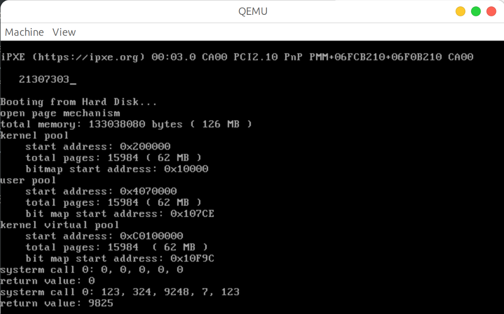

可见光标移动到了(3,3)并输出了我的学号，说明系统调用成功

##### 2.分析系统调用后栈的变化情况

准备进入system_call 0x7be4

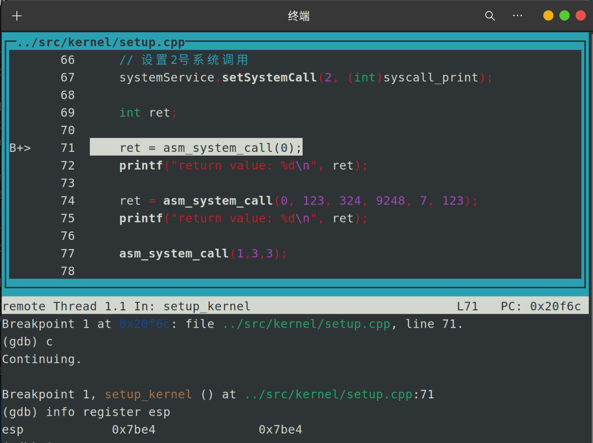

进入system_call 0x7bc0

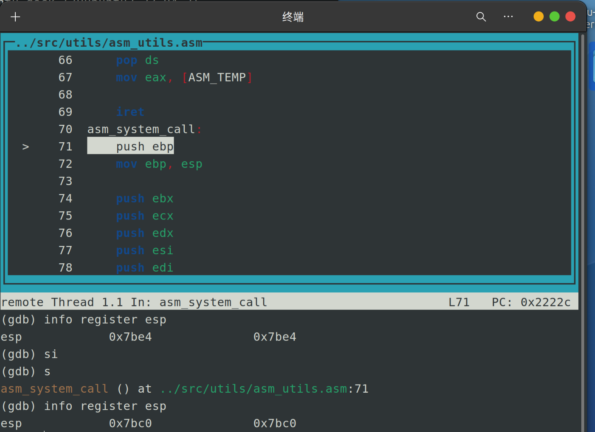

将ebp给esp后 0x7bbc

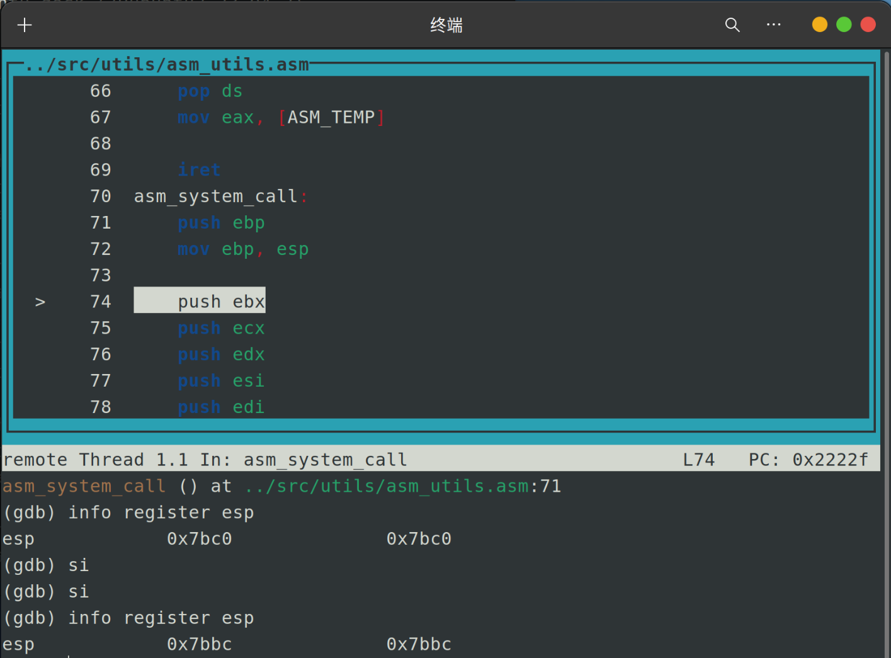

刚进入asm_system_call_handler 0x7b8c

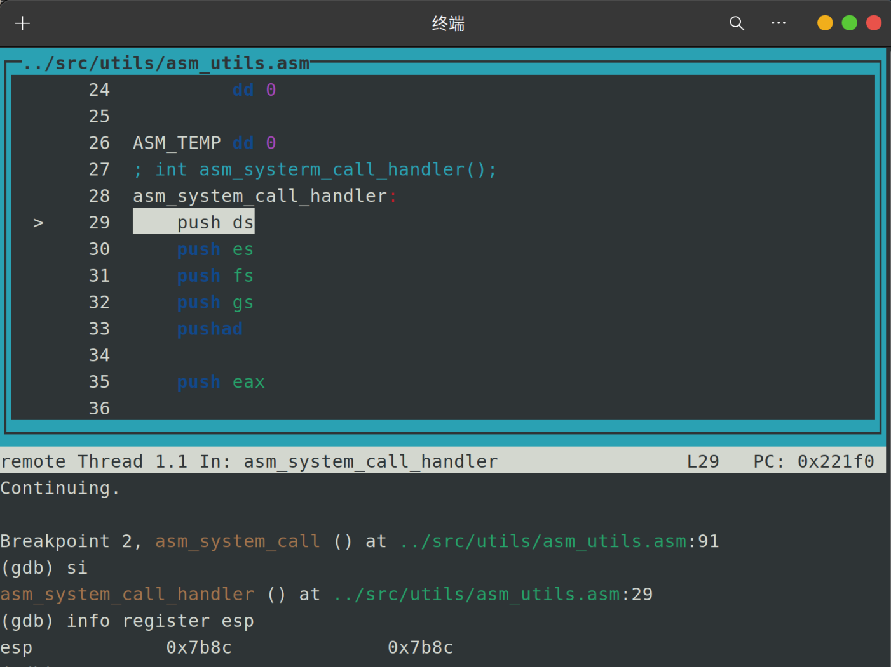

保存完现场后 0x7b48

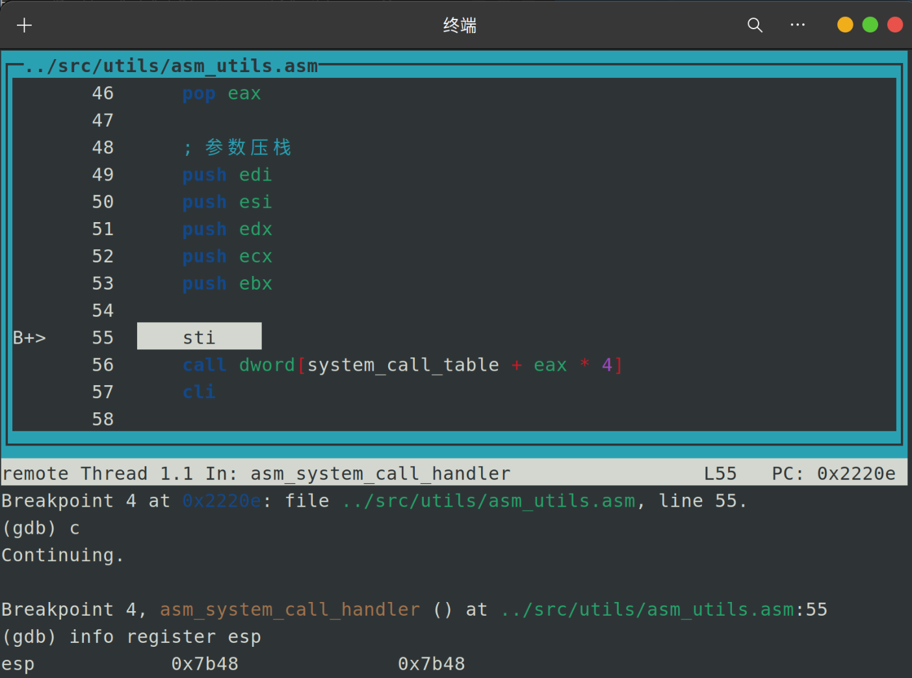

开中断，并进入内核态 0x7b44

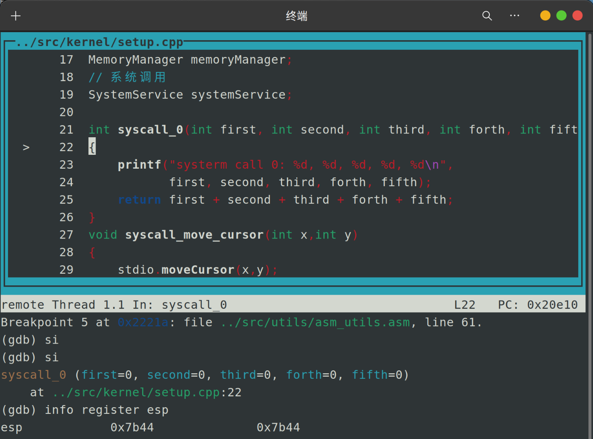

即将退出asm_system_call_handler 0x7b8c

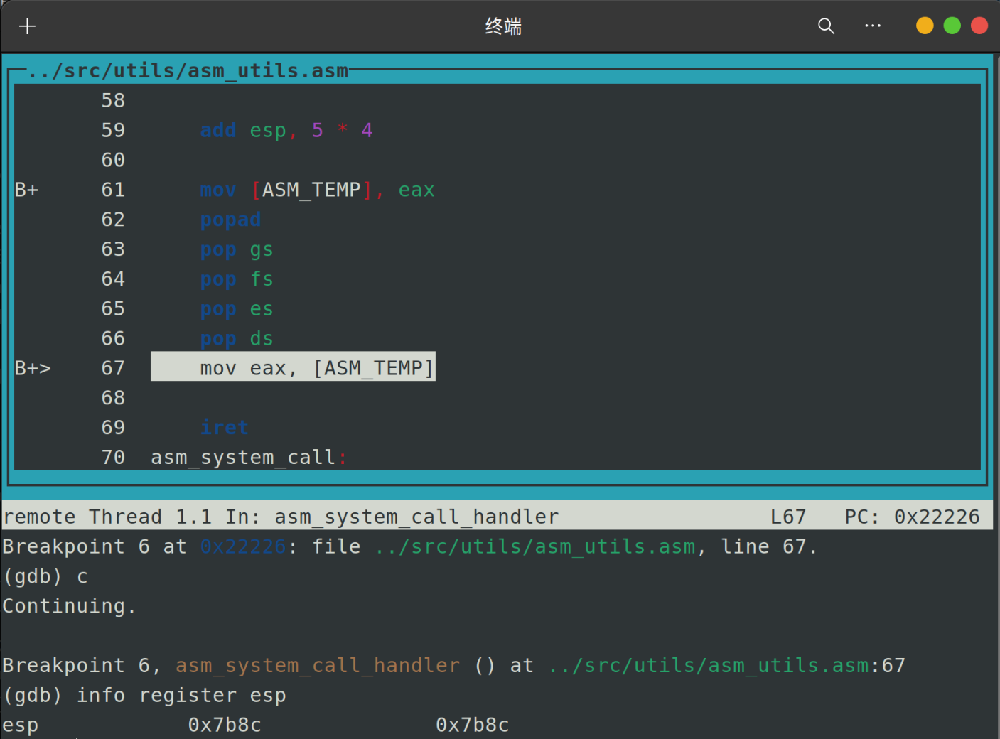

回到asm_system_call 0x7b98

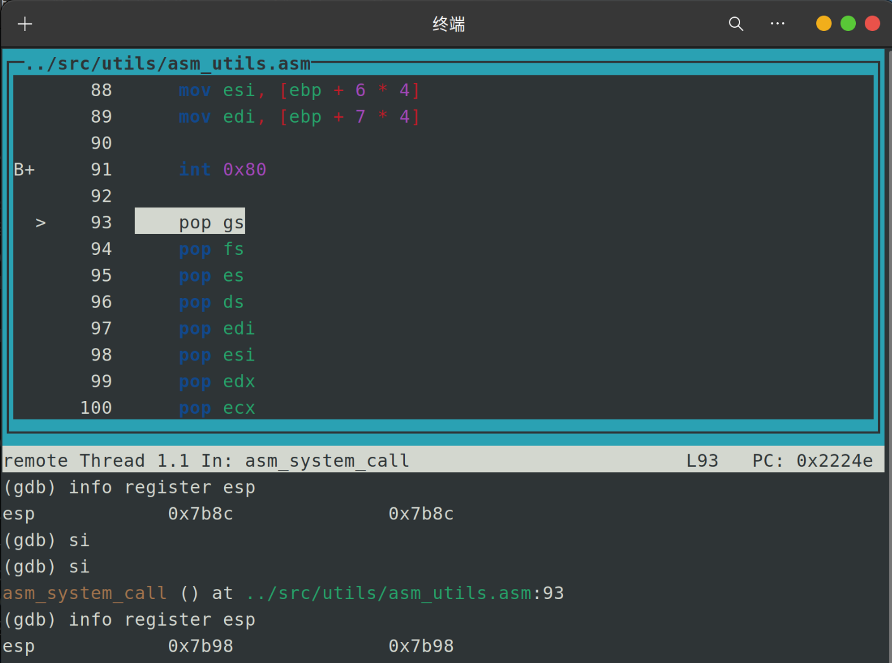

即将退出asm_system_call 0x7bc0

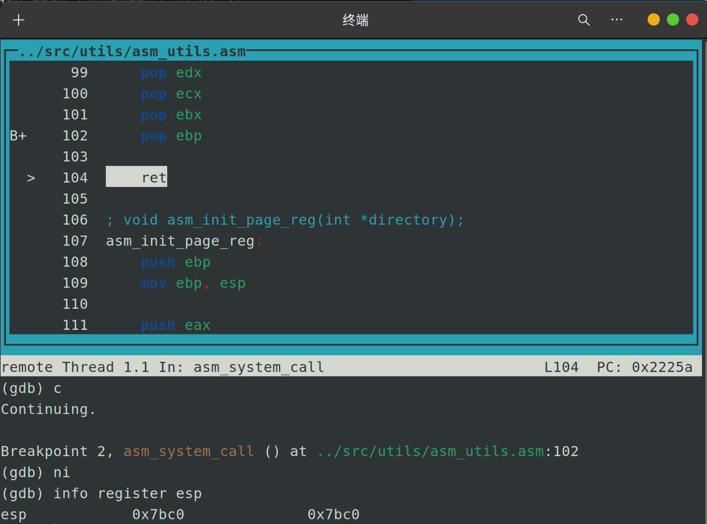

回到setup.cpp 0x7bc4

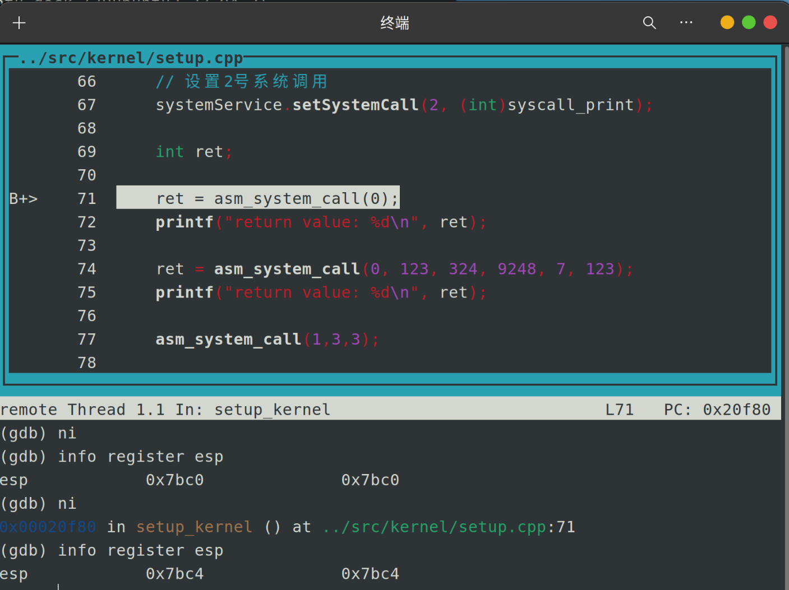

完全经过系统调用语句 0x7be4

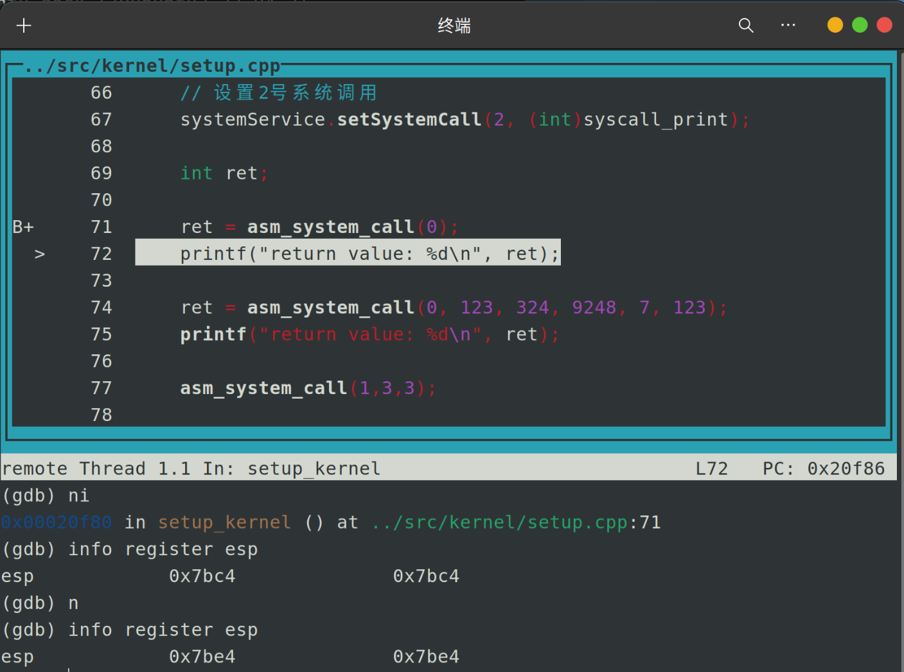

进入一层函数都会压一个返回地址，过完函数后返回值与返回地址弹出栈。

在asm__system_call_handler中会有一次更换esp的动作，其余时候都是正常压栈弹栈

##### 3，说明TSS在系统调用中的作用

TSS(任务状态段)是在操作系统进程管理的过程中，进程切换时的任务现场信息。

在系统调用时，低特权级转移到高特权级时，CPU要从TTS中把高特权级的栈地址加载到esp寄存器中

### Assignment 2 Fork的奥秘

#### 实验内容

实现fork函数，并回答以下问题。

+ 请根据代码逻辑和执行结果来分析fork实现的基本思路。
+ 从子进程第一次被调度执行时开始，逐步跟踪子进程的执行流程一直到子进程从 `fork`返回，根据gdb来分析子进程的跳转地址、数据寄存器和段寄存器的变化。同时，比较上述过程和父进程执行完 `ProgramManager::fork`后的返回过程的异同。
+ 请根据代码逻辑和gdb来解释fork是如何保证子进程的 `fork`返回值是0，而父进程的 `fork`返回值是子进程的pid。

#### 实验原理

**分页机制**

每个进程都包含了main函数，虚拟地址从0开始，这看似会雨内核冲突，但由于分页机制，每个进程都有自己的页目录表与页表。
每一个进程都含有0\~4GB的虚拟地址空间，对每一个进程，我们单独地划分出3\~4GB的虚拟地址空间来作为共享的内核区域。然后通过分页机制，巧妙地将这部分虚拟地址变换到和虚拟地址0\~1MB相同的物理地址上，从而使得进程也能访问到内核的资源

分页函数内容包括 初始化页目录表、初始化页目录项

在bootloader中调用分页函数来开启分页机制

**TSS**

在ProgramManager中要存好用户代码段选择子、用户数据段选择子、用户栈段选择子

tss结构体就非常简单粗暴，就是所有的寄存器状态

**进程创建**

PCB需要存出进程页目录表地址与用户程序虚拟地址池

进程的创建分为3步。

+ 创建进程的PCB。
+ 初始化进程的页目录表。
+ 初始化进程的虚拟地址池。

初始化虚拟地址池时，最后一个页目录项指向用户进程页目录表物理地址，这是为了在切换到用户进程后，也能够构造出页目录项和页表项的虚拟地址

当进程的PCB被首次加载到处理器执行时，CPU首先会进入 `load_process`，load_process工作如下

+ 关中断，然后初始化启动进程需要的栈结构。
+ 在进程虚拟地址空间中分配一页来作为进程的特权级3栈,进程的特权级0栈在进程的PCB中

**进程调度**

仅需在线程调度的基础上加上

+ 切换页目录表。
+ 更新TSS中的特权级0的栈。

**fork的实现**

fork是一个系统调用，用于创建一个新进程。父子进程共享代码段，但对于数据段、栈段等其他资源，父进程调用的fork函数会将这部分资源完全复制到子进程中。因此，对于这部分资源，父子进程并不共享。

创建新的子进程后，两个进程将从fork的返回点开始执行。

在父子进程的fork返回点中，fork返回的结果是不一样的，fork返回值如下。

+ 在父进程中，fork返回新创建子进程的进程ID。
+ 在子进程中，fork返回0。
+ 如果出现错误，fork返回一个负值。

#### 分析fork实现思路

`ProgramManager::fork()`功能如下

+ 关闭中断，防止fork过程中被换下引发错误
+ 检测内核线程调用，防止内核线程调用fork
+ 创建子进程
+ 初始化子进程
+ 用copyProcess()**把父进程复制给子进程**
+ 恢复中断


#### 实验结果

### Assignment 3 哼哈二将 wait & exit

#### 实验内容

实现wait函数和exit函数，并回答以下问题。

+ 请结合代码逻辑和具体的实例来分析exit的执行过程。
+ 请分析进程退出后能够隐式地调用exit和此时的exit返回值是0的原因。
+ 请结合代码逻辑和具体的实例来分析wait的执行过程。
+ 如果一个父进程先于子进程退出，那么子进程在退出之前会被称为孤儿进程。子进程在退出后，从状态被标记为 `DEAD`开始到被回收，子进程会被称为僵尸进程。请分析src/6代码实例中，实现回收僵尸进程的有效方法。

#### 实验原理

#### 实验代码

#### 实验结果

## 3.总结

<style>
    img[alt="def"]{
        width:450px;
    }
    img[alt="sml"]{
        width:350px;
    }
</style>
