<div align="center">
    
</div>

<center><font size=6>本科生实验报告</font></center>

实验课程:操作系统原理

实验名称:lab8 从内核态到用户态

专业名称:计算机科学与技术(人工智能与大数据方向)

学生姓名:刘卓逸

学生学号:21307303

实验地点:东校园实验中心大楼D503

实验成绩:

报告时间:2023年6月15日

<div style="page-break-after:always"></div>

## 1.实验要求

> - DDL：2023年06月15号 23:59
> - 提交的内容：请将**3个assignment的代码**和**实验报告**放到**压缩包**中，命名为“**lab8-姓名-学号**”，并交到课程邮箱 os_sysu_lab@163.com
>
>   实验报告的pdf提交至 http://inbox.weiyun.com/CmccX5vB
> - **材料的代码放置在 `src`目录下**。

1. 实验不限语言， C/C++/Rust都可以。
2. 实验不限平台， Windows、Linux和MacOS等都可以。
3. 实验不限CPU， ARM/Intel/Risc-V都可以。

## 2.实验过程

### Assignment 1 系统调用

#### 实验内容

编写一个系统调用，然后在进程中调用之，根据结果回答以下问题。

+ 展现系统调用执行结果的正确性，结果截图并说说你的实现思路。
+ 分析执行系统调用后的栈的变化情况。
+ 说明TSS在系统调用执行过程中的作用。

#### 实验原理

**asm_system_call**

先保存现场，后将系统调用参数传入寄存器，执行 `int 0x80`中断，最后恢复现场。

由于系统调用时CPU会从TSS中加载高特权级的栈地址到esp寄存中，所以原本的栈和系统调用时的栈不是同一个(指针不同),所以需要将参数传入寄存器

**SystemService类**

管理系统调用的类。

定义如下

```cpp
#include "os_constant.h"
class SystemService
{
public:
    SystemService();
    void initialize();
    // 设置系统调用，index=系统调用号，function=处理第index个系统调用函数的地址
    bool setSystemCall(int index, int function);
};

void SystemService::initialize()
{
    memset((char *)system_call_table, 0, sizeof(int) * MAX_SYSTEM_CALL);
    // 代码段的选择子默认是DPL=0的平坦模式代码段选择子，
    // 但中断描述符的DPL=3，否则用户态程序无法使用该中断描述符
    interruptManager.setInterruptDescriptor(0x80, (uint32)asm_system_call_handler, 3);
}
```

**asm_system_call_handler**

0x80中断处理函数：

保护现场，从tss加载ds,es,fs,gs寄存器，

开启中断并调用系统处理函数，调用完关中断，

将参数弹出栈，并把系统处理函数的返回值从eax存到ASM_TEMP中

最后还原现场，完成系统调用

#### 实验过程

##### 1.展现系统调用结果的正确性

###### 实验代码

在 `assignment1/inlcude/syscall.h`中添加系统调用的函数声明：

```cpp
// 第1个系统调用
void syscall_move_cursor(int x,int y);
// 第2个系统调用
void syscall_print(const char *str);
```

在 `assignment1/src/kernel/setup.cpp`中添加系统调用的实现

```cpp
void syscall_move_cursor(int x,int y)
{
    stdio.moveCursor(x,y);
}
void syscall_print(const char *str)
{
    stdio.print(str);
}
```

在 `assignment1/src/kernel/setup.cpp/setup_kernel()`中调用system_call'

```cpp
    ret = asm_system_call(0);
    printf("return value: %d\n", ret);

    ret = asm_system_call(0, 123, 324, 9248, 7, 123);
    printf("return value: %d\n", ret);
  
    asm_system_call(1,3,3);
  
    asm_system_call(2,(int)((const char *)"21307303"));
```

###### 实验结果


可见光标移动到了(3,3)并输出了我的学号，说明系统调用成功

##### 2.分析系统调用后栈的变化情况

准备进入system_call 0x7be4


进入system_call 0x7bc0


将ebp给esp后 0x7bbc


刚进入asm_system_call_handler 0x7b8c


保存完现场后 0x7b48


开中断，并进入内核态 0x7b44


即将退出asm_system_call_handler 0x7b8c


回到asm_system_call 0x7b98


即将退出asm_system_call 0x7bc0


回到setup.cpp 0x7bc4


完全经过系统调用语句 0x7be4


进入一层函数都会压一个返回地址，过完函数后返回值与返回地址弹出栈。

在asm__system_call_handler中会有一次更换esp的动作，其余时候都是正常压栈弹栈

##### 3，说明TSS在系统调用中的作用

TSS(任务状态段)是在操作系统进程管理的过程中，进程切换时的任务现场信息。

在系统调用时，低特权级转移到高特权级时，CPU要从TTS中把高特权级的栈地址加载到esp寄存器中

### Assignment 2 Fork的奥秘

#### 实验内容

实现fork函数，并回答以下问题。

+ 请根据代码逻辑和执行结果来分析fork实现的基本思路。
+ 从子进程第一次被调度执行时开始，逐步跟踪子进程的执行流程一直到子进程从 `fork`返回，根据gdb来分析子进程的跳转地址、数据寄存器和段寄存器的变化。同时，比较上述过程和父进程执行完 `ProgramManager::fork`后的返回过程的异同。
+ 请根据代码逻辑和gdb来解释fork是如何保证子进程的 `fork`返回值是0，而父进程的 `fork`返回值是子进程的pid。

#### 实验原理

**分页机制**

每个进程都包含了main函数，虚拟地址从0开始，这看似会雨内核冲突，但由于分页机制，每个进程都有自己的页目录表与页表。
每一个进程都含有0\~4GB的虚拟地址空间，对每一个进程，我们单独地划分出3\~4GB的虚拟地址空间来作为共享的内核区域。然后通过分页机制，巧妙地将这部分虚拟地址变换到和虚拟地址0\~1MB相同的物理地址上，从而使得进程也能访问到内核的资源

分页函数内容包括 初始化页目录表、初始化页目录项

在bootloader中调用分页函数来开启分页机制

**TSS**

在ProgramManager中要存好用户代码段选择子、用户数据段选择子、用户栈段选择子

tss结构体就非常简单粗暴，就是所有的寄存器状态

**进程创建**

PCB需要存出进程页目录表地址与用户程序虚拟地址池

进程的创建分为3步。

+ 创建进程的PCB。
+ 初始化进程的页目录表。
+ 初始化进程的虚拟地址池。

初始化虚拟地址池时，最后一个页目录项指向用户进程页目录表物理地址，这是为了在切换到用户进程后，也能够构造出页目录项和页表项的虚拟地址

当进程的PCB被首次加载到处理器执行时，CPU首先会进入 `load_process`，load_process工作如下

+ 关中断，然后初始化启动进程需要的栈结构。
+ 在进程虚拟地址空间中分配一页来作为进程的特权级3栈,进程的特权级0栈在进程的PCB中

**进程调度**

仅需在线程调度的基础上加上

+ 切换页目录表。
+ 更新TSS中的特权级0的栈。

**fork的实现**

fork是一个系统调用，用于创建一个新进程。父子进程共享代码段，但对于数据段、栈段等其他资源，父进程调用的fork函数会将这部分资源完全复制到子进程中。因此，对于这部分资源，父子进程并不共享。

创建新的子进程后，两个进程将从fork的返回点开始执行。

在父子进程的fork返回点中，fork返回的结果是不一样的，fork返回值如下。

+ 在父进程中，fork返回新创建子进程的进程ID。
+ 在子进程中，fork返回0。
+ 如果出现错误，fork返回一个负值。

#### 分析fork实现思路

**fork实现的四个关键问题**

* 如何实现父子进程的代码段共享？
  将父进程的代码段复制到子进程中
* 如何使得父子进程从相同的返回点开始执行？
  将父进程的程序计数器（PC）复制到子进程中
* 除代码段外，进程包含的资源有哪些？
  数据段、堆栈段
* 如何实现进程的资源在进程之间的复制？
  通过申请中转页来中转资源

**ProgramManager::fork()** 功能如下

+ 关闭中断，防止fork过程中被换下引发错误
+ 检测内核线程调用，防止内核线程调用fork
+ 创建子进程
+ 初始化子进程
+ 用copyProcess()**把父进程复制给子进程**
+ 恢复中断

**ProgramManager::copyProcess()** 功能如下

+ 复制父进程的0特权级栈到子进程中：在父进程的0特权级栈中，子进程真正关心的部分应该是 `asm_system_call_handler`的返回地址和执行 `asm_system_call_handler`前保护的现场，因此复制的父进程0特权栈的起始地址只是进程的PCB所在的页的顶部减去一个 `ProgramStartStack`的大小，相当于把中断那一刻保存的寄存器内容复制到子进程的0特权级栈中，由于eax装了函数的返回值，**这时直接将子进程的eax设为0**，这样父进程fork()的返回值就是正常函数返回值，而子进程fork()的返回值就是0了
+ 初始化子进程的0特权级栈
+ 设置子进程的PCB、复制父进程的管理虚拟地址池的bitmap到子进程的管理虚拟地址池的bitmap
+ 通过中转页将父进程的页目录表复制到子进程中，之后复制页表和物理页的数据：父进程和子进程的虚拟地址是相同的，于是需要借助内核空间的中转页，首先在父进程的虚拟地址空间下将数据复制到中转页中，再切换到子进程的虚拟地址空间中，然后将中转页复制到子进程对应的位置，再回到父进程的虚拟地址。
+ 归还中转页，返回子进程pid

示例代码执行结果

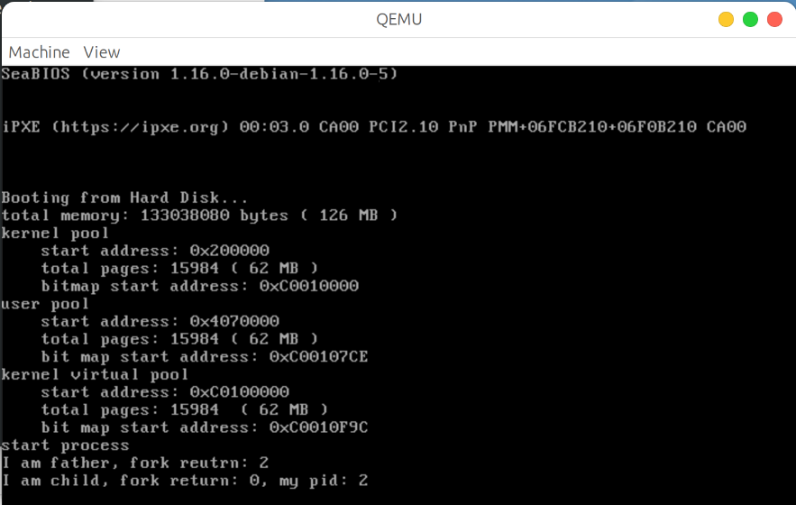

#### 跟踪程序执行，分析父子进程执行完fork的异同

先在copyProcess()设置断点，这是把中断那一刻保存的寄存器内容复制给子进程0特权级栈的函数

然后再这通过 `x /17x parentpss`指令看父进程0级栈的内容，这里注意到第16个寄存器esp=0x08048f98,第12个寄存器eip=0xc0022ccf

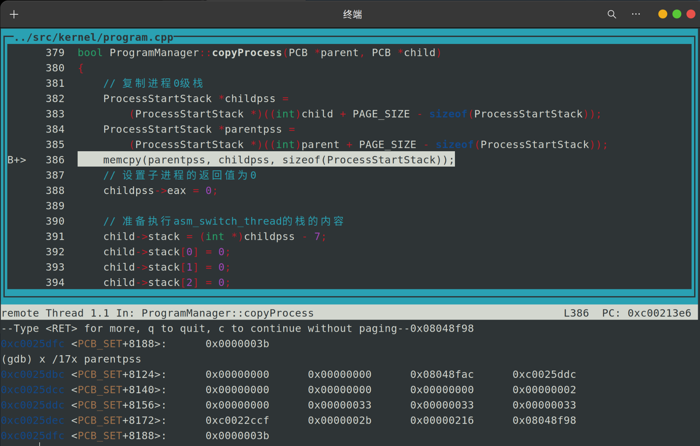

执行完 `memcpy(parentpss, childpss, sizeof(ProcessStack))`后发现childpss和parentpss完全一致，而且eip=0xc0022ccf是asm_system_call_handler的返回地址

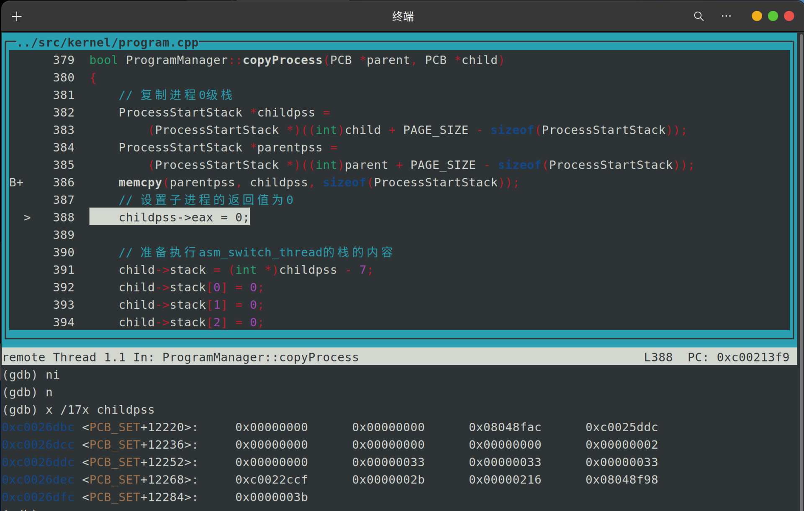

之后分析第一次执行asm_start_process时候，执行打iret的结果。

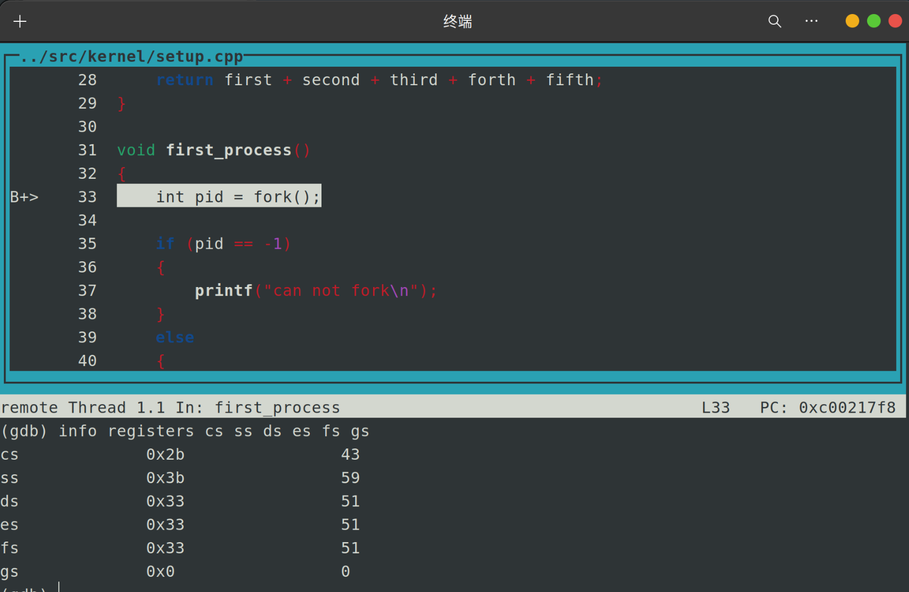

在第一次执行 asm_start_process 里，我们期望得到跟上一次实验相同的结果，也就是执行 iret 后启动进程 first_process()。

先一直在asm_start_process打上断点，next到if语句内输出 `I am father ...`即父进程结束

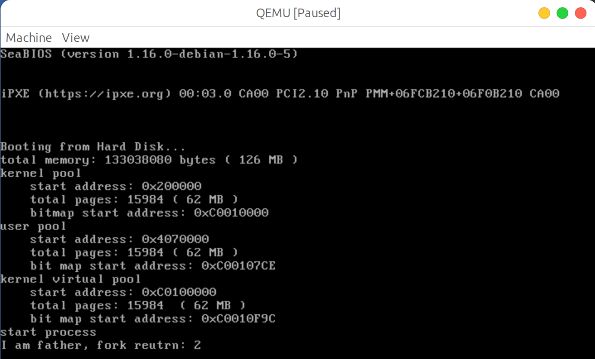

执行完first_process的代码后，发现代码跳转到 `asm_start_process`。

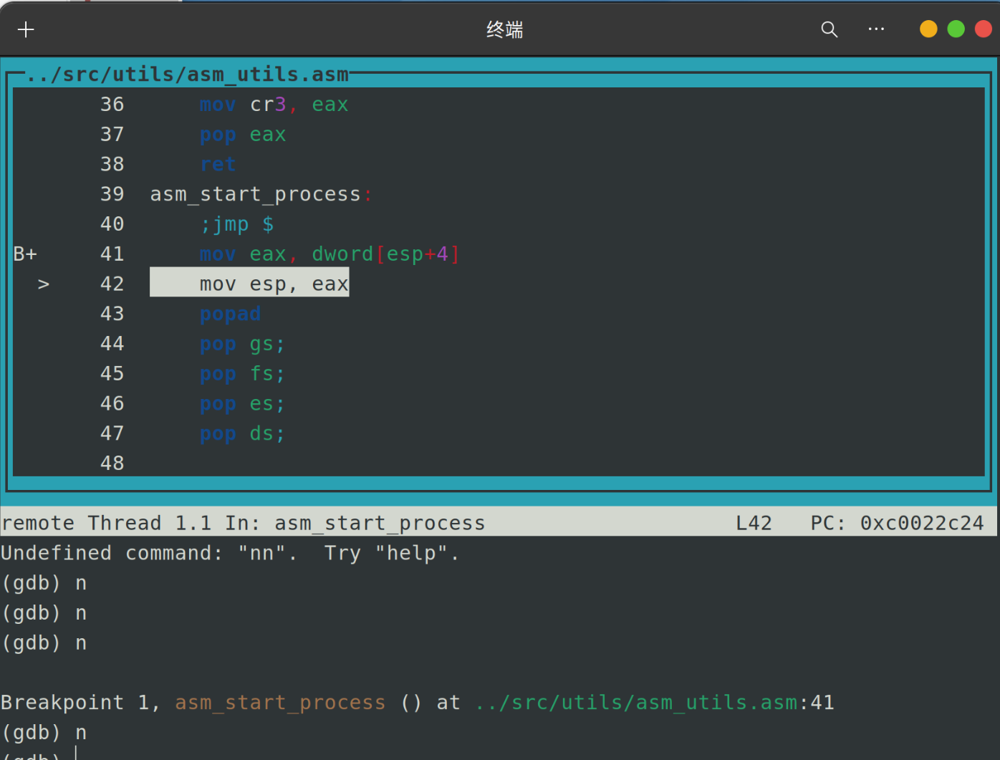

这是因为在copyProcess()初始化子进程0级栈为以下内容

```cpp
  // 准备执行asm_switch_thread的栈的内容
    child->stack = (int *)childpss - 7;
    child->stack[0] = 0;
    child->stack[1] = 0;
    child->stack[2] = 0;
    child->stack[3] = 0;
    child->stack[4] = (int)asm_start_process; //***
    child->stack[5] = 0;             // asm_start_process 返回地址
    child->stack[6] = (int)childpss; // asm_start_process 参数
```

这使得在调换线程的时候，会执行asm_start_process的代码因为我们先前把0特权栈复制到childpss里面，所以在启动函数
asm_start_process执行了iret以后会把0特权级栈的eip送入eip中，并执行该地址的代码。

如再执行一次next指令，就会跳到到保存在0特级权的栈的eip=0xc0022ccf,也就是asm_system_call的代码地址吗：

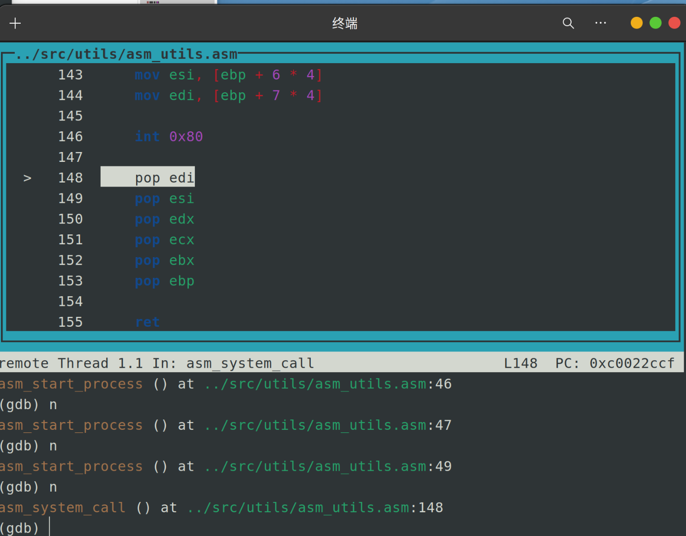

当中会调用系统号为 2 的系统调用,也就是 syscall_fork()。最后从fork返回。

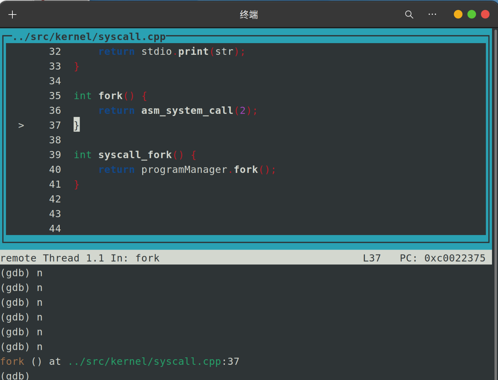

之后回到first_process()

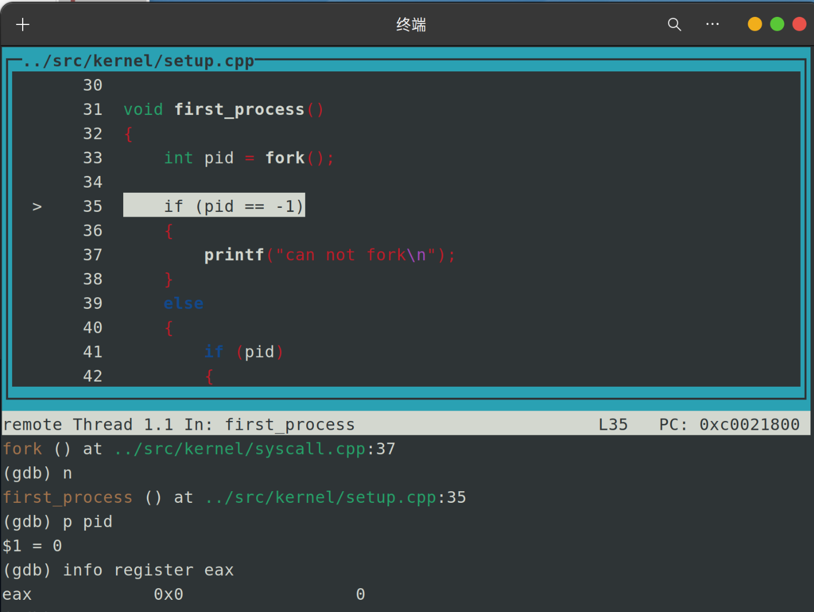

注意到此时pid值为0，而观察到eax的值也为0，这是因为copyProcess()中把childpps->eax设置为0，这保证了fork()返回值为0。反映了子进程调用fork()后返回pid=0而父进程调用fork()返回pid为子进程的进程ID

最后结束

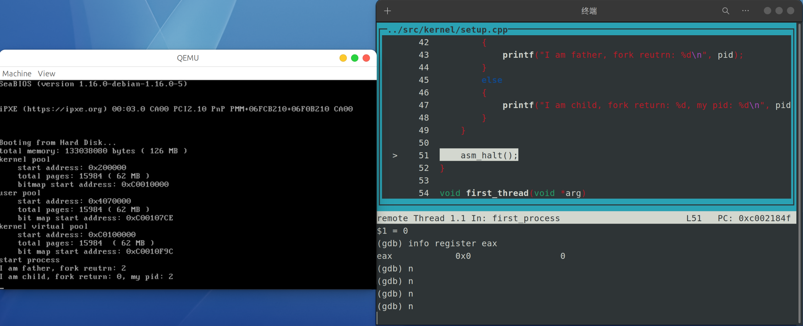

通过观察programManager.fork(),我们可以看到函数返回的pid是从executeProcess("",0)得到的，而父进程就是返回programManager.fork()的值。

excuteProcess()调用excuteThread(),excuteThread()调用allocatePCB分配一个子进程PCB，并且返回id，这最终使父进程的fork()返回子进程ID

子进程由于在copyProcess中设定了childpss->eax=0,在fork中把存返回值的eax修改了为0,使得fork()返回值为0

### Assignment 3 哼哈二将 wait & exit

#### 实验内容

实现wait函数和exit函数，并回答以下问题。

+ 请结合代码逻辑和具体的实例来分析exit的执行过程。
+ 请分析进程退出后能够隐式地调用exit和此时的exit返回值是0的原因。
+ 请结合代码逻辑和具体的实例来分析wait的执行过程。
+ 如果一个父进程先于子进程退出，那么子进程在退出之前会被称为孤儿进程。子进程在退出后，从状态被标记为 `DEAD`开始到被回收，子进程会被称为僵尸进程。请分析src/6代码实例中，实现回收僵尸进程的有效方法。

#### 分析exit执行过程

exit用于进程与线程的主动结束运行

`ProgramManager::exit()`代码如下

```cpp
void exit(int ret) {
    asm_system_call(3, ret);
}

void syscall_exit(int ret) {
    programManager.exit(ret);
}
```

```cpp
void ProgramManager::exit(int ret)
{
    // 关中断
    interruptManager.disableInterrupt();
  
    // 第一步，标记PCB状态为`DEAD`并放入返回值。
    PCB *program = this->running;
    program->retValue = ret;
    program->status = ProgramStatus::DEAD;

    int *pageDir, *page;
    int paddr;

    // 第二步，如果PCB标识的是进程，则释放进程所占用的物理页、页表、页目录表和虚拟地址池bitmap的空间。
    if (program->pageDirectoryAddress)
    {
        pageDir = (int *)program->pageDirectoryAddress;
        for (int i = 0; i < 768; ++i)
        {
            if (!(pageDir[i] & 0x1))
            {
                continue;
            }

            page = (int *)(0xffc00000 + (i << 12));

            for (int j = 0; j < 1024; ++j)
            {
                if(!(page[j] & 0x1)) {
                    continue;
                }

                paddr = memoryManager.vaddr2paddr((i << 22) + (j << 12));
                memoryManager.releasePhysicalPages(AddressPoolType::USER, paddr, 1);
            }

            paddr = memoryManager.vaddr2paddr((int)page);
            memoryManager.releasePhysicalPages(AddressPoolType::USER, paddr, 1);
        }

        memoryManager.releasePages(AddressPoolType::KERNEL, (int)pageDir, 1);
    
        int bitmapBytes = ceil(program->userVirtual.resources.length, 8);
        int bitmapPages = ceil(bitmapBytes, PAGE_SIZE);

        memoryManager.releasePages(AddressPoolType::KERNEL,
                                   (int)program->userVirtual.resources.bitmap, 
                                   bitmapPages);

    }

    // 第三步，立即执行线程/进程调度。
    schedule();
}
```

`ProgramManager::exit()`实现分三步：

* 标记PCB状态为 `DEAD`并放入返回值。
* 如果PCB标识的是进程，则释放进程所占用的物理页、页表、页目录表和虚拟地址池bitmap的空间。否则不做处理。
* 立即执行线程/进程调度。

基本就是copyProcess部分的逆过程

具体解释：

```
在第 7-9 行，设置正在运行的进程 program 的 PCB 的返回值 program→retValue = ret, 另外状态为 DEAD。

在第 15-48 行，如果 program 为一个进程而不是线程就把进程所占用的物理页，页目录表和虚拟地址池 bitmap 的空间进行释放。我们是通过第 15 行的 if 语句判断是进程还是线程的，因为进程有页目录表，而线程没有。

在 17 行定义 pageDir 指向页目录表的地址。

在 18-39 行，我们对于页目录表指向的页表的物理地址以及每一个页表指向的物理页进行释放。

在第 25 行，定义 page 为对应页目录表项指向的页表的物理地址。在第 37 行找出了它的物理页地址，并在第 38 行释放它。

第 27-35 行是释放每一个页表的所有物理页。在第 33 行找出物理页的地址，并在第 34 行释放它。

第 41 行释放指向页目录表的物理页。

在 43-46 行释放 bitmap。

最后在第 53 行执行调度函数 schedule()
```

**具体实例**

```cpp
void first_process()
{
    int pid = fork();

    if (pid == -1)
    {
        printf("can not fork\n");
        asm_halt();
    }
    else
    {
        if (pid)
        {
            printf("I am father\n");
            asm_halt();
        }
        else
        {
            printf("I am child, exit\n");
        }
    }
}

void second_thread(void *arg) {
    printf("thread exit\n");
    exit(0);
}

void first_thread(void *arg)
{

    printf("start process\n");
    programManager.executeProcess((const char *)first_process, 1);
    programManager.executeThread(second_thread, nullptr, "second", 1);
    asm_halt();
}
```

执行的结果

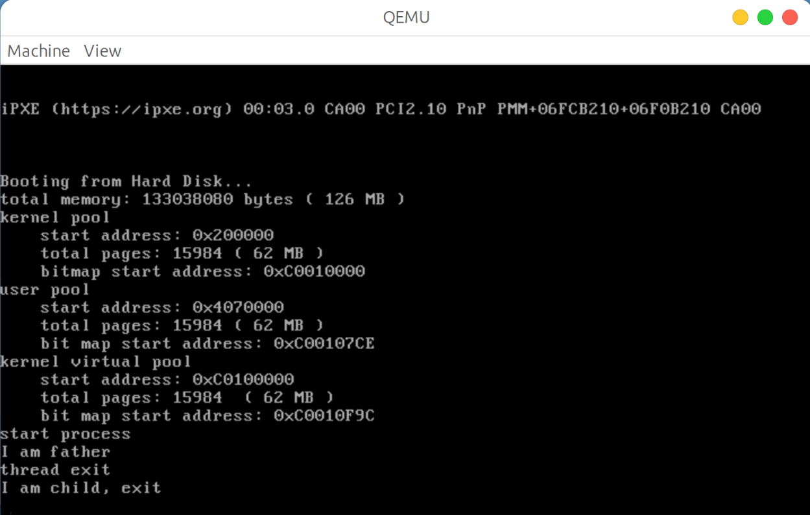

实例有一个first_process进程和second_thread线程按顺序执行。首先执行第一个进程first_process，在执行了父进程以后，schedule函数会调度second_thread执行
在执行 second_thread 会打印 “thread exit”然后执行 exit(0)从而结束进程。因为 exit 函数的代码最后会执行 schedule()以调度进程，所以会继续执行进程 first_process 的子进程部分，并打印出“I am child, exit”。执行子进程的代码部分和上一个实验没有什么不同，但是在 first_process 里面,子进程执行 else 语句的代码部分不需要 asm_halt 要结束进程。

对比assignment2，不同之处在于只是执行完父进程要asm_halt(),子进程不需要asm_halt()，因为load_process()函数把first_process的第三级栈的顶部加入了exit函数地址exit的地址（0）和参数（0）这样使得first_process最后会执行exit(0)来退出并结束进程

#### 进程退出后能阴式调用exit且返回0的原因

为了实现返回机制，可以使用到我们实现的退出函数 exit。通过在进程的 3 特权级栈的顶部放入exit
的地址和参数，可以使得参数的函数推出后主动跳转到 exit。
通过在 load_process 函数里面，在 interruptStack 的栈依次加入 exit 的地址，exit 的返回地址，以及 exit 的参数 ret,使得在进程函数执行完毕后，自动跳入 exit 以结束该进程。因为 fork 实执行了父进程然后再执行子进程，因此最后执行的子进程执行完一定会通过 interruptStack 的栈调用 exit(0)，保证了进程推出后能够肯定第调用 exit 和此时的 exit 返回值为 0。

#### 分析wait的执行过程

子进程的状态被标记为DEAD后并没有被清除而是再等待其他进程来回收进程的PCB.
进程的PCB是通过wait系统调用来等待其子进程执行完成并回收子进程。

```cpp
int wait(int *retval) {
    return asm_system_call(4, (int)retval);
}

int syscall_wait(int *retval) {
    return programManager.wait(retval);
}
```

wait 函数的参数retval用来存放子进程的返回值。如果 retval==nullptr, 说明我们不关心子进程的返回值。
wait的返回值是被回收的子进程。如果没有子进程，wait 会返回-1。如果存在子进程的状态不是DEAD,则父进程会一直被阻塞，则wait不会返回，直到子进程结束。

```cpp
int ProgramManager::wait(int *retval)
{
    PCB *child;
    ListItem *item;
    bool interrupt, flag;

    while (true)
    {
        interrupt = interruptManager.getInterruptStatus();
        interruptManager.disableInterrupt();

        item = this->allPrograms.head.next;

        // 查找子进程
        flag = true;
        while (item)
        {
            child = ListItem2PCB(item, tagInAllList);
            if (child->parentPid == this->running->pid)
            {
                flag = false;
                if (child->status == ProgramStatus::DEAD)
                {
                    break;
                }
            }
            item = item->next;
        }

        if (item) // 找到一个可返回的子进程
        {
            if (retval)
            {
                *retval = child->retValue;
            }
            int pid = child->pid;
            releasePCB(child);
            interruptManager.setInterruptStatus(interrupt);
            return pid;
        }
        else 
        {
            if (flag) // 子进程已经返回
            {
          
                interruptManager.setInterruptStatus(interrupt);
                return -1;
            }
            else // 存在子进程，但子进程的状态不是DEAD
            {
                interruptManager.setInterruptStatus(interrupt);
                schedule();
            }
        }
    }
}
```

具体解释

```
从第 12 行到第 28 行我们从 allPrograms 找到一个状态为 DEAD 的子进程。

从第 30-41 行，我们从之前找出来可回收子进程。

第 32-35 行的 if 语句，当 retval 不为 nullptr 时，我们取出子进程的返回值放入到 retval 指向的变量中

第 37 行，取出子进程的 pid 定义为变量 pid。

第 38 行调用 releasePCB 来回收子进程的 PCB

第 39 行返回子进程的 pid

第 44-49 行，若没有找到子进程则返回-1

第50-54行，存在子进程但子进程的状态不是 `DEAD`，因此我们执行调度。注意到该进程的主体是一个死循环，因此当进程的第53语句返回后，wait并不会返回。而是再一次重复上面的步骤，尝试回收子进程。也就是前面所说的，当父进程调用wait后，如果存在子进程但子进程的状态不是 `DEAD`，则父进程会被阻塞，即wait不会返回直到子进程结束。
```

`ProgramManager::releasePCB()`代码如下，相对于之前加入了第五行从

```cpp
void ProgramManager::releasePCB(PCB *program)
{
    int index = ((int)program - (int)PCB_SET) / PCB_SIZE;
    PCB_SET_STATUS[index] = false;
    this->allPrograms.erase(&(program->tagInAllList));
}
```

schedule也要修改，增加对DEAD状态进程的处理

```cpp
void ProgramManager::schedule()
{
...

    if (running->status == ProgramStatus::RUNNING)
    {
        running->status = ProgramStatus::READY;
        running->ticks = running->priority * 10;
        readyPrograms.push_back(&(running->tagInGeneralList));
    }
    else if (running->status == ProgramStatus::DEAD)
    {
        // 回收线程，子进程留到父进程回收
        if(!running->pageDirectoryAddress) {
            releasePCB(running);
        }
    }

...
}
```

#### 回收僵尸进程的有效方法

如果一个父进程先于子进程退出，那么紫禁城在退出之前就会被称为孤儿进程(orphaned process)。子进程退出后，从状态被标记为 DEAD 开始被回收，子进程会被称为僵尸进程(zombie process)。我们通过在 Linux 环境实现一个例子来看看僵尸进程

执行src6代码以实现回收僵尸进程的有效方法

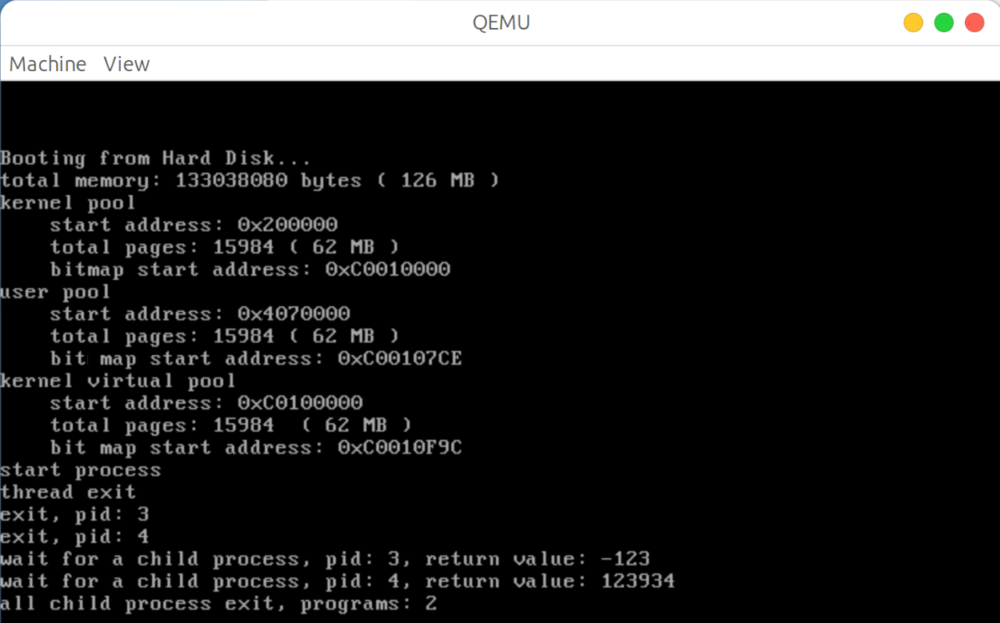

```cpp
void first_process()
{
    int pid = fork();
    int retval;

    if (pid)
    {
        pid = fork();
        if (pid)
        {
            while ((pid = wait(&retval)) != -1)
            {
                printf("wait for a child process, pid: %d, return value: %d\n", pid, retval);
            }

            printf("all child process exit, programs: %d\n", programManager.allPrograms.size());
            
            asm_halt();
        }
        else
        {
            uint32 tmp = 0xffffff;
            while (tmp)
                --tmp;
            printf("exit, pid: %d\n", programManager.running->pid);
            exit(123934);
        }
    }
    else
    {
        uint32 tmp = 0xffffff;
        while (tmp)
            --tmp;
        printf("exit, pid: %d\n", programManager.running->pid);
        exit(-123);
    }
}
```

在 first_process 进程里面，我们可以分为父进程，子进程和孙进程。

子进程执行的部分为第 29-36 行，孙进程执行的部分为第 20-27 行。

首先是子进程执行，在执行完毕后，打印出 `exit, pid: 3`，显示子进程的 ID = 3，并调用 exit(-123)， 来结束子进程并设置它的 PCB status = DEAD, 返回值retVal = -123。

之后是孙进程执行，在执行完毕后，打印出 `exit, pid:4`，显示子进程的 ID = 4，并调用 exit(123934)，来结束子进程并设置它的PCB status = DEAD, 返回值 retVal = 123934。

父进程的部分为第 9-19 行。注意到在第 11 行的 while 语句里面：`while((pid = wait(&retval)) != -1)`在这个语句里的 wait(&retval)只要有子进程的状态不为 DEAD, 它都一直不会返回的，因此在存在状态不为 DEAD 的子进程的情况下，一直都是死循环的。因此我们对应到运行结果，发现父进程在子进程和孙进程都执行完毕的情况下以后，才会执行 while 语句里面第 13 行的语句，并且对于该可返回的进程进行回收。

然后，如果没有子进程的状态都是 dead 的话，代表所有的子进程都已经通过之前while语句的选代步的 wait(&retVal)被回收，因此现在的wait(&retval) = -1，从而跳出while 语句。打印 `all child process,exit, programs: 2`，代表所有的子进程（包括子进程的子进程）都被回收，当中的2代表子进程的总数量。因此我们通过exit系统调用来实现所有子进程在执行父进程前进行释放，从而避免子进程成为孤儿进程，也解决了僵尸进程的问题

## 3.总结

在这次实验里，我在理解教程中所讲解的系统调用的运行过程中遇到了困难。在深入gdb调试后才更深入体会和理解到系统调用实现的原理。

同时我发现这个实验需要回顾到之前的实验的知识点，特别是中断，调度，内存管理的实验，来讲解这次实验的原理。

<style>
    img[alt="def"]{
        width:450px;
    }
    img[alt="sml"]{
        width:350px;
    }
</style>
