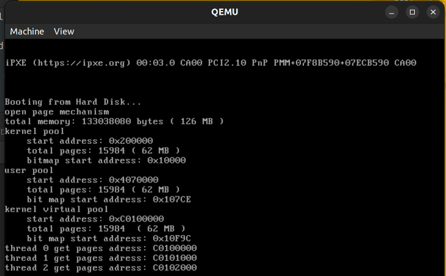
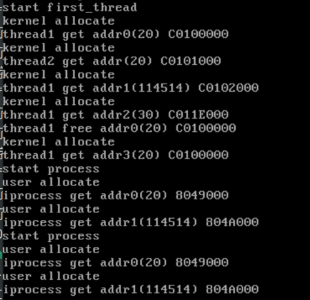

<div align="center">
    
</div>

<center><font size=6>本科生实验报告</font></center>

实验课程:操作系统原理

实验名称:lab9 课程项目

专业名称:计算机科学与技术(人工智能与大数据方向)

学生姓名:刘卓逸

学生学号:21307303

实验地点:东校园实验中心大楼D503

实验成绩:

报告时间:2023年6月16日

<div style="page-break-after:always"></div>

## 1.实验要求

> - DDL：2023年07月9号 23:59
> - 提交的内容：将**若干个project的代码**和**实验报告**放到**压缩包**中。压缩包命名为“**lab9-姓名-学号**”，并交到课程邮箱 os_sysu_lab@163.com
>
>   大作业报告的pdf提交至 http://inbox.weiyun.com/E75pWg6W
> - 不同的project的代码需要放在不同的文件夹下。

1. 实验不限语言， C/C++/Rust都可以。
2. 实验不限平台， Windows、Linux和MacOS等都可以。
3. 实验不限CPU， ARM/Intel/Risc-V都可以。

## Project 1 malloc/free的实现

#### 项目要求

编写一个系统调用，然后在进程中调用之，根据结果回答以下问题。

+ 展现系统调用执行结果的正确性，结果截图并说说你的实现思路。
+ 分析执行系统调用后的栈的变化情况。
+ 说明TSS在系统调用执行过程中的作用。

#### 项目思路

项目基于lab8/src/7的代码

当要分配X个字节的内存时，直接分配$2^{\lceil log_2 X \rceil}$个字节。X超过了4096(一个页),那分配$\lceil X/4096 \rceil$个页，把这些页的起始地址作为分配结果。

每种相同大小的连续块用链表串联在一起，每次分配就从链表中取出一个块，释放时就把块加回链表

在找到空闲连续的块之后、分配这些块之前线程被阻断的话，另一线程在做同样的申请找到同样的位置的话，会使得两个线程的malloc()分配到相同的地址，这样会导致**线程不安全**。因此malloc()要加上锁机制确保不会有两个线程同时在执行malloc，保证动态内存分配时的线程安全。

#### 实现代码

**解决页分配的线程安全**

通过在bitmap中找到连续块与分配连续块之间添加延迟，在确定分配地址后但分配完成前进行线程切换，就会导致分配到的页地址一致

programManager.executeThread()中加入delay()且用以下代码测试

```cpp
template<int T>
void threads(void *arg)
{
	int id=T;
	char *p = (char *)memoryManager.allocatePages(AddressPoolType::KERNEL, 1);
	printf("thread %d get pages adress: %x\n", id,p);
}
void first_thread(void *arg)
{
    programManager.executeThread(threads<0>, nullptr, "p0", 1);
    programManager.executeThread(threads<1>, nullptr, "p1", 1);
    programManager.executeThread(threads<2>, nullptr, "p2", 1);
    asm_halt();
}
```

则会导致分配到的页地址一致


因此要给`MemoryManager::allocatePages()`加入锁机制

```cpp
....
#include "sync.h"
Semaphore allocating;
void MemoryManager::initialize()
{
    allocating.initialize(1);
    ....
}
int MemoryManager::allocatePages(enum AddressPoolType type, const int count)
{
    allocating.P();
    ....
    allocating.V();
}
```

实验得出解决了页分配的线程安全问题



**定义一个类 `MemoryManager`来做动态内存分配**

同样的，在allocate()中确定要分配的地址与分配地址之间被换下的话同样会造成分配同样地址的问题，因此在`ByteMemoryManager::allocate()`中也要加上锁机制

bytememory.h

```cpp
#ifndef BYTEMEMORY_H
#define BYTEMEMORY_H

#include "address_pool.h"
#include "memory.h"
// 元信息类型
enum ArenaType
{
    ARENA_16,
    ARENA_32,
    ARENA_64,
    ARENA_128,
    ARENA_256,
    ARENA_512,
    ARENA_1024,
    ARENA_MORE
};
// 元信息定义
struct Arena
{
    ArenaType type; // Arena的类型
    int counter;  // 如果是ARENA_MORE，则counter表明页的数量，
                    // 否则counter表明该页中的可分配arena的数量
};
// Arena的双向链表
struct MemoryBlockListItem
{
    MemoryBlockListItem *previous, *next;
};
// 内核态调用
class ByteMemoryManager
{

private:
    // 16, 32, 64, 128, 256, 512, 1024
    static const int MEM_BLOCK_TYPES = 7;       // 内存块的类型数目
    static const int minSize = 16;              // 内存块的最小大小
    int arenaSize[MEM_BLOCK_TYPES];             // 每种类型对应的内存块大小
    MemoryBlockListItem *arenas[MEM_BLOCK_TYPES]; // 每种类型的arena内存块的指针

public:
    ByteMemoryManager();
    void initialize();
    void *allocate(int size);  // 分配一块地址
    void release(void *address); // 释放一块地址

private:
    bool getNewArena(AddressPoolType type, int index);
};

#endif
```

bytememory.cpp

```cpp
#include "memory.h"
#include "bytememory.h"
#include "os_constant.h"
#include "stdlib.h"
#include "asm_utils.h"
#include "stdio.h"
#include "program.h"
#include "os_modules.h"
#include "sync.h"
Semaphore bytememory_allocating;
ByteMemoryManager::ByteMemoryManager()
{
    initialize();
}

void ByteMemoryManager::initialize()
{
    bytememory_allocating.initialize(1);
    int size = minSize;
    for (int i = 0; i < MEM_BLOCK_TYPES; ++i)
    {
        arenas[i] = nullptr;
        arenaSize[i] = size;
        size = size << 1;
    }
}

//内存分配函数
//分配多个页的情况由memoryManager.allocatePages()来保证线程安全
//在内存块链表中取出内存块的步骤需要上锁
void *ByteMemoryManager::allocate(int size)
{
    
    int index = 0;
    while (index < MEM_BLOCK_TYPES && arenaSize[index] < size)
        ++index;

    PCB *pcb = programManager.running;
    AddressPoolType poolType = (pcb->pageDirectoryAddress) ? AddressPoolType::USER : AddressPoolType::KERNEL;
    void *ans = nullptr;

    if (index == MEM_BLOCK_TYPES)
    {
        // 上取整
        int pageAmount = (size + sizeof(Arena) + PAGE_SIZE - 1) / PAGE_SIZE;

        ans = (void*)memoryManager.allocatePages(poolType, pageAmount);

        if (ans)
        {
            Arena *arena = (Arena *)ans;
            arena->type = ArenaType::ARENA_MORE;
            arena->counter = pageAmount;
        }
    }
    else
    {

        if (arenas[index] == nullptr)
        {
            if (!getNewArena(poolType, index)){
                return nullptr;
            }
        }

        // 每次取出内存块链表中的第一个内存块
        bytememory_allocating.P();
        ans = arenas[index];
        arenas[index] = ((MemoryBlockListItem *)ans)->next;

        if (arenas[index])
        {
            (arenas[index])->previous = nullptr;
        }

        Arena *arena = (Arena *)((int)ans & 0xfffff000);
        --(arena->counter);
        bytememory_allocating.V();
    }
    return ans;
}


extern MemoryManager memoryManager;
// 如果空闲arena链表为空，则需要从内核中分配一个页，写入元信息，然后将该页划分成一个个arena
bool ByteMemoryManager::getNewArena(AddressPoolType type, int index)
{
    void *ptr = (void*)memoryManager.allocatePages(type, 1);

    if (ptr == nullptr)
        return false;

    // 内存块的数量
    int times = (PAGE_SIZE - sizeof(Arena)) / arenaSize[index];
    // 内存块的起始地址
    int address = (int)ptr + sizeof(Arena);

    // 记录下内存块的数据
    Arena *arena = (Arena *)ptr;
    arena->type = (ArenaType)index;
    arena->counter = times;
    MemoryBlockListItem *prevPtr = (MemoryBlockListItem *)address;
    MemoryBlockListItem *curPtr = nullptr;
    arenas[index] = prevPtr;
    prevPtr->previous = nullptr;
    prevPtr->next = nullptr;
    --times;

    while (times)
    {
        address += arenaSize[index];
        curPtr = (MemoryBlockListItem *)address;
        prevPtr->next = curPtr;
        curPtr->previous = prevPtr;
        curPtr->next = nullptr;
        prevPtr = curPtr;
        --times;
    }

    return true;
}
// 内存释放 
// 找到这个地址所在的页。然后通过这个页开头保存的元信息就能够找到这个地址对应的arena类型。最后将这个arena放到对应的空闲arena链表
// 当一个页内的所有arena都被释放时，释放这个页
void ByteMemoryManager::release(void *address)
{
    //得到当前线程的类型
    PCB *pcb = programManager.running;
    AddressPoolType poolType = (pcb->pageDirectoryAddress) ? AddressPoolType::USER : AddressPoolType::KERNEL;
    // 由于Arena是按页分配的，所以其首地址的低12位必定0，
    // 其中划分的内存块的高20位也必定与其所在的Arena首地址相同
    Arena *arena = (Arena *)((int)address & 0xfffff000);

    if (arena->type == ARENA_MORE)
    {
        int address = (int)arena;

        memoryManager.releasePages(poolType, address, arena->counter);
    }
    else
    {
        MemoryBlockListItem *itemPtr = (MemoryBlockListItem *)address;
        itemPtr->next = arenas[arena->type];
        itemPtr->previous = nullptr;

        if (itemPtr->next)
        {
            itemPtr->next->previous = itemPtr;
        }

        arenas[arena->type] = itemPtr;
        ++(arena->counter);

        // 若整个Arena被归还，则清空分配给Arena的页
        int amount = (PAGE_SIZE - sizeof(Arena)) / arenaSize[arena->type];
        // printf("---ByteMemoryManager::release---: arena->counter: %d, amount: %d\n", arena->counter, amount);

        if (arena->counter == amount)
        {
            // 将属于Arena的内存块从链上删除
            while (itemPtr)
            {
                if ((int)arena != ((int)itemPtr & 0xfffff000))
                {
                    itemPtr = itemPtr->next;
                    continue;
                }

                if (itemPtr->previous == nullptr) // 链表中的第一个节点
                {
                    arenas[arena->type] = itemPtr->next;
                    if (itemPtr->next)
                    {
                        itemPtr->next->previous = nullptr;
                    }
                }
                else
                {
                    itemPtr->previous->next = itemPtr->next;
                }

                if (itemPtr->next)
                {
                    itemPtr->next->previous = itemPtr->previous;
                }

                itemPtr = itemPtr->next;
            }

            memoryManager.releasePages(poolType,(int)address, 1);
        }
    }
}
```

**完善PCB**

由于每个进程有自己的内存空间，因此在PCB中加入 `ByteMemeoryManager`

thread.h

```cpp
struct PCB
{
	...
    ByteMemoryManager byteMemoryManager; // 进程内存管理者
    ...
};
```

**添加系统调用**

syscall.h

```cpp
#include "bytememory.h"
...
void *malloc(int size);
void *syscall_malloc(int size);

void free(void *address);
void syscall_free(void *address);

int executeThread(ThreadFunction function, void *parameter, const char *name, int priority);
int syscall_executeThread(ThreadFunction function, void *parameter, const char *name, int priority);

int executeProcess(const char *filename, int priority);
int syscall_executeProcess(const char *filename, int priority);
```

syscall.cpp

```cpp
extern ByteMemoryManager kernelByteMemoryManager;
void *malloc(int size){
    return (void*)asm_system_call(6,size);
}
void *syscall_malloc(int size)
{
    PCB *pcb = programManager.running;
    if (pcb->pageDirectoryAddress)
    {
        // 每一个进程有自己的ByteMemoryManager
        return pcb->byteMemoryManager.allocate(size);
    }
    else
    {
        // 所有内核线程共享一个ByteMemoryManager
        return kernelByteMemoryManager.allocate(size);
    }
}

void free(void *address){
    asm_system_call(7,(int)address);
}
void syscall_free(void *address)
{
    PCB *pcb = programManager.running;
    if (pcb->pageDirectoryAddress)
    {
        pcb->byteMemoryManager.release(address);
    }
    else
    {
        kernelByteMemoryManager.release(address);
    }
}

extern ProgramManager programManager;
int executeThread(ThreadFunction function, void *parameter, const char *name, int priority){
    return asm_system_call(8,(int)function,(int)parameter,(int)name,(int)priority);
}
int syscall_executeThread(ThreadFunction function, void *parameter, const char *name, int priority){
    return programManager.executeThread(function,parameter,name,priority);
}   
int executeProcess(const char *filename, int priority){
    return asm_system_call(9,(int)filename,(int)priority);
}
int syscall_executeProcess(const char *filename, int priority){
    return programManager.executeProcess(filename,priority);
}
```

setup.cpp/setup_kernel()

```cpp
...
    // 设置6号系统调用
    systemService.setSystemCall(6, (int)syscall_malloc);
    // 设置7号系统调用
    systemService.setSystemCall(7, (int)syscall_free);
...
```

#### 项目测试

setup.cpp

```cpp
void delay(unsigned int t){
    while (t--);
}

void thread1(void *arg)
{
    void *addr = malloc(20);
    printf("thread1 get addr0(20) %x\n", addr);
    delay(0x3fffffff);
    void *addr1 = malloc(114514);
    printf("thread1 get addr1(114514) %x\n",addr1);
    void *addr2 = malloc(30);
    printf("thread1 get addr2(30) %x\n",addr2);
    free(addr);
    printf("thread1 free addr0(20) %x\n",addr);
    void *addr3 = malloc(20);
    printf("thread1 get addr3(20) %x\n",addr3);
    free(addr1);
    free(addr2);
    free(addr3);
}
void thread2(void *arg)
{
    void *addr = malloc(20);
    printf("thread2 get addr(20) %x\n",addr);
    delay(0x3fffffff);
    free(addr);
}

void iprocess()
{
    printf("start process\n");
    void *addr = malloc(20);
    printf("iprocess get addr0(20) %x\n", addr);
    void *addr2 = malloc(114514);
    printf("iprocess get addr1(114514) %x\n", addr2);
    asm_halt();
}

void first_thread(void *arg)
{

    printf("start first_thread\n");
    executeThread(thread1, nullptr, "t1", 1);
    executeThread(thread2, nullptr, "t2", 1);
    delay(0xffffffff);
    executeProcess((const char *)iprocess, 1);
    executeProcess((const char *)iprocess, 1);
    asm_halt();
}
```

测试结果



一个进程下的线程之间共用栈，所以不会malloc()出相同的地址；

进程有各自的栈空间，所以不同进程会malloc()出相同的地址


**经实验验证认为实现了进程安全的malloc()与free()**

<style>
    img[alt="def"]{
        width:450px;
    }
    img[alt="sml"]{
        width:350px;
    }
</style>
