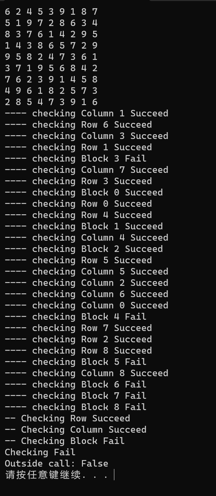

<div align="center">
    
</div>

<center><font size=6>本科生实验报告</font></center>

实验课程:操作系统原理

实验名称:操作系统编程大作业

专业名称:计算机科学与技术(人工智能与大数据方向)

学生姓名:刘卓逸

学生学号:21307303

实验地点:东校园实验中心大楼D503

<div style="page-break-after:always"></div>

## 1.实验要求

针对下列问题提出解决方案，将相应的源代码和说明文件打包后提交。

+ 题目一：课本p134，项目一“数独解决方案验证器”
+ 题目二：课本p105，3.14“Collatz 猜想问题”

## 2.实验过程

### Assignment 1 数独解决方案验证器

#### 实验内容

设计一个**多线程**应用程序，以判定数独谜题的解决方案是否有效

#### 实验原理

使用C++语言，基于pthread.h库完成

主线程创建3个子线程分别判断所有的行、列、块是否有效，

3个子线程又分别创建9个子线程判断每个行、列、块是否有效

#### 实验代码

Main函数：输入与输出

```cpp
int main()
{
    int a[9][9];
    for (int i=0;i<9;i++){
        for (int j=0;j<9;j++)
            scanf("%d",&a[i][j]);
    }
    if (parallel_check(a)){
        printf("Outside call: True");
    }
    else{
        printf("Outside call: False");
    }
    return 0;
}
```

pthread只能传递给子线程一个 `void*`参数，考虑用一个 `struct args`来传递所有需要的参数

```cpp
struct args{
    int (*a)[9]; // 数独
    bool *ans; // 要将结果返回的地方
    int rcb; // 当前任务是判断行还是列还是块
    int id; // 当前任务是判断第几个行列块
    args(int (*_a)[9]=nullptr,bool *_ans=nullptr,int _rcb=0,int _id=0):a(_a),ans(_ans),id(_id),rcb(_rcb){}
};
const char *(RCB[3])={"Row","Column","Block"};
```

主判断函数,创建三个子线程，三个子线程都完成后将结果汇总

```cpp
bool parallel_check(int a[][9]){
    // 参数准备
    bool ans[3]={0};
    args arg[3]={args(a,ans,0),args(a,ans+1,1),args(a,ans+2,2)}; //分别是行、列、块，把结果返回到ans[3]中
    // 从创建线程，传递参数
    pthread_t c_cols, c_rows, c_blks;
    int iret_rows = pthread_create(&c_rows, NULL, check_rcbs, (void*)(&arg[0]));
    int iret_cols = pthread_create(&c_cols, NULL, check_rcbs, (void*)(&arg[1]));
    int iret_blks = pthread_create(&c_blks, NULL, check_rcbs, (void*)(&arg[2]));
    // 等待线程结束
    pthread_join(c_cols, NULL);
    pthread_join(c_rows, NULL);
    pthread_join(c_blks, NULL);
    // 整理结果
    bool ansX=!(ans[0]||ans[1]||ans[2]);
    printf("Checking %s\n",ansX?"Succeed":"Fail");
    return ansX;
}
```

行、列、块的大判断函数，创建9个子线程

```cpp
void *check_rcbs(void *_arg){
    // 参数传输
    args* arg=(args*)_arg;
    int (*a)[9]=arg->a;
    bool *ans=arg->ans;
    int rcb=arg->rcb;
    // 参数准备
    bool ans2[9]={0};
    args arg2[9];
    for (int i=0;i<9;i++)
        arg2[i]=args(a,ans2+i,rcb,i); //rcb将大任务传递给小任务,i切割小任务
    // 主模块
    pthread_t c_rcb[9];
    int iret_rcb[9];
    for (int i=0;i<9;i++)
        iret_rcb[i]=pthread_create(&c_rcb[i], NULL, check_rcb, (void*)(&arg2[i]));
    for (int i=0;i<9;i++)
        pthread_join(c_rcb[i], NULL);
    // 合并
    bool ansX=0;
    for (int i=0;i<9;i++)
        ansX|=ans2[i];
    if (ansX)
        printf("-- Checking %s Fail\n",RCB[rcb]);
    else
        printf("-- Checking %s Succeed\n",RCB[rcb]);
    *ans=ansX;
    return nullptr;
}
```

行、列、块的小判断函数，判断单独的行、列、块是否满足
由于三个函数结果几乎一致，只需在不同的地方用if来区分

```cpp
void *check_rcb(void *_arg){
    // 参数传输
    args* arg=(args*)_arg;
    int (*a)[9]=arg->a;
    bool *ans=arg->ans;
    int rcb=arg->rcb;
    int i=arg->id;
    // 主模块
    bool hash[10]={0};
    for (int j=0;j<9;j++){
        //区分rcb
        int temp=(rcb==0)?a[i][j]:
                 (rcb==1)?a[j][i]:
                 a[(i/3)*3+j/3][(i%3)*3+j%3];
        if (temp<1||temp>9||hash[temp-1]){
            *ans=1;
            printf("---- checking %s %d Fail\n", RCB[rcb] , i);
            return nullptr;
        }
        else{
            hash[temp-1]=1;
        }
    }
    printf("---- checking %s %d Succeed\n",RCB[rcb],i);
    return nullptr;
}
```

完整代码

```cpp
#include <iostream>
#include <stdio.h>
#include <pthread.h>

struct args{
    int (*a)[9]; // 数独
    bool *ans; // 要将结果返回的地方
    int rcb; // 当前任务是判断行还是列还是块
    int id; // 当前任务是判断第几个行列块
    args(int (*_a)[9]=nullptr,bool *_ans=nullptr,int _rcb=0,int _id=0):a(_a),ans(_ans),id(_id),rcb(_rcb){}
};
const char *(RCB[3])={"Row","Column","Block"};

void *check_rcb(void *_arg){
    // 参数传输
    args* arg=(args*)_arg;
    int (*a)[9]=arg->a;
    bool *ans=arg->ans;
    int rcb=arg->rcb;
    int i=arg->id;
    // 主模块
    bool hash[10]={0};
    for (int j=0;j<9;j++){
        int temp=(rcb==0)?a[i][j]:
                 (rcb==1)?a[j][i]:
                 a[(i/3)*3+j/3][(i%3)*3+j%3];
        if (temp<1||temp>9||hash[temp-1]){
            *ans=1;
            printf("---- checking %s %d Fail\n", RCB[rcb] , i);
            return nullptr;
        }
        else{
            hash[temp-1]=1;
        }
    }
    printf("---- checking %s %d Succeed\n",RCB[rcb],i);
    return nullptr;
}

void *check_rcbs(void *_arg){
    // 参数传输
    args* arg=(args*)_arg;
    int (*a)[9]=arg->a;
    bool *ans=arg->ans;
    int rcb=arg->rcb;
    // 参数准备
    bool ans2[9]={0};
    args arg2[9];
    for (int i=0;i<9;i++)
        arg2[i]=args(a,ans2+i,rcb,i);
    // 主模块
    pthread_t c_rcb[9];
    int iret_rcb[9];
    for (int i=0;i<9;i++)
        iret_rcb[i]=pthread_create(&c_rcb[i], NULL, check_rcb, (void*)(&arg2[i]));
    for (int i=0;i<9;i++)
        pthread_join(c_rcb[i], NULL);
    // 合并
    bool ansX=0;
    for (int i=0;i<9;i++)
        ansX|=ans2[i];
    if (ansX)
        printf("-- Checking %s Fail\n",RCB[rcb]);
    else
        printf("-- Checking %s Succeed\n",RCB[rcb]);
    *ans=ansX;
    return nullptr;
}

bool parallel_check(int a[][9]){
    // 参数准备
    bool ans[3]={0};
    args arg[3]={args(a,ans,0),args(a,ans+1,1),args(a,ans+2,2)};
    // 从创建线程，传递参数
    pthread_t c_cols, c_rows, c_blks;
    int iret_rows = pthread_create(&c_rows, NULL, check_rcbs, (void*)(&arg[0]));
    int iret_cols = pthread_create(&c_cols, NULL, check_rcbs, (void*)(&arg[1]));
    int iret_blks = pthread_create(&c_blks, NULL, check_rcbs, (void*)(&arg[2]));
    // 等待线程结束
    pthread_join(c_cols, NULL);
    pthread_join(c_rows, NULL);
    pthread_join(c_blks, NULL);
    // 整理结果
    bool ansX=!(ans[0]||ans[1]||ans[2]);
    printf("Checking %s\n",ansX?"Succeed":"Fail");
    return ansX;
}

int main()
{
    int a[9][9];
    for (int i=0;i<9;i++){
        for (int j=0;j<9;j++)
            scanf("%d",&a[i][j]);
    }
    if (parallel_check(a)){
        printf("Outside call: True");
    }
    else{
        printf("Outside call: False");
    }
    return 0;
}

```

#### 实验结果

三组输入证明三个模块能正常工作吗，而且确实是并行的工作


其他输入




证明验证器正常工作

### Assignment 2

#### 实验内容

#### 实验原理

#### 实验代码

#### 实验结果

### Assignment 3

#### 实验内容

#### 实验原理

#### 实验代码

#### 实验结果

<style>
    img[alt="def"]{
        width:450px;
    }
</style>
